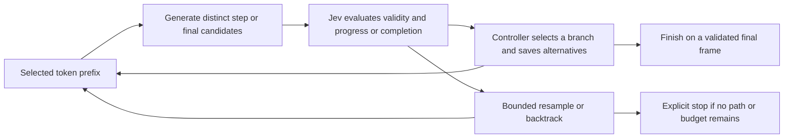

# Jev-guided decoding

Experimental Python controllers that ask a language model for candidate answer
continuations or explicit reasoning steps, use [TypeSafe Jev](https://docs.typesafe.ai/concepts/system-one) to
evaluate those candidates, and continue generation from the selected tokens.
IBM Granite 4.0 1B is the first test model; the controller uses backend and scorer
protocols so other compatible models can be evaluated independently.

**Status:** frozen-weight Transformers controllers for continuations and reasoning
steps, plus a separate experimental hook that turns Jev source relevance into
biases inside selected Granite attention heads. No model training or vLLM serving
extension is included.

[Latest internal-attention study](reports/2026-09-21-evidence-attention/README.md):
all **5,760 outputs completed without errors**. Granite scored **42.22%** and Jev
attention **51.25%** (+9.03 pp, adjusted interval [5.83,12.50]) on held-out authored
containment questions. Lexical/prompt superiority is inconclusive, so the stricter
all-controls criterion is unmet. Always UNKNOWN obtains 50% on this constrained
one-token task; general reasoning improvement is unproven. Full traces, source/data
hashes, independent audits and figures are public. Weights are unchanged; all task
resources are deleted; cumulative estimated spending is **$9.27/$50**.

[Earlier seven-arm study](reports/2026-09-21-structured-study/README.md): all 6,300
planned jobs were attempted on 300 authored logic worlds; 6,299 completed and one
service failure remains incorrect. Direct Granite scored **42.67%**, staged
Granite **37.00%**, likelihood search **35.44%**, and bounded Jev guidance **36.00%**.
No primary comparison established a useful accuracy gain. Every arm used the same
final-label grammar, and Granite chose every completed final label. The report
includes complete public traces, adjusted intervals, controls, figures and an
independent token/input audit. Both GPU deployments are deleted; cumulative
estimated spending at R13 completion was $8.49 of the $50 allowance.

[Earlier external-benchmark study](reports/2026-09-20-generated-answer-study/README.md):
all 3,600 trials were recorded with Granite generating every final answer. Jev did
not demonstrate an accuracy gain: math was 56.5% versus 61.5% single-candidate
Granite and 67.8% likelihood selection; logic was 52.5%, 52.7%, and 52.8%
respectively. The report includes adjusted paired intervals, actual work, and
verified token provenance. This uses a common staged prompt, not default chat.

[Research notebook](research/README.md): the complete study register, a new
offline failure analysis, primary-source architecture review, next-study design,
and a paper draft. The [new sparse logit-control prototype](reports/2026-09-21-logit-guidance/README.md)
now passes real-Granite probability, frozen-weight and zero-bias checks with replayed
Jev scores. Its original R12 development scoring was interrupted by a provider error, with
inadequate grader coverage and final formatting. R13 subsequently repaired the
operational issues and completed the comparison above, without demonstrating a
quality gain. R14 subsequently evaluated the internal-attention mechanism above;
its narrower evidence does not establish a generally best insertion point.

[Initial measured results](reports/2026-09-20-granite-smoke/README.md): the 12-case
smoke test demonstrated in-generation control, but no established quality gain;
Jev added latency and incorrectly rejected the ending of one correct answer.

The earlier saved-alternative reasoning-search controller follows this flow:



## Install

Python 3.11–3.13 is supported. The tested inference stack is PyTorch 2.8.0 and
Transformers 4.57.1, pinned in the optional extra and `uv.lock`.

```bash
git clone https://github.com/OVRLab/jev-guided-decoding.git
cd jev-guided-decoding
uv sync --locked --extra transformers --extra dev
```

Or install with `python -m pip install -e '.[transformers,dev]'` in a virtual
environment. The core controller/client can be installed without inference
dependencies: `python -m pip install -e .`.

Jev credentials come from `TYPESAFE_API_KEY`, then `~/.typesafe.ai/jev`; an explicit
`--key-file /path/to/key` overrides both. The file contains only the raw key.
Do not put credentials in configuration or source files. Baseline modes need no key.

## Generate an answer

```bash
uv run --no-sync jev-decode generate \
  --config configs/granite-4.0-1b.toml \
  --question "Who owns the Lumen release checklist, and who is the backup reviewer?" \
  --evidence-file data/example-evidence.txt \
  --mode jev \
  --output results/example.json
```

The first run downloads the original Granite checkpoint unless it is cached.
Add `--local-files-only` to require cached files. The example config selects CUDA,
then Apple MPS, then CPU, with BF16 on GPU and FP32 on CPU; set `device` and `dtype`
explicitly for hardware needing another combination. The checkpoint revision is
pinned, and all parameters remain frozen.

Output includes selected text, stop reason, every candidate and its token IDs,
raw Jev answers, actual returned Jev model version, usage, timings, and memory
counters. A budget stop or `all_rejected` can return **partial or empty text**;
inspect `result.stop_reason` instead of assuming every result is complete.
A service error returns exit code 2 and preserves its diagnostic trace.
Existing output paths are never overwritten.

In Jev mode, the question, evidence, accepted text, and candidates are sent to
TypeSafe's hosted API. The fixtures are fictional and authored for this repository.
Reference answers are used only by the local benchmark, never by the generator or
Jev scorer. Traces contain the input text, so review them before publishing results
produced from your own documents.

## Guide intermediate reasoning

The new [reasoning controller](docs/reasoning-controller.md) lets Granite propose
complete `<step>` or `<final>` frames. Jev judges each candidate against the original
evidence and tentative derivation; Python selects a path, keeps alternatives, and
backtracks if that path gets stuck. No training or weight changes are required.

```bash
uv run --no-sync jev-decode reason-benchmark \
  --config configs/granite-4.0-1b-reasoning.toml \
  --dataset data/reasoning-controller-smoke.jsonl \
  --modes greedy likelihood final_jev jev \
  --seeds 42 \
  --output results/reasoning-controller
```

For one question, use `reason` with the same `--question`, `--evidence-file`,
`--mode`, and `--output` arguments as `generate`, and the reasoning config above.
`greedy` and `likelihood` provide unguided controls; `final_jev` checks only final
candidates; `jev` also checks intermediate steps. All use the same frame prompt.
Exact duplicate token sequences are scored once per parent; bounded resampling
can seek alternatives but does not guarantee semantic diversity.

Only a completed final frame populates `result.text`. Partial steps are retained
separately, and final completion does not require an extra EOS token. Reasoning
commands exit with 0 for completion, 3 for an incomplete search, 2 for a backend or
scorer error, and 130 for recorded cancellation. A benchmark keeps incomplete runs
and returns 3 if any search was incomplete. Baselines never read a Jev key.

This controls explicitly generated text during inference. It does not expose
Granite's hidden neural states. The four-case fixture is a mechanism check, not a
held-out quality evaluation. See the controller documentation for resource limits,
trace semantics, cancellation, and remaining validation work. The
[first live reasoning run](reports/2026-09-20-reasoning-controller/README.md) verified
branch recovery but found 0/4 completions with step guidance: Granite kept proposing
copied premises. No quality improvement was established.

The optional `prompt_style = "examples"` setting adds worked rule-application
examples and a conclusion-first cue. It is configured in
[the examples config](configs/granite-4.0-1b-reasoning-examples.toml); `instructions`
remains the default. The [proposal experiment](docs/proposal-generation-experiment.md)
separates prompt development from evaluation and grades final verdict labels with
an independent rule oracle. The examples are instructions, not training data used
to change weights, and are not evidence for the current question.

```bash
# Fixed six-case, two-seed comparison with a 1,800-second stage limit:
uv run --no-sync python experiments/proposal_probe.py evaluate \
  --config configs/granite-4.0-1b-reasoning-examples.toml \
  --output results/proposal-evaluation

# Offline oracle grading; writes verdicts.json without overwriting prior grades:
uv run --no-sync python experiments/proposal_probe.py grade \
  --output results/proposal-evaluation
```

The grader counts missing/incomplete runs and unrecognized labels as nonmatches;
verdict agreement does not establish correct explanations or intermediate steps.
Use the generic `reason` command with the examples config for your own questions.

The [completed proposal experiment](reports/2026-09-20-proposal-generation/README.md)
improved development candidate availability from 0/8 to 6/8 batches. In the separate
48-run comparison, step Jev, greedy, and likelihood each matched 6/12 oracle verdicts;
final-only Jev matched 5/12. One trace demonstrates a useful early intervention, but
both UNKNOWN worlds remained unsolved. The report retains every failure, label typo,
and the timeout that required completing never-started jobs in a separate stage.

For consistent claim-classification tasks, `fixed_jev` adds a final Jev
[Choice](https://docs.typesafe.ai/primitives/choice) over three options supplied by
code: `ENTAILED`, `CONTRADICTED`, and `UNKNOWN`. It runs step-guided reasoning first,
then judges the original evidence with the selected intermediate steps treated as
tentative suggestions. Granite does not need to generate any of the verdict labels.
`direct_jev` is a control using the same decision without Granite reasoning; when
used alone it does not load or import the inference backend.
`unguided_fixed_jev` supplies the missing control: Granite selects intermediate
candidates by likelihood, with no step-scoring calls, followed by the identical
final Jev Choice and reservation. Compare it with `fixed_jev` to isolate the effect
of guidance before the final decision. `final_only_fixed_jev` also filters
generated final frames, but leaves intermediate steps unjudged; this separates
intermediate guidance from that final-frame filter.

```bash
uv run --no-sync jev-decode reason-benchmark \
  --config configs/granite-4.0-1b-fixed-verdict.toml \
  --dataset data/fixed-verdict-evaluation.jsonl \
  --modes jev fixed_jev direct_jev --seeds 42 \
  --output results/fixed-verdict-example
```

Fixed mode reserves one call and ten seconds **within** the configured total
request budgets. Cancellation or a service/backend failure stops it without a new
decision call. A unique winner must meet `[verdict].min_probability` (default 0.75);
otherwise the result is `uncertain_verdict`, not UNKNOWN. UNKNOWN means neither
the claim nor its explicit negation is established. This threshold is experimental.

`fixed-verdict-v1` records `output_source = "jev_choice"`, the full decision payload,
probabilities/confidence, and `reasoning_outcome`. Its `text` is only the canonical
verdict label; `token_ids` and `steps` retain Granite's original path and do not
pretend the label was generated by Granite. No prose explanation is produced by
this decision stage. These modes assume consistent evidence and a classification
question, not an arbitrary question needing a general answer. See the
[design and evaluation plan](docs/fixed-verdict-experiment.md).

In the [six-world fixed-choice check](reports/2026-09-20-fixed-verdict/README.md),
fixed mode matched 6/6 verdicts, including both UNKNOWN cases, versus 2/6 with
generated finals. Direct Jev also matched 6/6. All paired Granite searches retained
identical candidate token sequences and selected paths; the added final decision
resolved the classifications without improving the underlying reasoning search.

The [controlled ProofWriter protocol](docs/proofwriter-experiment.md) compares these
four final-decision arms on 200 distinct theories and three seeds. It also grades
Granite's preserved final answer before the Choice, yielding a Granite-alone
control without generating the same path twice. The runner freezes source/data
hashes, journals jobs before dispatch, preserves failures, and reports paired
confidence intervals grouped by problem. See the protocol for the separate pilot,
resource ceilings, partial step-audit limits, and executable reproduction commands.
The [completed study](reports/2026-09-20-controlled-study/README.md) recorded all
2,400 main jobs and 96 separate stress jobs. Guided accuracy was 84.5% versus
84.7% for direct Jev; all three adjusted comparison intervals include zero.
In 542/600 guided runs no intermediate step was accepted. The report also documents
conflicting generated-answer instructions, which limit interpretation of the
derived Granite-alone score. No added accuracy from intermediate guidance was
established for this configuration.

## Compare Granite-generated answers

The owner identified a scope error in the fixed-choice study: its final answer
came from Jev. Its scores do not establish improvement in Granite's generated
answers. The replacement [generated-answer protocol](docs/generated-answer-experiment.md)
keeps Granite as the answerer in all three arms: single sampled reasoning,
three-candidate likelihood selection, and three-candidate intermediate Jev selection.
Jev never scores or supplies the final answer. Code supplies framing delimiters;
Granite generates the content, retaining its exact accepted reasoning tokens.

The [controller](src/jev_guided_decoding/generated_answer.py) reserves one common
Granite final generation even after all steps are rejected. Tests enforce answer
provenance and no final Jev calls. A separate persistent ledger reserves the maximum
input-token charge before each Jev request. The first development pilot failed the
format gate and was preserved; the [corrected pilot](reports/2026-09-20-generated-answer-pilot-v2/README.md)
passed final-token ownership, format, and exercised-guidance checks. The 3,600-job
[evaluation is complete](reports/2026-09-20-generated-answer-study/README.md):
Jev changed 484 intermediate selections but did not demonstrate higher final-answer
accuracy. All final generations passed the token audit. The temporary L40S and
related resources were deleted after verified backup retrieval; estimated compute,
disk and Jev cost was $3.29 before tax and separate network charges.

After downloading the pinned GSM8K files and ProofWriter archive described in the
protocol, freeze and run development data first:

```bash
uv run --no-sync python experiments/generated_answer_study.py freeze --pilot \
  --archive results/proofwriter-source/proofwriter-dataset-V2020.12.3.zip \
  --gsm results/generated-answer-source/gsm8k-train.jsonl \
  --exclusions data/generated-answer-exclusions.json \
  --output results/generated-answer-pilot
uv run --no-sync python experiments/generated_answer_study.py run \
  --output results/generated-answer-pilot \
  --ledger results/generated-answer-budget.jsonl
uv run --no-sync python experiments/generated_answer_study.py analyze \
  --output results/generated-answer-pilot
```

The ledger's $3 cap is shared across pilot and evaluation. Freeze requires a clean
committed source tree. Model files must already be downloaded at the pinned revision.
The single-candidate baseline uses the same staged prompt and is not an unrestricted
default-chat benchmark. See the protocol for the development gate and fresh evaluation.

## Compare the four original decoding modes

```bash
uv run --no-sync jev-decode benchmark \
  --config configs/granite-4.0-1b.toml \
  --dataset data/grounded-smoke.jsonl \
  --modes greedy sample likelihood jev \
  --seeds 42 \
  --output results/granite-smoke
```

Use `--limit 4` for a shorter run. For baseline-only measurements, omit `jev`
from `--modes`. For a larger follow-up, use several seeds and a separate held-out
dataset with the same JSONL schema:

```json
{"id":"unique-id","evidence":"Source document...","question":"Question?","answers":["Reference answer."]}
```

| Mode | Generation | Selection |
| --- | --- | --- |
| `greedy` | One greedy continuation per chunk | Sole continuation |
| `sample` | One sampled continuation per chunk | Sole continuation |
| `likelihood` | N sampled continuations per chunk | Highest mean unmodified-model token log probability |
| `jev` | N sampled continuations per chunk | Threshold support/relevance, then rank eligible candidates |

`likelihood` is the extra-generation control: it uses the same candidate count,
sampling settings, chunking, initial seeds, and configured token ceilings as `jev`.
**These are comparable ceilings, not identical realized computation.** Branches,
lengths, EOS, and retries change actual work. Reports include generated tokens,
padded decode token slots, repeated prefill tokens, API calls, and elapsed time.
Seeds reduce variation but do not guarantee bitwise reproducibility across hardware
or batch shapes.

Results are written incrementally as `metadata.json`, `runs.jsonl`, and
`summary.json`. Metadata includes dataset hash, selected case IDs, model revision,
versions, configuration, and source Git revision. A short warm-up is excluded from
per-run times; loading is reported separately. Mode order rotates across cases.
CUDA reports per-run peak allocated memory; MPS reports current allocations and
**does not report peak memory**. Accepted-token throughput includes generation and
Jev waiting. This is a serial prototype benchmark, not concurrent-serving throughput.

Exact match and token F1 are **lexical smoke metrics**, not grounding or comprehensive
answer-quality measures. They can penalize valid paraphrases and reward answers
containing incorrect additions. Inspect full answers, count incomplete/error runs,
and use independent evaluation before making quality claims. Do not tune thresholds
on these fixtures and present the results as held-out evaluation.

The example config contains TypeSafe's documented input price on 2026-09-20.
Estimated API cost uses returned input tokens and that editable rate, excludes local
compute, and is not an invoice. Failed calls can leave usage unknown.

## Selection and implementation

- Two independent Noul questions per candidate ask whether its proposed answer
  is supported by evidence and whether its continuation advances the answer.
  An additional completion question is asked for EOS candidates.
  For an empty EOS, only support and completion are checked: ending a finished
  answer does not need to add new information, and relevance is recorded as null.
- All candidate questions are batched in one API request. Candidate text lives in
  its question rather than shared state. Question IDs alone convey no meaning to Jev.
- Candidates must pass support/relevance thresholds, plus completion when ending.
  Eligible candidates are ranked by their lower support/relevance probability
  (support/completion for an empty EOS),
  with model likelihood breaking ties. This is a ranking heuristic, not a joint
  probability of correctness; the thresholds require validation.
- Rejected branches never enter the accepted token prefix. Retries use the same
  prefix and a different seed. Exhausted retries return `all_rejected`, without
  automatically accepting a rejected candidate.
- Generation preserves exact token IDs. Each batch row stops at an English
  sentence boundary, EOS, or the chunk/time limit. Sentence detection is heuristic;
  long sentences can hit the cap unfinished. Abbreviations, decimals, code, and
  other languages require further evaluation.
- KV caching is used **within** a chunk. The accepted prefix is recomputed **between**
  chunks to avoid sharing mutable caches across branches, adding prefill overhead.
  Retained-prefix caching and vLLM scheduler integration remain future work.
- Jev calls are asynchronous between chunks, outside GPU token processing.
  This prototype serializes generation on one backend and is not a serving server.
  Time limits are checked between steps; in-flight prefills/kernels cannot be
  interrupted immediately.
- HTTP 429/529 retries respect `Retry-After` and bounded budgets. Transport failures,
  timeouts, authentication errors, and malformed responses stop the run; possibly
  billed timed-out requests are not automatically replayed.

Jev evaluates text, not hidden neural states. Its documented limitations include
numerical precision and complex reasoning, so the initial scorer targets evidence
support rather than promising general reasoning gains. It can still accept bad
claims or reject good ones; see [Jev's limitations](https://docs.typesafe.ai/model-jaggedness/jev-1.13).

## Development

The [intermediate-reasoning investigation](docs/reasoning-step-investigation.md)
includes [live diagnostic results](reports/2026-09-20-reasoning-investigation/README.md)
and the original step-search proposal. The implemented
[reasoning controller](docs/reasoning-controller.md) follows that investigation;
its validation is recorded separately from those historical probes.

Contributors and coding agents should start with [AGENTS.md](AGENTS.md),
[the development workflow](docs/development-workflow.md), and
[the shared rules](.claude/rules/). [CLAUDE.md](CLAUDE.md) and [GEMINI.md](GEMINI.md)
route to the same policy; [CONTRIBUTING.md](CONTRIBUTING.md) explains the public
workflow, and [SECURITY.md](SECURITY.md) covers credentials and experiment data.
Scope and verified status live in [Project.md](Project.md), [LAUNCH.md](LAUNCH.md),
and [LIVE.md](LIVE.md); [flows.md](flows.md) maps validation to changed behavior.

The [adaptation record](docs/ai-guidance-import.md) explains how OVRLab's accumulated
guidance was rewritten for this Python project. Run the offline guidance checker
whenever rules, role guides, links, or documented commands change.

```bash
uv run --no-sync python scripts/check_ai_docs.py
uv run --no-sync ruff check .
uv run --no-sync ruff format --check .
uv run --no-sync pytest -q
uv build
```

Tests cover rejection, prefix isolation, EOS completion, budgets, malformed API
responses, retries, and ambiguous timeouts. With the Transformers extra installed,
an offline tiny causal model checks native greedy equivalence and unchanged weights;
core-only CI skips backend tests. Tests never call live Jev or download model weights.

`types.py` defines `Backend` and `Scorer` protocols; `controller.py` contains selection
and budgets for answer continuations; `reasoning.py` implements framed search;
`reasoning_scorer.py` defines step/final judgments; `jev.py` contains the shared HTTP transport; `backends/transformers.py` contains
the first adapter. For another model, create a config with its ID/revision and
validate its chat template, EOS behavior, context limits, and results. Current
support covers decoder-only causal LMs supported natively by Transformers without
remote model code. Each model still needs individual validation.

## Next stage

1. Collect and independently review larger held-out results at comparable budgets.
2. Measure where Jev corrects a selection error and where it introduces one.
3. If results justify it, add retained-prefix caching and a vLLM controller that
   schedules candidate branches and API evaluations per request.
4. Benchmark concurrent GPU serving before publishing performance claims.

References: [TypeSafe API](https://docs.typesafe.ai/api),
[citation-checking cookbook](https://docs.typesafe.ai/cookbooks/citation_check),
[versions and pricing](https://docs.typesafe.ai/models),
[Transformers generation utilities](https://huggingface.co/docs/transformers/v4.57.1/en/internal/generation_utils),
and [vLLM logits processors](https://github.com/vllm-project/vllm/blob/main/docs/features/custom_logitsprocs.md).
