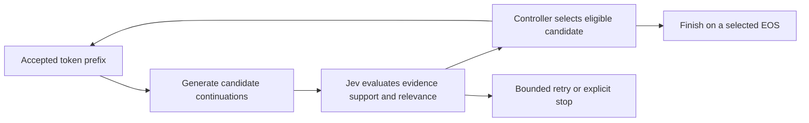

# Jev-guided decoding

An experimental Python controller that asks a language model for several next
sentences, uses [TypeSafe Jev](https://docs.typesafe.ai/concepts/system-one) to
evaluate those candidates, and continues generation from the selected tokens.
IBM Granite 4.0 1B is the first test model; the controller uses backend and scorer
protocols so other compatible models can be evaluated independently.

**Status:** initial Transformers prototype with frozen model weights and a small
synthetic smoke benchmark. This is generation-time text guidance, not a fusion of
Jev into attention layers. A vLLM serving extension is conditional on measured
gains; no vLLM extension is included in this version.

[Initial measured results](reports/2026-09-20-granite-smoke/README.md): the 12-case
smoke test demonstrated in-generation control, but no established quality gain;
Jev added latency and incorrectly rejected the ending of one correct answer.



## Install

Python 3.11–3.13 is supported. The tested inference stack is PyTorch 2.8.0 and
Transformers 4.57.1, pinned in the optional extra and `uv.lock`.

```bash
git clone https://github.com/OVRLab/jev-guided-decoding.git
cd jev-guided-decoding
uv sync --locked --extra transformers --extra dev
```

Or install with `python -m pip install -e '.[transformers,dev]'` in a virtual
environment. The core controller/client can be installed without inference
dependencies: `python -m pip install -e .`.

Jev credentials come from `TYPESAFE_API_KEY`, then `~/.typesafe.ai/jev`; an explicit
`--key-file /path/to/key` overrides both. The file contains only the raw key.
Do not put credentials in configuration or source files. Baseline modes need no key.

## Generate an answer

```bash
uv run --no-sync jev-decode generate \
  --config configs/granite-4.0-1b.toml \
  --question "Who owns the Lumen release checklist, and who is the backup reviewer?" \
  --evidence-file data/example-evidence.txt \
  --mode jev \
  --output results/example.json
```

The first run downloads the original Granite checkpoint unless it is cached.
Add `--local-files-only` to require cached files. The example config selects CUDA,
then Apple MPS, then CPU, with BF16 on GPU and FP32 on CPU; set `device` and `dtype`
explicitly for hardware needing another combination. The checkpoint revision is
pinned, and all parameters remain frozen.

Output includes selected text, stop reason, every candidate and its token IDs,
raw Jev answers, actual returned Jev model version, usage, timings, and memory
counters. A budget stop or `all_rejected` can return **partial or empty text**;
inspect `result.stop_reason` instead of assuming every result is complete.
A service error returns exit code 2 and preserves its diagnostic trace.
Existing output paths are never overwritten.

In Jev mode, the question, evidence, accepted text, and candidates are sent to
TypeSafe's hosted API. The fixtures are fictional and authored for this repository.
Reference answers are used only by the local benchmark, never by the generator or
Jev scorer. Traces contain the input text, so review them before publishing results
produced from your own documents.

## Compare the four modes

```bash
uv run --no-sync jev-decode benchmark \
  --config configs/granite-4.0-1b.toml \
  --dataset data/grounded-smoke.jsonl \
  --modes greedy sample likelihood jev \
  --seeds 42 \
  --output results/granite-smoke
```

Use `--limit 4` for a shorter run. For baseline-only measurements, omit `jev`
from `--modes`. For a larger follow-up, use several seeds and a separate held-out
dataset with the same JSONL schema:

```json
{"id":"unique-id","evidence":"Source document...","question":"Question?","answers":["Reference answer."]}
```

| Mode | Generation | Selection |
| --- | --- | --- |
| `greedy` | One greedy continuation per chunk | Sole continuation |
| `sample` | One sampled continuation per chunk | Sole continuation |
| `likelihood` | N sampled continuations per chunk | Highest mean unmodified-model token log probability |
| `jev` | N sampled continuations per chunk | Threshold support/relevance, then rank eligible candidates |

`likelihood` is the extra-generation control: it uses the same candidate count,
sampling settings, chunking, initial seeds, and configured token ceilings as `jev`.
**These are comparable ceilings, not identical realized computation.** Branches,
lengths, EOS, and retries change actual work. Reports include generated tokens,
padded decode token slots, repeated prefill tokens, API calls, and elapsed time.
Seeds reduce variation but do not guarantee bitwise reproducibility across hardware
or batch shapes.

Results are written incrementally as `metadata.json`, `runs.jsonl`, and
`summary.json`. Metadata includes dataset hash, selected case IDs, model revision,
versions, configuration, and source Git revision. A short warm-up is excluded from
per-run times; loading is reported separately. Mode order rotates across cases.
CUDA reports per-run peak allocated memory; MPS reports current allocations and
**does not report peak memory**. Accepted-token throughput includes generation and
Jev waiting. This is a serial prototype benchmark, not concurrent-serving throughput.

Exact match and token F1 are **lexical smoke metrics**, not grounding or comprehensive
answer-quality measures. They can penalize valid paraphrases and reward answers
containing incorrect additions. Inspect full answers, count incomplete/error runs,
and use independent evaluation before making quality claims. Do not tune thresholds
on these fixtures and present the results as held-out evaluation.

The example config contains TypeSafe's documented input price on 2026-09-20.
Estimated API cost uses returned input tokens and that editable rate, excludes local
compute, and is not an invoice. Failed calls can leave usage unknown.

## Selection and implementation

- Two independent Noul questions per candidate ask whether its proposed answer
  is supported by evidence and whether its continuation advances the answer.
  An additional completion question is asked for EOS candidates.
  For an empty EOS, only support and completion are checked: ending a finished
  answer does not need to add new information, and relevance is recorded as null.
- All candidate questions are batched in one API request. Candidate text lives in
  its question rather than shared state. Question IDs alone convey no meaning to Jev.
- Candidates must pass support/relevance thresholds, plus completion when ending.
  Eligible candidates are ranked by their lower support/relevance probability
  (support/completion for an empty EOS),
  with model likelihood breaking ties. This is a ranking heuristic, not a joint
  probability of correctness; the thresholds require validation.
- Rejected branches never enter the accepted token prefix. Retries use the same
  prefix and a different seed. Exhausted retries return `all_rejected`, without
  automatically accepting a rejected candidate.
- Generation preserves exact token IDs. Each batch row stops at an English
  sentence boundary, EOS, or the chunk/time limit. Sentence detection is heuristic;
  long sentences can hit the cap unfinished. Abbreviations, decimals, code, and
  other languages require further evaluation.
- KV caching is used **within** a chunk. The accepted prefix is recomputed **between**
  chunks to avoid sharing mutable caches across branches, adding prefill overhead.
  Retained-prefix caching and vLLM scheduler integration remain future work.
- Jev calls are asynchronous between chunks, outside GPU token processing.
  This prototype serializes generation on one backend and is not a serving server.
  Time limits are checked between steps; in-flight prefills/kernels cannot be
  interrupted immediately.
- HTTP 429/529 retries respect `Retry-After` and bounded budgets. Transport failures,
  timeouts, authentication errors, and malformed responses stop the run; possibly
  billed timed-out requests are not automatically replayed.

Jev evaluates text, not hidden neural states. Its documented limitations include
numerical precision and complex reasoning, so the initial scorer targets evidence
support rather than promising general reasoning gains. It can still accept bad
claims or reject good ones; see [Jev's limitations](https://docs.typesafe.ai/model-jaggedness/jev-1.13).

## Development

Contributors and coding agents should start with [AGENTS.md](AGENTS.md),
[the development workflow](docs/development-workflow.md), and
[the shared rules](.claude/rules/). [CLAUDE.md](CLAUDE.md) and [GEMINI.md](GEMINI.md)
route to the same policy; [CONTRIBUTING.md](CONTRIBUTING.md) explains the public
workflow, and [SECURITY.md](SECURITY.md) covers credentials and experiment data.
Scope and verified status live in [Project.md](Project.md), [LAUNCH.md](LAUNCH.md),
and [LIVE.md](LIVE.md); [flows.md](flows.md) maps validation to changed behavior.

The [adaptation record](docs/ai-guidance-import.md) explains how OVRLab's accumulated
guidance was rewritten for this Python project. Run the offline guidance checker
whenever rules, role guides, links, or documented commands change.

```bash
uv run --no-sync python scripts/check_ai_docs.py
uv run --no-sync ruff check .
uv run --no-sync ruff format --check .
uv run --no-sync pytest -q
uv build
```

Tests cover rejection, prefix isolation, EOS completion, budgets, malformed API
responses, retries, and ambiguous timeouts. With the Transformers extra installed,
an offline tiny causal model checks native greedy equivalence and unchanged weights;
core-only CI skips backend tests. Tests never call live Jev or download model weights.

`types.py` defines `Backend` and `Scorer` protocols; `controller.py` contains selection
and budgets; `jev.py` contains the HTTP scorer; `backends/transformers.py` contains
the first adapter. For another model, create a config with its ID/revision and
validate its chat template, EOS behavior, context limits, and results. Current
support covers decoder-only causal LMs supported natively by Transformers without
remote model code. Each model still needs individual validation.

## Next stage

1. Collect and independently review larger held-out results at comparable budgets.
2. Measure where Jev corrects a selection error and where it introduces one.
3. If results justify it, add retained-prefix caching and a vLLM controller that
   schedules candidate branches and API evaluations per request.
4. Benchmark concurrent GPU serving before publishing performance claims.

References: [TypeSafe API](https://docs.typesafe.ai/api),
[citation-checking cookbook](https://docs.typesafe.ai/cookbooks/citation_check),
[versions and pricing](https://docs.typesafe.ai/models),
[Transformers generation utilities](https://huggingface.co/docs/transformers/v4.57.1/en/internal/generation_utils),
and [vLLM logits processors](https://github.com/vllm-project/vllm/blob/main/docs/features/custom_logitsprocs.md).
