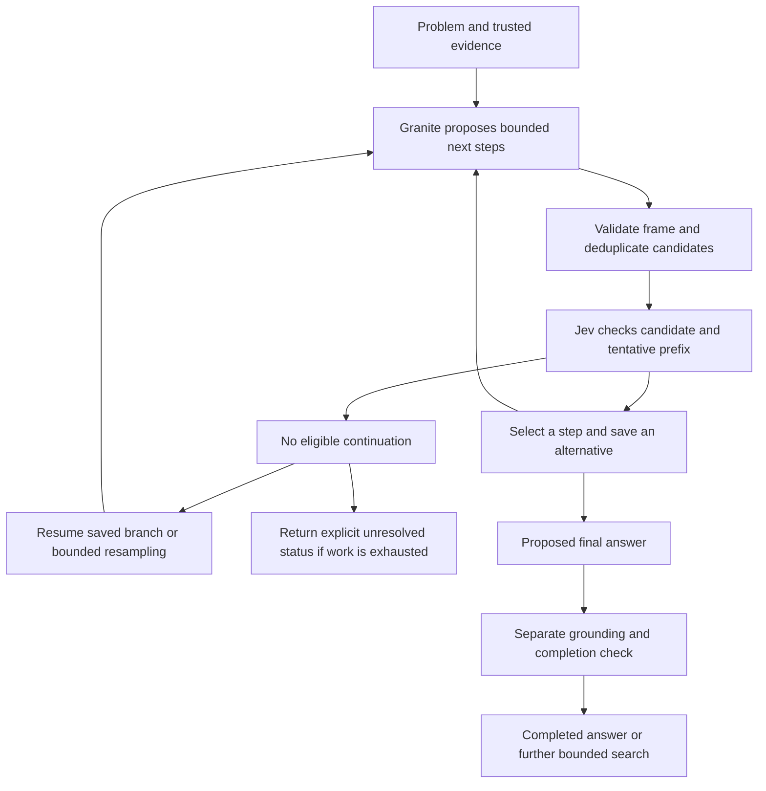

# Jev-guided intermediate reasoning: investigation

Started 2026-09-20 at the owner's request, before merging PR #1. The target is
the actual Jev model evaluating intermediate steps during inference, with both
models' weights unchanged. This is a follow-up investigation, not an implemented
reasoning-search feature or a claim of improved Granite answers.

## Plan and diagnostic protocol

1. Read primary research and current TypeSafe contracts; inspect the existing
   controller, scorer, token boundaries, and Granite interface.
2. Run a small, preregistered diagnostic of the scorer before building a search
   engine: eight fictional rule problems, three fixed candidate statements each.
3. Compare the existing answer rubric with an intermediate-step rubric on exactly
   those candidates. Use a deterministic rule engine for expected judgments;
   never send its results to Jev. Do not tune prompts or thresholds after the run.
4. Record sources, all requests/responses/errors, budgets, limitations, an engine
   design, and a separate held-out end-to-end experiment specification.

The diagnostic uses finite forward implications and explicit negative facts;
missing information does not imply its negation. A valid candidate and the entire
tentative prefix must follow from the original facts/rules. A useful next step
also adds a fact on a dependency path to the goal which is absent from the
original facts and prefix. The oracle implements this deliberately narrow task,
not general natural-language reasoning. Text is rendered from the same symbolic
fixture, so there is no uncertain free-text parsing in the oracle.

The baseline uses the unmodified `build_payload` answer rubric. The new rubric asks
about grounded validity and a useful intermediate deduction, explicitly allowing
an unfinished answer. Both use the fixed existing thresholds 0.75 and 0.60, with
first-in-fixture tie breaking and `min(validity, progress)` ranking. These are
heuristics, not calibrated guarantees. The fixtures contain useful incomplete
steps, missing conjuncts, reversed implication, explicit negation, irrelevant
truths, repetitions, and an intentionally contaminated prefix.

Budget: 16 serial HTTP requests maximum, one attempt each, 15 seconds per request,
180 seconds total; requested model `jev-1.13.0`. No retry of an ambiguous timeout.
The candidates are authored fixtures, not Granite generations. This is an exposed
diagnostic set with no held-out split, so it cannot establish end-to-end quality,
generalization, Granite candidate coverage, or latency of a deployed engine.

Files: a standalone experiment and synthetic fixture under `experiments/`, offline
regressions under `tests/`, this design, and a new dated report. Existing inference
code, package interfaces, PR #1, and previous raw reports are outside the change.
Validate oracle edge cases, reference isolation, invalid scores, no network in
tests, bounded requests, output preservation, documentation links, lint/tests/build.

## Sources and working findings

- [Tree of Thoughts](https://arxiv.org/abs/2305.10601) explores intermediate text
  branches with evaluation and backtracking; it establishes a related search
  pattern, not evidence for Jev or Granite.
- [Self-Evaluation Guided Beam Search](https://arxiv.org/html/2305.00633v3) treats
  a reasoning step as several tokens and scores chains during bounded search.
  Its evaluated generators/verifiers and tasks differ from ours.
- [Scaling test-time compute](https://arxiv.org/abs/2408.03314) finds that the best
  use of extra inference work depends on problem difficulty and the base model.
  Compare quality at actual work budgets, not just equal request ceilings.
- [TypeSafe's interface](https://docs.typesafe.ai/api) evaluates supplied text/state
  using typed questions. It exposes no Granite activation or gradient interface.
- [Jev's documented limitations](https://docs.typesafe.ai/model-jaggedness/jev-1.13)
  include numerical precision, indirection, and adversarial framing. Narrow step
  checks need measurement; “reasoning verifier” is a proposed role, not a validated
  property of this model.
- [Citation-checking cookbook](https://docs.typesafe.ai/cookbooks/citation_check)
  separates exact checks in code from contextual judgments by Jev. That separation
  informs the proposed evaluator; its published results are not our measurements.
- [Granite model card](https://huggingface.co/ibm-granite/granite-4.0-1b) and the
  existing adapter provide ordinary causal generation. We will request explicit
  intermediate text; we have not identified a dedicated hidden-reasoning stream.

## Existing code and necessary changes

- `types.py` asks for a direct concise answer; a new reasoning request needs an
  explicit intermediate/final protocol rather than treating the current output
  as evidence of internal thoughts.
- `jev.py` judges direct-answer progress. A step scorer must allow useful partial
  deductions, distinguish uncertain hypotheses from facts, and check a prefix
  against original evidence instead of promoting earlier scores to truth.
- `controller.py` commits to one prefix, retries only that prefix, and discards
  alternatives. It has no search frontier or backtracking.
- `ChunkStop` uses sentence punctuation. Reasoning needs explicit step/final
  boundaries, including multi-token delimiters and truncated-step outcomes.
- `TransformersBackend.propose` already accepts exact prefix token IDs and uses
  an independent generation cache per proposal. This is a safe first implementation
  for branches; retained branch caches are a later optimization with ownership tests.

## Follow-up generation check, declared after the scorer diagnostic

Both rubrics matched all eight fixture decisions, so there is no observed selection
advantage for the new rubric here. Before recommending an engine extension, check
whether the existing frozen Granite can produce explicit deductions. This is a
separate diagnostic, not an extension of the 16-call scorer result.

Run the existing controller on `useful-incomplete-step` and `missing-conjunct`, with
an explicit deduction/final-answer system prompt. Compare likelihood selection and
the existing Jev scorer, one seed (42), three candidates, 48-token chunks, four
steps, 160 accepted tokens and 576 decode slots maximum, no resampling retries,
120 seconds per run. Use at most eight Jev HTTP attempts across the two guided
runs. Rotate the two modes' order, load the already cached pinned Granite revision,
and warm up the three-candidate shape before timing. Keep all four results.

This checks generated step boundaries and exact-prefix continuation using existing
code. No backtracking, dedicated step scorer, or retained branch cache is added.
Qualitative review of generated traces is distinct from the symbolic oracle's
evaluation of the authored statements. No second attempt to repair a poor result.

## Measured outcome

See the [full dated report](../reports/2026-09-20-reasoning-investigation/README.md)
and its raw artifacts. Both rubrics selected or abstained correctly in 8/8 fixed
cases, accepting five useful steps and rejecting nineteen ineligible candidates.
There was no measured advantage for the new rubric. These simple related fixtures
are diagnostic, not a general verifier benchmark.

The four actual Granite runs revealed more useful engineering constraints:

- Seven of thirteen proposal batches contained three identical token sequences.
  Sampling three times did not reliably supply alternatives. Some identical
  candidates also received slightly different Jev scores within the same request.
- On the solvable problem both modes produced a correct final statement, but
  exhausted the four-step budget before EOS. A visible `Final:` prefix is not a
  completion state in the current engine.
- On the missing-premise problem likelihood selection invented manager approval.
  Jev rejected the earlier repetition of a known fact and returned an empty
  `all_rejected` result. It did not evaluate that later invented premise or return
  a correct explanation of missing evidence. This is not a demonstrated correction.
- The solvable derivation mostly repeated a fact and rules; requesting `Step:`
  text did not enforce a sequence of novel deductions.

This supports a scoped engineering experiment in explicit step control and recovery.
It does not establish better answers, a need to replace the current rubric, or
access to hidden reasoning. Jev's role remains active evaluation during inference;
neither model is trained and no surrogate critic is proposed.

## Proposed engine design

Implement a separate `ReasoningController`, preserving the ordinary answer
controller and its benchmark for comparison. Start with the existing Transformers
adapter's exact-token interface. No new serving framework is needed for this test.

1. **Explicit phases.** Use `reasoning`, `final_candidate`, `complete`, and failure
   states. A candidate carries a kind, text, evidence references where applicable,
   exact token IDs, parent ID, and finish reason. A justified “not established”
   answer is a valid final candidate. Rejecting all next deductions does not itself
   prove that the answer is unknown.
2. **Real step boundaries.** Stop at an explicit end-of-step delimiter encoded
   with the existing tokenizer; do not add untrained vocabulary entries. Preserve
   delimiters in accepted IDs, even if display omits them. A token limit in the
   middle of a frame is incomplete, not a judged step. Test multi-token delimiters,
   newlines, abbreviations, decimal points, malformed frames, and premature EOS.
3. **Distinct candidates.** Generate up to three proposals, deduplicate exact token
   sequences before scoring, and reuse a score only for identical text with the
   same complete state and rubric. Log unique counts and discarded work. Permit
   one bounded resampling attempt for all-duplicate/all-ineligible batches; more
   sampling is a hypothesis about coverage, not a guarantee of diversity.
4. **Jev sees the derivation.** Send the original problem/evidence, tentative prefix,
   and one candidate per independent question. Check claims against original
   evidence. Separate grounded validity, useful progress, and final completion.
   Do not hard-code the assumption that an intermediate step is a final answer,
   or reject a final summary simply because it repeats derived conclusions.
5. **Bounded backtracking.** Begin with depth-first search retaining the best two
   eligible children per expansion, one active branch and a stack of deferred
   siblings. Descend the preferred child; on a dead end, resume the latest saved
   sibling. Return the first adequately checked final answer. This is bounded
   search, not exhaustive proof or an optimal-path guarantee. Rank siblings by a
   declared heuristic, using model likelihood as a tie break; a chain of Jev
   scores is not a probability that the whole derivation is correct.
6. **One budget owner.** Cap depth, total expanded nodes, saved siblings, generated
   and padded tokens, prefill/context work, resampling, HTTP attempts, and elapsed
   time. Counters are per request and never reset after backtracking. Keep
   `scorer_error`, `premature_eos`, `incomplete_step`, `no_eligible_branch`, and each
   budget outcome observable. An API failure never becomes a correctness judgment.
7. **Token/cache ownership.** Initially reconstruct each branch from its saved
   exact token prefix, using an independent generation cache. Add retained caches
   only after tests establish copy/rollback/isolation and accounting. Never share
   a mutable branch cache or let a rejected continuation enter an accepted prefix.

Thresholds, ranking weights, and resampling settings must be set on development
cases before held-out runs. The current 0.75/0.60 thresholds are diagnostic starting
values; these measurements do not calibrate them for general reasoning.

## Acceptance experiment for an implementation

Use generated fictional rule worlds with machine-checkable outcomes first, then
separately assess natural-language tasks with independent grading. The generator
should vary names, rule graphs, missing premises, distractors, negation, and path
length. Hold out entire graph templates, not just entity names. A proposed first
run is eight development worlds and twenty-four held-out worlds with three
generation seeds; finalize and hash the split before tuning or execution.

Compare the same problems and sampling configuration across:

- Unguided explicit-step generation, to measure the value of search itself.
- Likelihood-guided search with the same branching/retry ceilings, to isolate
  Jev's selection contribution as far as different realized paths permit.
- Jev scoring only completed candidate answers, to test intervention timing.
- Jev step search, with a no-backtracking ablation to identify recovery's effect.

Use a frozen set of candidate branches as an additional offline selection test:
otherwise different prefixes cause different later candidates even with the same
seed. An oracle selector is only a diagnostic upper bound on available candidates,
never an input to the deployed Jev controller or its prompts.

Measure final correctness and completion, valid-candidate availability, selected
step validity conditional on a valid option existing, false acceptance/rejection,
recovery after a bad branch, duplicate rate, and all unresolved/error outcomes.
Score required answer fields with the independent task oracle; lexical overlap
and Jev's own scores do not establish correctness. For natural-language claims,
report the grader's provenance and uncertainty separately from formal checks.

Report quality alongside actual generation/prefill work and provider calls, plus
model generation time, Jev round-trip time, and total latency. Extra latency is
expected for a second model; its value depends on the resulting quality/resource
trade-off. Current measurements do not separate network from provider compute,
and no colocated Jev runtime was tested. Small timing differences are not a speedup
claim. Aggregate seeds within cases for paired uncertainty estimates rather than
treating every seed as an independent new task.

The engineering test passes when explicit final states, prefix isolation, duplicate
handling, bounded backtracking, and failure accounting work in offline scenarios
and a scoped live trace. A quality claim separately requires improvement against
the controls on held-out cases with uncertainty and actual work reported. A null
result still completes an honest experiment; it is not permission to tune on test.

## Implementation work and verification

Proposed new modules are `reasoning.py` (state/search) and `reasoning_scorer.py`
(phase-aware questions), plus an explicit-step stopping strategy in the existing
backend. Reuse HTTP transport/key handling with a tested payload boundary rather
than duplicating provider infrastructure in the production library. The standalone
diagnostic intentionally makes at most one HTTP attempt and is not that reusable
client. Add a separate CLI mode/config and versioned trace schema once implemented.

Before code changes, write failing scenarios for duplicate proposals, all-ineligible
children, a bad branch with a recoverable sibling, contaminated prefixes, missing
evidence, a valid final summary, split delimiters, late scores, cancellation, and
every global budget across backtracking. Test without credentials or optional
inference dependencies; use the existing tiny backend model for token continuity.
Then run the scoped live experiment above, including every failure in its report.

The present investigation adds no production controller behavior. Validation of
its experiment code included initially failing offline tests for the absent probe
and request builder, followed by passing oracle, reference-isolation, probability,
timeout/no-retry, request-budget, output-preservation, and selection checks. The
generation trace's exact selected-token and text-prefix continuity was also checked
offline. See the dated report for command outcomes and source revisions.
