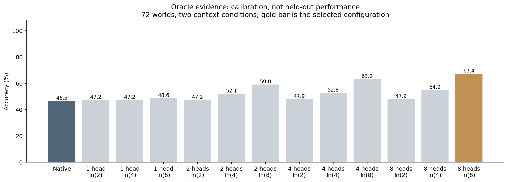
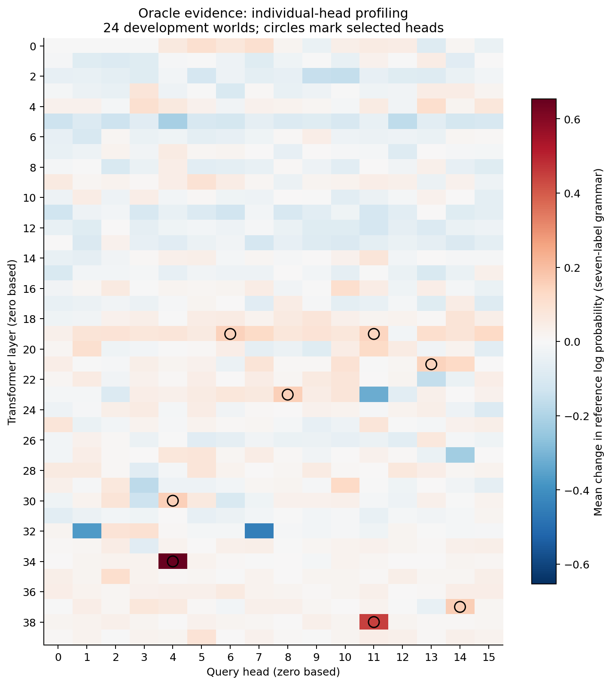
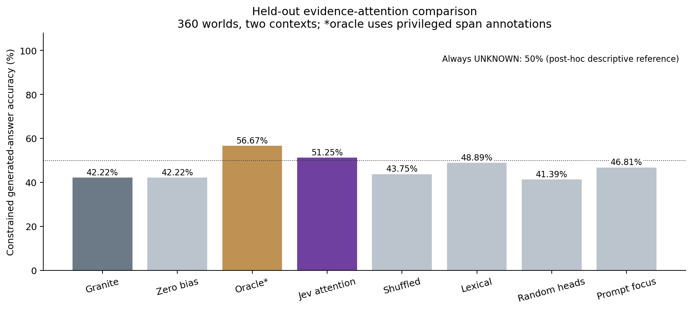
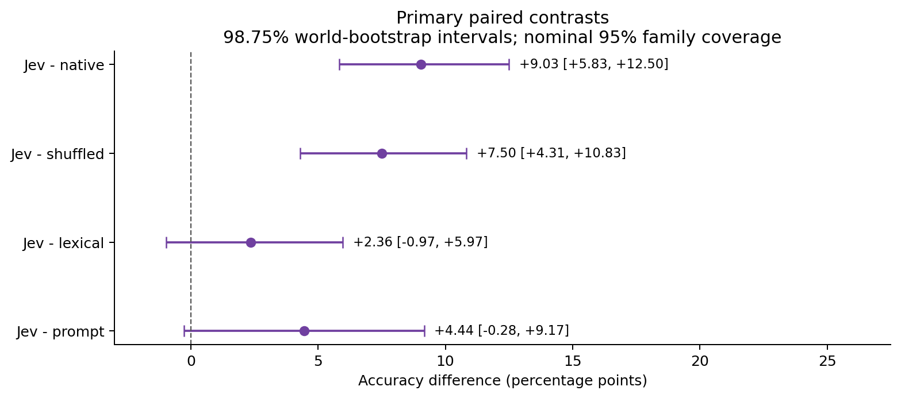

# R14: Jev-guided attention to source evidence

Completed on 2026-09-21. **Granite-generated answer accuracy increased from
42.22% to 51.25%**, a paired gain of **9.03 percentage points** with adjusted
interval **[5.83, 12.50]** on this held-out authored containment task. The gain
also exceeds shuffled scores. Superiority over lexical relevance and prompt
highlighting is inconclusive, so the stricter prospective **all-four-control
success criterion is not met** (`useful_gain: false`). This is a partial positive
result, not a successful general reasoning architecture.

Absolute performance remains limited: half the cases lack a final containment
link, so always answering UNKNOWN obtains **50%**. That is a post-hoc descriptive
reference, not another predeclared inferential comparison. The improvement over
Granite does not establish useful deployment quality.

All **5,760/5,760 held-out outputs completed**, with **zero model/API failures**.
Granite chose every final token; weights are unchanged. All temporary cloud
resources were deleted after verified retrieval. This experiment adds about
**$0.78**, for a cumulative estimate of **$9.27 of the $50 allowance**.

## Navigation and execution record

- [Prospective execution plan](../../research/evidence-attention-protocol.md):
  hypothesis, implementation, failures, stages, controls, statistics and stop rules;
  preserved byte-for-byte after the source freeze.
- [Frozen manifest and authored splits](../../research/protocols/evidence-attention-v1/manifest.json),
  [selected policy](artifacts/selected-policy.json),
  [test freeze](artifacts/test-freeze.json), [completion](artifacts/completion.json).
- [Primary results](artifacts/test-summary.json), [independent full audit](independent-analysis.json),
  [descriptive diagnostics](diagnostics.json), [cost and cleanup record](cost.json).
- [All traces](artifacts/), [artifact checksums](artifact-hashes.json),
  [original uncompressed checksums](raw-artifact-hashes.json), [figures](figures/).
- [Study register](../../research/study-register.md), [paper draft](../../research/paper-draft.md),
  and earlier [R10](../2026-09-20-generated-answer-study/README.md) /
  [R13](../2026-09-21-structured-study/README.md) results.

| Stage | Frozen procedure | Completed model decisions |
| --- | --- | ---: |
| Individual-head profiling | 24 development worlds, heavy context; native + zero + 640 individual heads at ln(4) | 15,408 |
| Oracle calibration | 72 other development worlds, two contexts; native + top 1/2/4/8 heads at ln(2)/ln(4)/ln(8) | 1,872 |
| Live Jev pilot | Six calibration worlds, two contexts, eight arms; operational admission | 96 |
| Held-out test | 360 new worlds, two contexts, eight arms | 5,760 |
| Total | No replay of started operations | 23,136 |

The oracle calibration improved from 46.53% to 67.36% (+20.83 pp); clean-context
accuracy improved by 23.61 pp. This passed the prospective gate of at least +3 pp
overall and no clean harm exceeding 3 pp. The selected policy was frozen before
live pilot/test evaluation. Profiling and calibration reference log probabilities
are normalized over the common seven allowed labels; traces separately record
their probability mass in the full vocabulary. All 12 pilot calls returned valid typed receipts;
a positive pilot accuracy was not an admission requirement. No test-based tuning,
policy amendment, paid retry or interrupted segment was needed.



## What was placed inside Granite

Jev judges whether each supplied source record belongs to the containment chain
starting at the queried parcel. Its request includes the question and all records,
including potential bridge facts. It receives no reference answer, oracle span
map, final answer choices, logits or hidden tensors. Each record's character span
maps to exact input-token offsets, including the complete chat template.

```text
Question + complete evidence
        |                         |
        v                         v
Granite embeddings        Hosted Jev relevance call (once)
        |                         |
        |                  source ID -> probability
        |                         |
        v                         v
Selected internal attention heads <--- bounded source-token bias
  QK scores + causal mask + bias
             |
           softmax -> weighted values -> output projection
             |
Remaining Granite computation -> output head
             |
Granite logits choose one of seven allowed answer tokens
```

The [scoped hook](../../research/experiments/evidence_attention.py) adds a 4D
attention-mask bias before softmax/value aggregation in the actual
`GraniteMoeHybridAttention` implementation. It affects evidence **key positions**
for **query positions after the evidence block**, only at these eight query heads
across seven layers (both indices **zero based**):

```text
(layer, head): (34,4), (38,11), (37,14), (30,4),
               (23,8), (19,6), (21,13), (19,11)
strength: ln(8) = 2.0794415416798357
bias: strength * max(0, 2 * relevance - 1)
```

All-equal relevance or zero strength gives zero intervention. The recorded bias
is the requested real-valued value; the runtime casts the additive mask to BF16,
so applied values have normal floating-point quantization. The existing causal
mask, RoPE, GQA and model parameters are preserved. Per-request hooks are removed
on completion or exception; cached/incremental input is rejected. There is no
shared concurrent serving or vLLM integration in this reference implementation.

This is **static relevance guidance during final-answer generation**. One remote
Jev call supplies a local bias map before the forward pass; there is no network
call inside a layer, dynamic reasoning-step refresh, hidden-tensor exchange or
training. R13 modified output vocabulary logits during intermediate claims and
left its final phase unassisted; R14 changes internal source attention during the
final phase. Their different tasks and policies prevent a pooled insertion-point
comparison. [PASTA](https://arxiv.org/abs/2311.02262) establishes the general family
of attention steering and head profiling; this project does not claim its invention.



## Data and comparison contract

The authored graph worlds cross chain depths 1/2/3 with answerable/missing final
links, balanced over six cells. Each has a light-distraction (`clean`) context
with one irrelevant three-edge chain and a heavy (`distracted`) context with six.
Test wording reverses the development relation template: “room contains crate”
instead of “crate is inside room.” Fresh aliases and source order differ across
worlds; task structure still overlaps across splits.

An independent visible-sentence parser reconstructs directed edges, follows the
query's chain and grades the room or UNKNOWN. Every arm permits the same six
color tokens plus UNKNOWN, with the semantic choice made greedily by Granite's
returned logits. No intermediate text is forced. **This is constrained one-token
QA, not unrestricted default chat or an open-ended reasoning benchmark.**

Native/zero/attention arms see identical prompts and complete evidence. The prompt
control adds `<focus>` markers for the same Jev scores above 0.5; it changes token
length but preserves facts. Oracle uses privileged annotations. Random-head and
shuffled-score arms keep the declared count/strength or score multiset while
changing the intervention mapping. All failed/missing outcomes would count
incorrect; none occurred. Arm order is rotated deterministically per context.

## Held-out results

| Arm | Correct / 720 | Accuracy | Clean | Distracted |
| --- | ---: | ---: | ---: | ---: |
| Native Granite | 304 | 42.22% | 43.61% | 40.83% |
| Zero bias | 304 | 42.22% | 43.61% | 40.83% |
| Oracle evidence (privileged diagnostic) | 408 | 56.67% | 59.44% | 53.89% |
| Jev attention | 369 | 51.25% | 53.61% | 48.89% |
| Shuffled Jev scores | 315 | 43.75% | 46.94% | 40.56% |
| Lexical relevance | 352 | 48.89% | 50.00% | 47.78% |
| Random heads with Jev | 298 | 41.39% | 43.61% | 39.17% |
| Prompt highlighting with Jev | 337 | 46.81% | 46.11% | 47.50% |



The independent statistical unit is one world, averaging its two contexts.
There are no artificial repetitions of deterministic generation treated as extra
samples. Primary contrasts use 10,000 paired world-bootstrap draws with individual
98.75% intervals, giving nominal 95% family coverage across four comparisons.
These are approximate bootstrap intervals, not a guarantee about all tasks.

| Jev minus control | Difference, pp | Adjusted interval, pp | World wins / losses / ties |
| --- | ---: | --- | --- |
| Native | +9.03 | [+5.83, +12.50] | 60 / 8 / 292 |
| Shuffled | +7.50 | [+4.31, +10.83] | 61 / 12 / 287 |
| Lexical | +2.36 | [−0.97, +5.97] | 35 / 22 / 303 |
| Prompt highlighting | +4.44 | [−0.28, +9.17] | 73 / 48 / 239 |

The >=3 pp native-gain condition passes, but the lexical and prompt intervals
cross zero. The predeclared conjunctive criterion is therefore false. Those
comparisons are inconclusive, not proof of equivalence. Oracle/random-head results
are diagnostic and were not added to the primary hypothesis family after testing.



### Descriptive diagnostics and interpretation

Relative to native, Jev changes 110 labels: **74 fixes, nine regressions, and 27
wrong-to-wrong changes**, giving the net 65-answer improvement. Most gain occurs
on answerable cases: 74/360 (20.56%) native versus 136/360 (37.78%) Jev. Missing-link
accuracy barely changes: 230/360 (63.89%) versus 233/360 (64.72%). UNKNOWN remains
a substantive weakness, even though it was explicitly available in all arms.

At the descriptive relevance threshold >0.5, 8,640 held-out Jev Noul judgments
contain 1,080 true positives, 243 false positives, 7,317 true negatives and no false
negatives: recall 100%, precision 81.63%, Brier score 0.04034. These source judgments
are dependent within cases and reflect this specific authored distribution.
They are not 8,640 independent reasoning problems or evidence of universal critic
reliability. False emphasis and imperfect use of correct evidence are plausible
remaining obstacles; this experiment does not isolate their causal contribution.
The 56.67% oracle result is a tested diagnostic, not a guaranteed attainable upper bound.

The constant-UNKNOWN reference (50%), per-class breakdown and fix/regression
counts are post-hoc descriptive checks, reproduced by
[evidence_metrics.py](../../research/analysis/evidence_metrics.py). None changes
the frozen primary decision or retroactively tunes the policy.

## Runtime, API use and cost

One Nebius L40S (48 GB), eight vCPUs, 32 GiB RAM and an 80 GiB SSD ran the study
in eu-north1. Software was Python 3.12.13, Torch 2.8.0+cu128 and Transformers 4.57.1,
CUDA BF16. The full study took 962.03 seconds (16.03 minutes), including the recorded
5.38-second initial model setup/weight digest; per-arm forward timings exclude loading,
profiling/calibration setup, scoring and reporting. Development forwards precede
the held-out test. This is a serial correctness reference, not a serving throughput test.

| Treatment | Mean model-forward seconds/context | Additional shared Jev seconds/context |
| --- | ---: | ---: |
| Native | 0.02561 | 0 |
| Jev attention | 0.02745 | 0.37097 |
| Lexical attention | 0.02742 | 0 |
| Jev prompt highlighting | 0.02566 | 0.37097 |

For a request requiring a new score, Jev attention's measured components total
about **0.39843 seconds**, versus 0.02561 for native; ancillary deployment overhead
is not measured. The same receipt is reused across Jev-dependent comparison arms,
counted once in actual spending, and included once for a per-request latency
estimate. Colocated Jev performance was not measured.

Held-out scoring used 720 successful calls, 1,772,748 input tokens and 179,100
reported output tokens, taking 267.10 API seconds. Including the pilot: **732
calls, 1,802,440 input tokens, zero unknown/unresolved calls**. The requested and
returned model was `jev-1.13.0`. The private key was securely transferred to the
VM, verified nonempty, permissioned 0600 and matched privately without exposing it;
public payload/receipt artifacts contain no credential.

The VM existed for 0.45521 hours. At $1.5484/hour compute plus $0.007781/hour disk,
new cloud cost is estimated at $0.70839; receipt-based Jev cost is $0.07570
($0.09012 under the conservative budget rate). The cumulative estimate including
prior studies is **$9.27290/$50**, before tax and separate network charges, not a
provider invoice. See [cost.json](cost.json),
[Nebius pricing](https://docs.nebius.com/compute/resources/pricing) and
[TypeSafe models/pricing](https://docs.typesafe.ai/models).

All 19 remote result files were backed up and hash-verified before deletion.
The task VM, managed disk, security rules/group, and both allocated addresses were
verified absent; deletion completed at 2026-09-21 21:49:12 UTC, with address checks
afterward. Private account/network identifiers and operational credentials remain
outside the public artifacts. No paid resources remain for R14.

## Integrity and reproduction

The [execution metadata](artifacts/metadata.json) records clean source commit
`94845097247add1d364f75c03bc4082995002ba4`, source hashes and exact model revision
`6a7381ba1f54d684ff508d991aeb7dc580157103`. The preparation manifest records its
parent Git revision because it was written immediately before the freeze commit;
its source/data hashes exactly match the executing checkout. Later analysis/tests
and report edits do not alter the frozen inference source set.

The original model contains 1,631,750,144 parameters, zero trainable parameters,
40 attention layers, 16 query heads and four KV heads. Complete state hashes match
before and after:

```text
311c1141187580dc0905c810e9d9e78853a0bf37b865bd5a5a511f6eed72f8c9
```

The independent audit verifies 1,509 distinct recorded input variants, **23,136
model decisions and bias maps**, all 732 scorer receipts, full expected schedules,
head ranking, calibration selection, source spans and directed-graph grades.
It independently reconstructs every selected final token from recorded logits and
recomputes primary bootstrap intervals using NumPy. All 756 native/zero pairs
match recorded logits/tokens; 24 profiling pairs additionally match the entire
vocabulary with maximum logit difference exactly zero. This is a separate code
path written by the same AI-assisted project, not an external scientific review.

For offline reproduction, use a fresh output directory and decompress the public
traces (no GPU/Jev calls):

```bash
uv sync --locked --extra dev --extra transformers
python - <<'PYCODE'
import gzip, hashlib, json
from pathlib import Path
report = Path('reports/2026-09-21-evidence-attention')
out = Path('results/r14-public-reproduction')
out.mkdir(parents=True, exist_ok=False)
expected = json.loads((report / 'raw-artifact-hashes.json').read_text())
for p in (report / 'artifacts').iterdir():
    name = p.name.removesuffix('.gz')
    data = gzip.decompress(p.read_bytes()) if p.suffix == '.gz' else p.read_bytes()
    assert hashlib.sha256(data).hexdigest() == expected[name]
    (out / name).write_bytes(data)
PYCODE
uv run --no-sync python research/analysis/evidence_attention.py \
  --manifest research/protocols/evidence-attention-v1 \
  --results results/r14-public-reproduction \
  --output results/r14-public-audit.json
uv run --no-sync python research/analysis/evidence_metrics.py \
  --manifest research/protocols/evidence-attention-v1 \
  --results results/r14-public-reproduction \
  --output results/r14-public-diagnostics.json
uv run --no-sync --with matplotlib==3.10.8 --with numpy==2.5.3 \
  python research/analysis/evidence_figures.py \
  --results results/r14-public-reproduction \
  --output results/r14-public-figures
```

The audit loads the pinned tokenizer (a download may be needed); it loads no model
weights and invokes no hosted scorer. Figure provenance pins plotting versions,
source inputs and renderer hashes. PNG, SVG and PDF figures are provided; generated
SVG/PDF metadata may vary across regenerations. The original trace bytes are
immutable and the decompressed hashes are the comparison target.

A **new paid inference replication** needs the exact frozen checkout/lockfile,
CUDA dependencies, the pinned model and a privately supplied Jev credential; it
must use fresh result/ledger paths and separately authorized infrastructure:

```bash
uv run --no-sync python research/experiments/evidence_study.py run \
  --manifest research/protocols/evidence-attention-v1 \
  --output results/r14-new-replication \
  --ledger results/r14-new-replication-ledger.jsonl --device cuda
```

The runner checks hashes and admits the held-out phase only after its development
gates. Provider nondeterminism and different devices may change replication outputs.
The command does not itself provision a GPU or implement cloud cleanup.

## Final engineering validation and remaining limits

The final offline suite passed **335 tests in 4.10 seconds**; Ruff lint and format
(183 Python files), the AI guidance checker (49 Markdown files), and package build
passed. The pre-execution remote suite passed 329 tests before later audit/analysis
tests were added. See [validation.md](validation.md) for checks and review limits. No paid inference was repeated for documentation
or analysis-only changes. All four figures were visually checked for legible labels
and consistency with their underlying tables. Source/data/protocol hashes and
compressed public artifact hashes were checked after packaging.

The follow-up analysis tests first failed for missing auditor/metrics capabilities,
then passed; the visible-record parser also first failed before implementation.
A Unicode/repeated-source test checks that a duplicated non-ASCII record maps to
its own positions in the complete rendered prompt. The added diagnostics reproduce
the original post-hoc aggregates and reject incomplete cohorts instead of silently
changing their denominators.

This study validates a working **internal attention insertion** and a narrow gain
over native Granite. It does not prove that these are universally correct heads,
that Jev uniquely caused an advantage over simpler relevance methods, that more
layers/stronger bias will help, or that general/open-ended reasoning improves.
A single checkpoint, short contexts, a small oracle search, shared task templates,
one greedy answer token and the 50% UNKNOWN reference limit interpretation.
Larger bias/head searches would require new development data and a new holdout;
this exposed test set must not be reused to claim independent improvement.
No weights/checkpoint, serving extension or research paper has been released by
this experiment. The paper draft retains R10/R13's negative outcomes alongside
this qualified result.

## Historical pre-execution implementation checks


The experimental [attention hook](../../research/experiments/evidence_attention.py)
adds bounded source-key biases to selected query heads inside Granite attention.
[Runtime](../../research/experiments/evidence_runtime.py),
[authored data and graph grader](../../research/experiments/evidence_data.py),
[typed scorer](../../research/experiments/evidence_scorer.py) and
[runner](../../research/experiments/evidence_study.py) retain original weights and
Granite's ownership of the one-token constrained room answer. This is static
source attention during final generation, not dynamic reasoning-prefix guidance.

The first new test invocation failed at collection because the attention/data
modules did not exist. The study/scorer tests likewise first failed for the missing
runner. During implementation, the tiny hybrid-family model fixture required a
valid Mamba head count even though its layers are attention-only; that fixture was
corrected. A strict equality assertion on untouched query rows observed a
1.1176e-8 SDPA numerical difference when a nonzero 4D mask changes kernel dispatch;
the targeted final-row change was 0.016869. The untouched-row test now uses 1e-7
absolute tolerance, while zero-bias native identity remains exact. A recovery test
first failed for the absent diagnostic extractor, then passed after using the
client's actual preserved HTTP diagnostics.

All **329 tests passed in 3.96 seconds**, including 21 new tests. They cover causal
mask locality, GQA indexing, exact zero identity, nonzero causal effects, frozen
weights, exception cleanup, prefix/cache/nested-request rejection, source offsets,
balanced graph grading, generator-token provenance, API receipt/unknown accounting,
and an end-to-end mocked overload that preserves four failed dependent outputs
and continues only the next context. Mocked API tests are not a live Jev result.

Ruff lint/format (176 files), the AI-docs checker (49 guidance files) and package
build passed. A tokenizer-only preflight checked all 912 profile/calibration/test
context variants against the pinned real tokenizer: 144–420 tokens each, all seven
answer labels distinct single tokens, with zero model forwards. No reference
answers enter the ordinary Granite/Jev view; oracle maps are a named privileged
diagnostic. These were pre-execution checks; the completed study and final validation are recorded above. Earlier negative studies remain unchanged.
