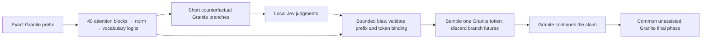

# Bounded logit guidance: mechanism works, quality admission remains closed

2026-09-21. Original `ibm-granite/granite-4.0-1b`, revision
`6a7381ba1f54d684ff508d991aeb7dc580157103`; hosted `jev-1.13.0` where scored.
Local Apple M1 Pro, MPS BF16, Torch 2.8.0, Transformers 4.57.1, Python 3.12.13.
The runtime/model metadata were captured during execution; the CPU/OS/Python
inventory in [integrity.json](integrity.json) was captured afterward.

**Result:** the implemented controller changes Granite's next-token distribution
at a precisely defined output-logit checkpoint, with unchanged weights and verified
no-op behavior. This does **not** establish better reasoning or answers. Critic
development exposed limited proposal diversity and grader coverage; its second
version was interrupted by a provider error. The held-out critic gate and the
large answer-quality study did not run. All eleven historical reports are unchanged.

## Development evidence

The [V1 protocol](../../research/local-claim-gate-protocol.md) and
[V2 revision](../../research/claim-forks-protocol.md) were frozen before their
respective runs. Sixty newly authored development rule worlds cover forward chains,
conjunctions, missing conditions, reversed implications, explicit negatives and
distractors. A separate 100-world gate exists but has no generated outcomes. The
oracle checks an entire canonical atomic assertion by forward closure; it does
not verify a written proof or arbitrary natural-language reasoning. Jev receives
evidence and candidate text only, never the oracle labels.

| Development observation | V1: three complete sampled proposals | V2: four property-boundary forks |
| --- | ---: | ---: |
| Worlds with proposal records | 60/60 | 60/60, including unpaid completion |
| Worlds reaching a property checkpoint | Not applicable | 56/60 (93.3%) |
| Raw proposals | 180 | 224; four worlds had no checkpoint |
| Independently graded full claims | 114/180 (63.3%) | 150/224 (67.0%) |
| Worlds with at least one graded correct claim | 39/60 | 54/60 |
| Fully graded mixed correct/incorrect sets | 2 scored sets | 8 proposal sets, mostly unscored |
| Completed live critic worlds | 60/60 | 6/60; only four needed a scorer call |

The columns describe different development proposal policies, not a paired quality
effect or a held-out improvement. V1 produced repeated equivalent candidates. Of
its 66 unassessed occurrences, 23 lacked a parsed body and 40 used the exact positive
“It is established that …” wrapper. The remaining three stayed unassessed. V2's
parser recognizes that exact wrapper; V1 was not regraded or overwritten.

Among V1's **59 unique graded/scored candidates**, all 17 false claims had Jev
support below 0.2 and all 42 true claims had support at least 0.8; descriptive Brier
score was 0.00107. This excludes unassessed text and contains correlated candidates.
It is evidence of useful discrimination on this narrow observed subset, not 59
independent trials, a general accuracy score, or a passed admission gate. On only
two mixed sets, Jev chose 2/2 correct versus likelihood 1/2; the difference interval
was [0, 1], too weak for admission. Seventeen high-scoring selected claims were
uncertified; that is not the same as 17 independently proven false claims.

V2 lets Granite generate a common prefix until it reaches a subject/copula boundary,
then takes four distinct high-probability next tokens and short greedy continuations.
Only the proposal policy/parser changed; the Jev rubric did not. Its seventh world
returned **HTTP 400** after one attempt, without a usage receipt. The client retained
the status but not the response body or provider request ID, so the underlying
provider reason and actual charge cannot be diagnosed from this record. No retry
or further paid request was sent. One maximum reservation remains charged.

The [local follow-up](../../research/local-followup-protocol.md) completed only the
53 never-attempted development proposal jobs without Jev; it did not replay any
successful or failed attempt. Its new offline oracle analysis includes the failed
call's already-generated candidates without changing the interrupted raw file.
Across all 60 worlds, 32 contain at least one graded correct and one graded incorrect
option, but only eight have completely graded mixed sets. Of 150 graded claims,
115 are statements that a fact is not established. This is a narrow, prompt-shaped
population, not evidence that multi-step deduction improved. The 67% grader coverage
is below the planned 80% tolerance even on development. Scorer calibration/ranking
on the remaining unscored worlds is unknown.

## Actual insertion and mechanical controls

The hook operates **after final normalization, the vocabulary head and Granite's
division of logits by eight, before token sampling**. None of the 40 attention
layers is modified. The hosted interface provides text judgments, not a tensor
mapping or gradients for a hidden-layer intervention.



The [real-checkpoint mechanism check](mechanism-v1/summary.json) replayed the four
successful pre-error Jev batches at their exact recorded prefixes. It made **zero
new provider calls**. Native, zero-bias, Jev, shuffled-score and synthetic-bias modes
each ran on all four prefixes. This is an inference check with received scores,
not fresh hosted end-to-end integration or an independent answer-quality trial.

- All four replayed native distributions matched their recorded root probabilities
  within the frozen 1e-7 tolerance. Scores were bound to the exact prefix and roots.
- Jev produced nonzero bias in all four cases; its maximum measured full-vocabulary
  `KL(q || p)` was 0.013683, below 0.02. Every absolute bias stayed at most 0.5.
  Unexamined vocabulary tokens remained available; no hard rejection forced a final.
- Native and zero-bias modes had identical committed roots, claim tokens and final
  tokens in all four worlds, despite intervening shadow generation. The full
  distributions were also identical after shadow work.
- Over 64 fixed root-sampling seeds per prefix, Jev changed 6/256 draws, shuffled
  scores 8/256, and the synthetic positive control 6/256; zero bias changed 0/256.
  These are repeated draws from four distributions, not 256 independent problems.
- Under the four prespecified continuation seeds, **all five modes chose the same
  root and generated the same continuation per world**. A probability change need
  not change a particular sample or its answer. Three native roots already had
  probability above 0.97, leaving limited scope for a small bounded adjustment.
- Full model state hashes before and after matched:
  `311c1141187580dc0905c810e9d9e78853a0bf37b865bd5a5a511f6eed72f8c9`.
  All 1,631,750,144 parameters remained frozen.
- All 20 final continuations came from Granite's returned token IDs; Jev did not
  score or select final labels. **Zero of 20 closed the requested final frame**:
  Granite emitted a label followed by EOS. This is a recorded final-format failure,
  not a completed-answer success. The mechanical `passed` field covers probability,
  isolation and token provenance; it does not certify final formatting or correctness.

The final phase uses a common separate prompt that treats the generated claim as
tentative, re-prefilling exact retained tokens plus a delimiter. It does not reuse
the proposal-only instruction as the final instruction. No final-answer accuracy
table is reported for these four exposed examples. A serving extension, asynchronous
multi-request scheduler, optimized shared KV cache and literal hidden-layer fusion
are not implemented by this reference prototype.

The assembled [live checkpoint function](../../research/experiments/live_logit_checkpoint.py)
also exists: it generates bounded branches, awaits a budgeted local-claim score,
checks prefix/model binding, and returns only the old prefix plus one sampled
Granite token. Six offline flow tests cover score-to-token integration, provider
failure, model-version drift, a missing budget, cancellation, and an unassessable
batch requiring no request. These tests do not turn the replay check into a fresh
hosted trial. The function is a research interface, not a released CLI or server.

## Work, spending and provenance

| Phase | Actual lookahead/generated tokens | Padded decode slots | Repeated prefill | Native prefix work | Successful Jev calls |
| --- | ---: | ---: | ---: | --- | ---: |
| V1 development | 2,080 | 2,283 | 43,875 | Included in full proposals | 60 |
| V2 interrupted | 59 | 59 | 4,807 | 43 sampled tokens; 11,891 prefill | 4 |
| V2 unpaid completion | 596 | 596 | 46,063 | 417 sampled tokens; 116,153 prefill | 0 |

V2 additionally has 224 forced root tokens and 516 native-prefix/checkpoint forward
calls across both phases. Forced roots are counterfactual actions from a shared
distribution, not 224 additional model forward passes. These counters are retained
separately to avoid overstating or hiding compute. V1 stage time was 167.6 s; V2's
interrupted stage 38.2 s and unpaid completion 334.0 s, excluding recorded loading
and warm-up. Mechanism per-mode tail/final counters are in [analysis.json](analysis.json);
shared shadow/checkpoint work is in its raw traces. These timings are not a
matched-compute performance comparison or a GPU-versus-MPS speedup estimate.

The new work made **64 successful Jev calls plus one failed attempt**, with 46,891
known input and 4,132 known output tokens. The failed attempt retains its 65,536
input-token maximum charge. At the ledger's conservative $0.05/million input rate,
new known-plus-reserved spend is at most **$0.005622** under that rate assumption.
Added to the prior corrected study/pilots' estimate, this is **about $3.30 of the
existing $50 authorization**, before tax/separate charges; it is not an invoice.
The ledger contains all 2,371 reservations, 2,370 settlements and one unsettled call.
No new cloud resource was launched; local electricity is unpriced. The earlier
temporary cloud resources had already been deleted.

All 65 dispatched payloads reconstructed exactly from evidence and model-generated
candidate text. No reference label or closure reached Jev. Original raw files and
copies match byte-for-byte; frozen manifest/source hashes match; all eleven older
report hashes remain unchanged. The public artifacts contain only newly authored
worlds, model outputs, typed responses and experiment metadata. The private shared
ledger is represented by its hash and reconciled counts, without credentials or
operational account files.

## Reproduce and interpret

Read the [study register](../../research/study-register.md),
[execution plan](../../docs/logit-guidance-execution.md), and frozen manifests:
[V1](../../research/protocols/local-claims-v1/manifest.json),
[V2](../../research/protocols/claim-forks-v2/manifest.json),
[unpaid completion](../../research/protocols/claim-forks-v2/completion.json),
[mechanism](../../research/protocols/claim-forks-v2/mechanism.json).
Each manifest identifies its pre-execution source commit and file hashes.

Offline aggregate reproduction from the repository root, using a new output path:

```bash
uv run --no-sync python research/analysis/logit_study.py \
  --input reports/2026-09-21-logit-guidance --output /tmp/logit-analysis.json
```

The runner rejects an existing output file rather than overwriting evidence.
[analysis.json](analysis.json) reproduces both saved live summaries and adds the
explicitly separate opportunity/mechanism counts. [integrity.json](integrity.json)
records copy/source checks, reconstructed requests, ledger counts and environment.
All raw attempts are linked in the phase folders, including the interrupted call.

The held-out critic gate remains **unexecuted**, not statistically failed or passed.
This version is not admitted to the larger quality study. The next scientific
requirements are independently gradable useful alternatives, a reconciled provider
failure, a reliable final-output contract, and a new prospective protocol. Reusing
these development findings as held-out evidence or changing the old test scores
would not meet those requirements. Broader arithmetic/causal contrast diagnostics,
relevance labeling, soft-step ablation and Gate C controls were not run after the
stop; they are not replaced by the narrow symbolic or mechanical results here.

## Software verification and review

`uv run --no-sync pytest -q`: **262 passed** locally with optional inference
dependencies present. Ruff lint, format (142 files), guidance checks (48 Markdown
files), package build and `git diff --check` passed. A separate research-link check
validated 57 local links across ten research/report Markdown files. The new
capability tests first failed on absent modules/functions; interrupted-branch
recording also failed before its record parameter was implemented. A regression
for HTTP 400 confirms one dispatch, retained maximum reservation and refusal of
the next paid dispatch. All tests use local doubles or small offline models.

The full PR scope against its actual stacked base and the new implementation,
data manifests, raw-output integrity and claims were reviewed locally. No submitted
review or review thread was present when checked. The automated Codex reviewer
reported exhausted review quota; its absence is not approval. This work remains
in PR #2, stacked on PR #1, without a merge, package/model release or paper submission.
