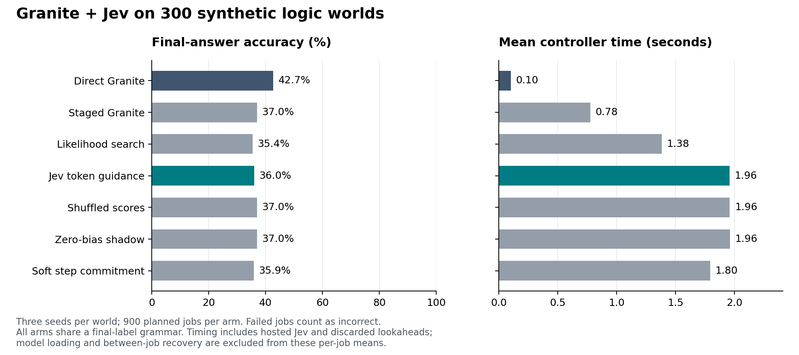
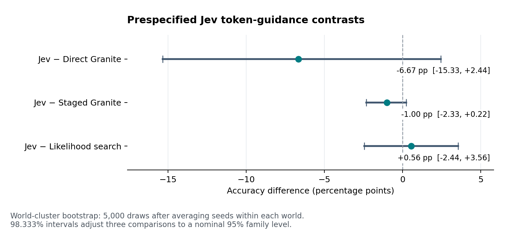

# R13: API recovery and controlled inference study

Status: **all 6,300 planned jobs attempted; 6,299 completed and one service failure
retained**. Direct Granite scores **42.67%**, bounded Jev guidance **36.00%**;
no primary comparison establishes a useful accuracy gain. Both GPU deployments
are deleted. Cumulative estimated spending is **$8.49 / $50**. These results use a
shared final-label grammar on 300 synthetic logic worlds, not unrestricted chat.
All failed pilots, the interrupted segment and original model weights are preserved.

## Completed planned test: no demonstrated accuracy gain

All 6,300 planned jobs were attempted across 300 authored worlds, three seeds and
seven arms. Exactly 6,299 completed; the original soft-step provider failure is
retained as incorrect. The continuation ran all 3,284 previously unstarted jobs
without another failure or cooldown. No started job was replayed. The combined
raw file is byte-for-byte the concatenation of the two preserved segments.

| Arm | Complete / planned | Correct / planned | Accuracy | Mean seconds / job |
| --- | ---: | ---: | ---: | ---: |
| Direct Granite | 900/900 | 384/900 | 42.67% | 0.103 |
| Staged Granite | 900/900 | 333/900 | 37.00% | 0.777 |
| Likelihood search | 900/900 | 319/900 | 35.44% | 1.384 |
| Jev token guidance | 900/900 | 324/900 | 36.00% | 1.961 |
| Shuffled scores | 900/900 | 333/900 | 37.00% | 1.962 |
| Zero-bias shadow | 900/900 | 333/900 | 37.00% | 1.963 |
| Soft-step commitment | 899/900 | 323/900 | 35.89% | 1.795 |

All arms share the same prompt and three-label final grammar. Direct Granite
means greedy generation among TRUE/FALSE/UNKNOWN, not unrestricted default chat.
Granite chooses every completed final label; Jev never supplies a final answer.
Native's repeated greedy answers do not create 900 independent worlds.

| Jev minus control | Difference (pp) | Adjusted interval (pp) |
| --- | ---: | ---: |
| Direct Granite | -6.67 | [-15.33, +2.44] |
| Staged Granite | -1.00 | [-2.33, +0.22] |
| Likelihood search | +0.56 | [-2.44, +3.56] |

Intervals use 5,000 world-cluster bootstrap draws, averaging the three seeds per
world. The 98.333% individual intervals adjust the three primary comparisons to
a nominal 95% family level. None excludes zero, and none meets the prespecified
useful-gain criterion (at least +5 percentage points with an interval above zero).
The direct comparison is a negative point estimate, not conclusive evidence of
harm across a wider population. Zero inclusion is also not proof of equivalence.





### What the controls and critic show

Adding two constrained sampled claims changed accuracy from 42.67% direct to
37.00% staged before Jev was added. Jev's incremental point difference versus that
matched staging control is −1.00 percentage point. Do not attribute the entire
6.67-point direct-to-Jev gap to Jev. Shuffled scores and zero bias both score
37.00%; zero bias reproduces all 900 staged token paths exactly.

Jev's local judgments are strong on this narrow distribution: among 1,179 mixed
candidate sets, its highest-support claim is independently supported in all
1,179, versus 874 (74.13%) for the highest-likelihood lookahead. Its 7,200 graded
scores have Brier score 0.00881; mean support is 0.9428 for true claims and 0.0346
for false claims. These correlated descriptive counts do not establish universal
critic reliability, and the controller samples from a bounded distribution rather
than always taking the highest Jev score.

Supported accepted claims rise from 1,059/1,800 (58.83%) staged to 1,114/1,800
(61.89%) with Jev, while final accuracy falls by nine answers. Jev changes 56/900
accepted paths and 24/900 final labels relative to staged: five incorrect answers
become correct and 14 correct answers become incorrect. This is evidence that
better local claim support did not translate into better final answers here,
not proof of a single causal explanation. [Paired counts](paired-paths.json) and
[all diagnostics](test/independent-analysis.json) expose those distinctions.

Only 236/7,200 Jev lookaheads have any remaining tail choice; only four selected
in-pool roots have such a choice. One of 1,772 selected in-pool lookaheads differs
from the subsequently accepted claim; 28 selections lie outside the scored pool,
as the bounded full-distribution policy permits. Thus tail mismatch is too rare
to explain a broad result by itself. The soft-step arm has identical final labels
to Jev in all 899 jointly completed pairs (898 accepted paths also match). Its
one-answer accuracy deficit is the retained provider failure. This comparison
cannot establish a better insertion point: most tails are forced, and the policies
also differ in commitment length and greedy versus sampled tail decoding.

The class trade-off is substantial and mostly precedes Jev:

| Reference class | Direct correct / 300 | Staged correct / 300 | Jev correct / 300 |
| --- | ---: | ---: | ---: |
| TRUE | 291 (97.00%) | 67 (22.33%) | 68 (22.67%) |
| FALSE | 69 (23.00%) | 113 (37.67%) | 102 (34.00%) |
| UNKNOWN | 24 (8.00%) | 153 (51.00%) | 154 (51.33%) |

UNKNOWN is available and generated. Staging greatly improves its recall while
severely reducing TRUE recall; Jev adds little to UNKNOWN performance. These
class diagnostics are exploratory and do not replace the primary comparisons.

### Integrity, actual work and resources

Independent reconstruction matches all 6,300 frozen prompts and all 6,299
completed final/intermediate token paths. All 35,996 lookahead claim grades and
10,798 accepted-claim grades are recomputed. Initial proposal pools match all
3,600 paired comparisons; all 900 staged/zero pairs match exactly. Model weights
are unchanged across both servers, with digest
`311c1141187580dc0905c810e9d9e78853a0bf37b865bd5a5a511f6eed72f8c9`.
The original full-run all-complete/provenance gates remain false because one job
has no final answer; this is not a claim that every planned job passed those gates.
See [integrity](integrity.json), [original source metadata](stopped-v2/metadata.json),
[continuation metadata](continuation/metadata.json) and [completion](continuation/completion.json).

The main test received 7,198 successful Jev responses (10,298,802 input / 1,122,888
reported output tokens), plus one failed request without a usage receipt. The
successful main receipts cost $0.43255 at the recorded input list price. Jev's
900-job arm spends 500.80 seconds in API calls, about 0.556 seconds/job, within its
1.961-second mean total. Its remaining time includes extra model work: 43,279
reasoning forwards and 12,856,257 reasoning prefill tokens, versus no intermediate
forwards in the direct arm and 21,446 in staged. Final work is 3,600 tokens/forwards
in each fully completed arm. The soft-step arm uses 37,937 reasoning forwards;
equal configured limits are not equal actual computation.

The two main execution segments total 8,980.74 seconds (2.495 hours), excluding
loading and the gap between deployments. Each used one L40S, eight Intel Xeon Gold
6338 vCPUs, 32 GiB RAM, driver 580.173.02, Python 3.12.13, Torch 2.8.0+cu128 and
Transformers 4.57.1. Both stored 80 GiB managed SSDs. Inference recomputes accepted
prefixes; these timings are not optimized vLLM throughput or measured colocation
performance. [Resource accounting](resources.json) includes each arm's actual work.

New R13 infrastructure is estimated at $4.73885. All R13 successful API receipts,
including three diagnostics and both pilots, add $0.45539; the new unknown request
retains a $0.00328 maximum allowance. With the prior $3.2913 allowance, cumulative
estimated spending is **$8.49 of the authorized $50**, before taxes and separately
billed network charges, not a provider invoice. The two historical unknown calls
remain maximum-charged, never relabeled as actual receipts. Both VMs, managed
disks, task security rules/groups and ephemeral IP allocations are deleted and
absence verified after 19 and 21 remote result files matched their local backups.
See [cost assumptions and timestamps](cost.json).

### Public evidence and reproduction

[Combined raw attempts](test/runs.jsonl.gz), [all start records](test/job-starts.jsonl.gz),
[remote combined summary](test/summary.json), [independent analysis](test/independent-analysis.json),
[continuation-only attempts](continuation/runs.jsonl.gz), [continuation start records](continuation/job-starts.jsonl.gz),
[empty continuation incident log](continuation/incidents.jsonl.gz), and
[artifact hashes](artifact-hashes.json) retain every planned outcome. The original
stopped summary and both pilots below are unchanged. The protocols freeze original
source `97fc05c` and continuation `34ef382`; only successful-policy-neutral error
diagnostics and the registered scheduling/recovery wrapper changed between segments.

To reproduce the offline audit after extracting the combined raw file:

```bash
gzip -dc reports/2026-09-21-structured-study/test/runs.jsonl.gz > /tmp/r13-combined-runs.jsonl
uv run --no-sync python experiments/analyze_structured_study.py \
  --manifest research/protocols/structured-v2 \
  --runs /tmp/r13-combined-runs.jsonl --split test \
  --output /tmp/r13-independent-analysis.json
```

The pinned tokenizer must already be cached; this command performs no inference
or Jev calls and requires a fresh output path. Figures are exported as PNG, SVG
and PDF, with [renderer/data/library provenance](figures/provenance.json). The
actual PNGs were visually inspected against the numeric table; labels and error
bars are readable. Local validation: 308 tests, Ruff lint/format, AI-docs checker
and package build pass; the frozen continuation passed its then-current 306 tests
on the GPU. Automated code review remains unavailable because of its quota limit.

This is a transparent negative result for one constrained inference policy on
300 authored rule worlds. It establishes neither general reasoning improvement
nor an optimal hidden-layer insertion point, and does not create a trained or
modified model checkpoint.

## API recovery

Both frozen diagnostic requests succeeded with Jev 1.13.0: fresh authentication
and the exact previously failing request shape. Total 1,910 input tokens. This
verifies current access, not the unrecoverable cause of R12's HTTP 400. The old
unknown request is still actual-usage unknown and carried at its full reserved
65,536-token charge. Error handling now retains bounded, credential-redacted
response diagnostics. See the [recovery manifest](../../research/protocols/recovery-v1/api.json).

## V1 GPU pilot: failed operational admission

Source `4daa94e`, manifest/data freeze `98628a6`, original model revision
`6a7381ba1f54d684ff508d991aeb7dc580157103`. One NVIDIA L40S, BF16,
Torch 2.8.0 / Transformers 4.57.1 / Python 3.12.13. All 291 offline tests also
passed on that server. Its Jev key was copied privately with mode 600 and never
logged. The following 192 authenticated calls verify that the server used it.

| Arm | Complete | Valid final format | Independently correct |
| --- | ---: | ---: | ---: |
| Direct native | 24 | 23 | 9 |
| Staged native | 24 | 16 | 5 |
| Likelihood | 24 | 18 | 5 |
| Jev token | 24 | 16 | 5 |
| Shuffled | 24 | 16 | 5 |
| Zero bias | 24 | 16 | 5 |
| Soft step | 24 | 16 | 5 |

All 168 jobs ran in 243.53 seconds excluding model loading/warm-up. No provider or
backend errors occurred; 270,264 input / 29,952 output tokens were received from
192 Jev calls, $0.011351088 input list price. All 960 branch claims were graded,
all 240 possible checkpoints were reached, and all 168 token/prompt audits passed.
An independent local token reconstruction also certified 168/168. Staged/zero
token paths matched 24/24, and the weight digest before/after was
`311c1141187580dc0905c810e9d9e78853a0bf37b865bd5a5a511f6eed72f8c9`.

The format gate failed: 121/168 valid final responses. Granite sometimes generated
an empty EOS or an explanation rather than the requested label. The study correctly
stopped before test admission. These development accuracy figures do not establish
a benefit or a population comparison; the invalid answers remain incorrect.

The [V1 protocol](../../research/structured-study-protocol.md),
[V1 manifest](../../research/protocols/structured-v1/manifest.json),
[raw compressed attempts](pilot-v1/runs.jsonl.gz), [summary](pilot-v1/summary.json),
[independent analysis](pilot-v1/independent-analysis.json), and
[artifact hashes](artifact-hashes.json) preserve this attempt. All fixtures are
authored rule worlds; no claim of general math improvement is supported.

## V2 GPU pilot: passed operational admission

Source `b6ca4cb`, freeze `97fc05c`. The same development worlds were rerun after the
prospectively recorded [shared final-label grammar change](../../research/structured-study-v2-protocol.md).
Test data hashes are unchanged and no test outcome informed that correction.
All 295 offline tests passed locally and on the GPU server before V2 inference.

All 168 jobs completed with valid Granite-generated labels; 960/960 candidate
claims were independently gradable, 240/240 checkpoints were reached, 168/168
online token/prompt audits passed, and staged/zero paths matched 24/24 pairs.
Independent local token reconstruction also passed 168/168, including the final
constrained token loop; initial proposal pools matched all 96 paired comparisons.
Formatting is enforced by the shared grammar and is not learned instruction-following.

Pilot accuracy was 11/24 direct Granite, 8/24 staged, 7/24 likelihood and 8/24 in
each Jev/shuffled/zero/soft-step arm. This development pilot demonstrates operational
readiness, not an accuracy gain. In the Jev arm's 36 mixed-quality candidate sets,
Jev's highest-support proposal was independently correct in 36, versus 27 for
highest likelihood. This descriptive critic ranking is distinct from the bounded
stochastic token policy and its final-answer quality.

Elapsed pilot time was 244.39 seconds excluding loading/warm-up. All 192 Jev calls
succeeded: 270,264 input / 29,952 output tokens ($0.011351088 input list price).
The original cumulative ledger remains in use. The measured runtime plus the
prespecified margin admitted the full 6,300-job, 300-world, three-seed test.
No test outcome will change its method or trigger accuracy-based early stopping.

[Raw attempts](pilot-v2/runs.jsonl.gz), [summary](pilot-v2/summary.json),
[independent analysis](pilot-v2/independent-analysis.json),
[manifest](../../research/protocols/structured-v2/manifest.json).

The [figure renderer](../../experiments/plot_structured_study.py) now exports the
completed independent summary as PNG, SVG and PDF with source/data hashes and
plotting-library versions. The final figures above contain all 6,300 outcomes and
passed visual/table verification; no invented preview data was used.

During main execution, the offline auditor was strengthened to bind each recorded
question, evidence, system instruction and exact chat-template prompt tokens to
the frozen case. The new regression first failed because that independent check
was absent, then passed while rejecting altered inputs under an unchanged case ID.
All 168 V2 pilot prompts also passed this additional reconstruction. This changes
offline verification only; the frozen GPU inference code and protocol are unchanged.

## V2 service interruption and registered continuation

The original test stopped at attempt 3,016. Its last soft-step request followed
the HTTP 429/529 exhaustion branch, which lost the exact status/body and wrongly
labeled usage known. The ledger nevertheless retained the full 65,536-token
reservation. That client diagnostic defect is now regression-tested and fixed;
the lost status is not recoverable. All 19 remote result files matched the local
backup, and the first VM, disk and task network resources were deleted. Granite
weights remained unchanged. [All stopped attempts](stopped-v2/runs.jsonl.gz),
[stopped summary](stopped-v2/summary.json) and [completion record](stopped-v2/completion.json)
are preserved, including the original error fields.

The [prospective continuation](../../research/structured-study-continuation.md)
excludes every started key, preserves the 6,300-job denominator, and changes only
operational recovery and error diagnostics. Successful inference policy is fixed.
The unknown request was carried at its full maximum under the existing owner
authorization; it was not replayed or settled at zero. One [new service probe](continuation-api-recovery.json)
succeeded. The replacement L40S completed exactly the 3,284 remaining jobs, with
no further failure or cooldown. The registered policy allowed at most three bounded
cooldowns after explicit rate-limit/overload failures, retaining each failed job;
other service/backend failures would stop it. The original $50 cumulative allowance
was not reset.

Additional offline descriptive diagnostics count lookaheads whose tails still
permit a semantic choice, selections outside the scored root pool, and differences
between a scored greedy lookahead and the claim actually accepted after root-only
guidance. These are exploratory mechanism diagnostics, not new primary tests.
Their regression first exposed the missing counters, then verified that differing
accepted text is not counted as the scored claim. No live inference code changed.
