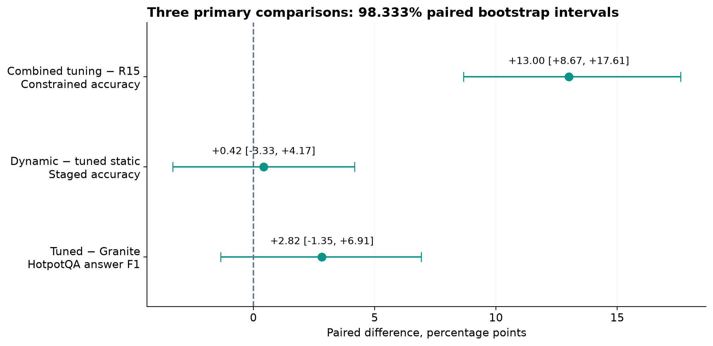
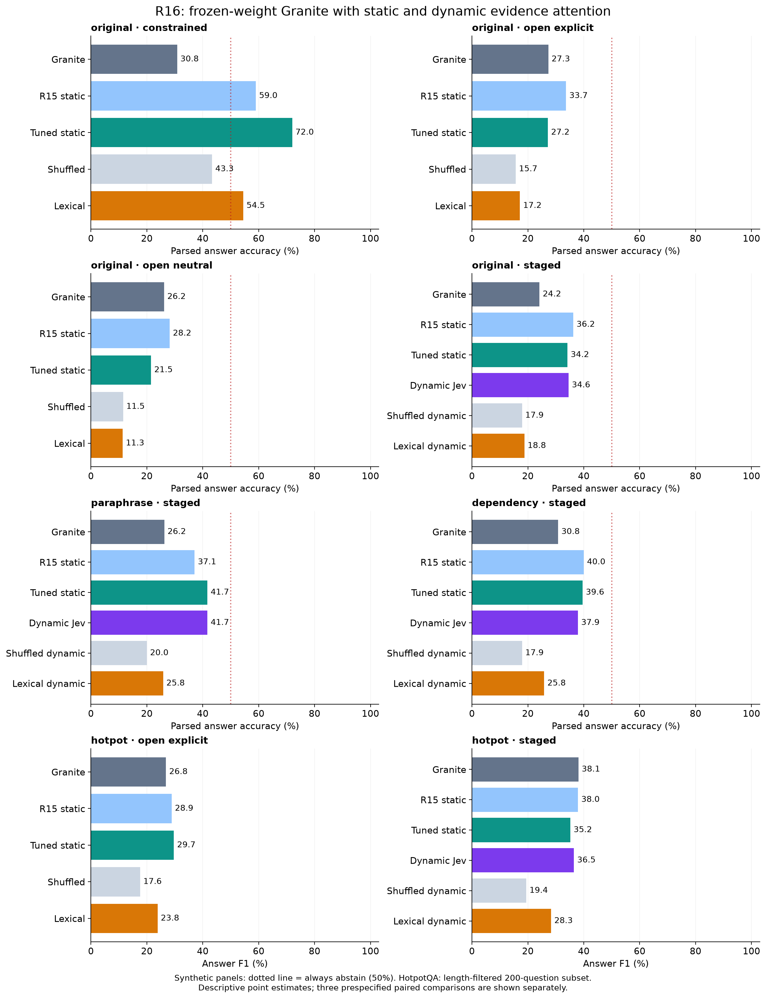
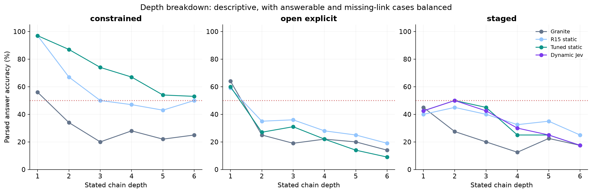
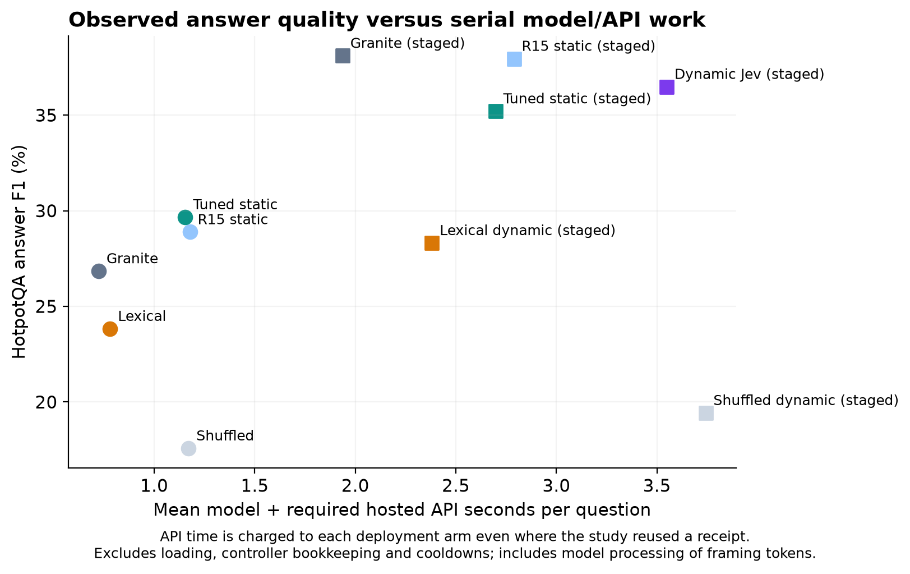

# R16: adaptive source attention and unrestricted answers

Completed controlled study of frozen-weight Granite 4.0 1B with hosted Jev relevance judgments. No training, checkpoint release or final-answer substitution was used. All arms use greedy decoding in FP32. All 16,120 planned main test outcomes and 3,600 exploratory factorial outcomes are retained.

**Result: a further gain on constrained authored QA, but no established general improvement in unrestricted generation.** Tuned attention scores **72.00%**, versus **59.00%** for matched R15 and **30.83%** for native Granite. The primary tuned-minus-R15 interval is wholly positive. On direct free text, tuned accuracy is **27.17% versus 33.67% R15** with explicit uncertainty, and **21.50% versus 28.17% R15** without that instruction. Both tuned-minus-R15 exploratory intervals are negative. Dynamic refresh and direct HotpotQA transfer remain inconclusive on their primary comparisons.

The factorial control identifies **stronger attention bias** as the clearest contributor to the constrained gain: its averaged effect is **+12.38 pp [9.50,15.33]**. Disabling steering on one head and changing the relevance threshold have intervals crossing zero. Their benefits, and any need for different strengths on different heads, are unestablished. The slightly higher 72.33% factorial corner is an exposed diagnostic result, not a newly selected policy.

Removing the required UNKNOWN token worked mechanically: all 28 recognized tuned abstentions in the open-explicit panel used longer natural wording, with zero bare UNKNOWN answers. However, these cover only **28/300 missing-evidence cases (9.33%)**, versus 269/300 (89.67%) under constrained generation. The contracts differ in prompting and computation as well as vocabulary, so this is not an isolated causal estimate of the UNKNOWN token. Tuned free-text parser coverage is only 224/600 (37.33%); [post-hoc examples](free-text-failures.md) show source citations and intermediate facts replacing requested answers, including outputs that ended naturally before the token cap.

## Three primary questions

Each question has its own conclusion; success does not require beating every exploratory control. Individual 98.333% paired world-bootstrap intervals provide nominal 95% family coverage for the three prespecified comparisons. This is finite-sample evidence, not proof of universal improvement.

| Question | Difference and adjusted interval (pp) | Conclusion |
| --- | ---: | --- |
| Does the combined tuned policy improve on R15? | +13.00 [+8.67, +17.61] | positive |
| Does refreshed Jev guidance improve on tuned static guidance? | +0.42 [-3.33, +4.17] | inconclusive at the stated interval level |
| Does tuned static guidance transfer to HotpotQA answer F1? | +2.82 [-1.35, +6.91] | inconclusive at the stated interval level |

## What changed

Development selected eleven steered query heads at additive strength 5 and strict Jev relevance >0.65; steering on zero-based head (layer 21, head 13) was disabled; the head itself still computes normal Granite attention. The other eleven strengths are uniform: the selected vector is not evidence that distinct per-head strengths are necessary. R15 uses all twelve candidate heads at ln(16), relevance >0.5. Both policies are rerun in FP32 on the same new cases.

Jev changes source-key attention logits inside selected Granite heads. Static guidance scores the original question and evidence once. Dynamic guidance can refresh those scores after each of the first two Granite-generated reasoning chunks. Granite produces every semantic output token; Jev never selects the final answer. Previously cached representations are not retroactively recomputed.

Open explicit and open neutral outputs use the full vocabulary, no colour answer list and no required UNKNOWN token. The explicit prompt permits natural statements of insufficient evidence; the neutral prompt has no special uncertainty instruction. An offline parser maps recognized abstentions to the reference category solely for grading. Staged output reserves up to three 24-token reasoning chunks and 32 final tokens. Resource limits and controller framing remain.

[Related-method comparison](../../research/adaptive-attention-related-work.md) · [Frozen method and architecture](method.md) · [Original protocol](../../research/adaptive-attention-protocol.md) · [FP32 amendment](../../research/adaptive-attention-fp32-amendment.md) · [Factorial supplement](../../research/adaptive-attention-factorial.md)

## Complete quality results

Synthetic accuracy is conservative parsed-answer accuracy. EM is strict normalized whole-answer exact match. HotpotQA F1 is the official normalized answer-token overlap metric, not general reasoning accuracy. Failed or interrupted outcomes score zero and remain in the denominator.

### original/constrained

| Arm | Cases | Complete | Accuracy / EM (%) | Strict EM (%) | Answer F1 (%) | Parser coverage (%) |
| --- | ---: | ---: | ---: | ---: | ---: | ---: |
| Granite | 600 | 600 | 30.83 | 30.83 | 30.83 | 100.00 |
| R15 static | 600 | 600 | 59.00 | 59.00 | 59.00 | 100.00 |
| Tuned static | 600 | 600 | 72.00 | 72.00 | 72.00 | 100.00 |
| Shuffled | 600 | 600 | 43.33 | 43.33 | 43.33 | 100.00 |
| Lexical | 600 | 600 | 54.50 | 54.50 | 54.50 | 100.00 |
| Zero bias | 600 | 600 | 30.83 | 30.83 | 30.83 | 100.00 |

Paired Tuned static minus each control; **primary** rows use 98.333% intervals, all other rows are exploratory 95% intervals.

| Control | Difference and interval (pp) | Status |
| --- | ---: | --- |
| Lexical | +17.50 [+13.33, +21.67] | Exploratory |
| Granite | +41.17 [+36.50, +45.83] | Exploratory |
| R15 static | +13.00 [+8.67, +17.61] | **Primary** |
| Shuffled | +28.67 [+24.00, +33.17] | Exploratory |
| Zero bias | +41.17 [+36.50, +45.83] | Exploratory |

### original/open_explicit

| Arm | Cases | Complete | Accuracy / EM (%) | Strict EM (%) | Answer F1 (%) | Parser coverage (%) |
| --- | ---: | ---: | ---: | ---: | ---: | ---: |
| Granite | 600 | 600 | 27.33 | 0.00 | 6.78 | 77.00 |
| R15 static | 600 | 600 | 33.67 | 0.00 | 8.54 | 59.17 |
| Tuned static | 600 | 600 | 27.17 | 0.00 | 6.39 | 37.33 |
| Shuffled | 600 | 600 | 15.67 | 0.00 | 2.83 | 53.50 |
| Lexical | 600 | 600 | 17.17 | 0.00 | 3.07 | 39.50 |

Paired Tuned static minus each control; **primary** rows use 98.333% intervals, all other rows are exploratory 95% intervals.

| Control | Difference and interval (pp) | Status |
| --- | ---: | --- |
| Lexical | +10.00 [+7.00, +13.17] | Exploratory |
| Granite | -0.17 [-3.67, +3.33] | Exploratory |
| R15 static | -6.50 [-9.33, -3.67] | Exploratory |
| Shuffled | +11.50 [+7.83, +15.17] | Exploratory |

### original/open_neutral

| Arm | Cases | Complete | Accuracy / EM (%) | Strict EM (%) | Answer F1 (%) | Parser coverage (%) |
| --- | ---: | ---: | ---: | ---: | ---: | ---: |
| Granite | 600 | 600 | 26.17 | 0.00 | 5.92 | 81.67 |
| R15 static | 600 | 600 | 28.17 | 0.00 | 6.61 | 54.50 |
| Tuned static | 600 | 600 | 21.50 | 0.00 | 4.78 | 33.67 |
| Shuffled | 600 | 600 | 11.50 | 0.00 | 2.08 | 47.83 |
| Lexical | 600 | 600 | 11.33 | 0.00 | 2.40 | 31.67 |

Paired Tuned static minus each control; **primary** rows use 98.333% intervals, all other rows are exploratory 95% intervals.

| Control | Difference and interval (pp) | Status |
| --- | ---: | --- |
| Lexical | +10.17 [+7.33, +13.00] | Exploratory |
| Granite | -4.67 [-8.17, -1.17] | Exploratory |
| R15 static | -6.67 [-9.33, -4.00] | Exploratory |
| Shuffled | +10.00 [+6.67, +13.50] | Exploratory |

### original/staged

| Arm | Cases | Complete | Accuracy / EM (%) | Strict EM (%) | Answer F1 (%) | Parser coverage (%) |
| --- | ---: | ---: | ---: | ---: | ---: | ---: |
| Granite | 240 | 240 | 24.17 | 0.00 | 8.16 | 68.75 |
| R15 static | 240 | 240 | 36.25 | 0.42 | 11.69 | 69.17 |
| Tuned static | 240 | 240 | 34.17 | 1.67 | 10.76 | 52.08 |
| Dynamic Jev | 240 | 239 | 34.58 | 1.67 | 10.90 | 52.08 |
| Shuffled dynamic | 240 | 240 | 17.92 | 0.42 | 4.83 | 59.17 |
| Lexical dynamic | 240 | 240 | 18.75 | 1.67 | 7.17 | 45.83 |

Paired Dynamic Jev minus each control; **primary** rows use 98.333% intervals, all other rows are exploratory 95% intervals.

| Control | Difference and interval (pp) | Status |
| --- | ---: | --- |
| Lexical dynamic | +15.83 [+10.00, +22.08] | Exploratory |
| Granite | +10.42 [+4.58, +16.67] | Exploratory |
| R15 static | -1.67 [-6.67, +3.33] | Exploratory |
| Shuffled dynamic | +16.67 [+10.42, +23.33] | Exploratory |
| Tuned static | +0.42 [-3.33, +4.17] | **Primary** |

### paraphrase/staged

| Arm | Cases | Complete | Accuracy / EM (%) | Strict EM (%) | Answer F1 (%) | Parser coverage (%) |
| --- | ---: | ---: | ---: | ---: | ---: | ---: |
| Granite | 240 | 240 | 26.25 | 0.83 | 6.46 | 72.92 |
| R15 static | 240 | 240 | 37.08 | 1.67 | 10.42 | 74.17 |
| Tuned static | 240 | 240 | 41.67 | 0.00 | 11.10 | 66.25 |
| Dynamic Jev | 240 | 240 | 41.67 | 0.00 | 10.04 | 62.50 |
| Shuffled dynamic | 240 | 240 | 20.00 | 0.42 | 5.68 | 71.67 |
| Lexical dynamic | 240 | 240 | 25.83 | 0.42 | 6.27 | 49.17 |

Paired Dynamic Jev minus each control; **primary** rows use 98.333% intervals, all other rows are exploratory 95% intervals.

| Control | Difference and interval (pp) | Status |
| --- | ---: | --- |
| Lexical dynamic | +15.83 [+10.00, +21.67] | Exploratory |
| Granite | +15.42 [+9.17, +21.67] | Exploratory |
| R15 static | +4.58 [+0.00, +9.17] | Exploratory |
| Shuffled dynamic | +21.67 [+15.00, +28.33] | Exploratory |
| Tuned static | +0.00 [-2.50, +2.50] | Exploratory |

### dependency/staged

| Arm | Cases | Complete | Accuracy / EM (%) | Strict EM (%) | Answer F1 (%) | Parser coverage (%) |
| --- | ---: | ---: | ---: | ---: | ---: | ---: |
| Granite | 240 | 240 | 30.83 | 5.42 | 12.91 | 62.50 |
| R15 static | 240 | 240 | 40.00 | 5.42 | 18.04 | 73.33 |
| Tuned static | 240 | 240 | 39.58 | 4.58 | 17.90 | 64.17 |
| Dynamic Jev | 240 | 240 | 37.92 | 4.58 | 17.07 | 56.67 |
| Shuffled dynamic | 240 | 240 | 17.92 | 0.42 | 6.49 | 70.00 |
| Lexical dynamic | 240 | 240 | 25.83 | 5.42 | 12.87 | 42.50 |

Paired Dynamic Jev minus each control; **primary** rows use 98.333% intervals, all other rows are exploratory 95% intervals.

| Control | Difference and interval (pp) | Status |
| --- | ---: | --- |
| Lexical dynamic | +12.08 [+6.25, +18.33] | Exploratory |
| Granite | +7.08 [+0.42, +13.33] | Exploratory |
| R15 static | -2.08 [-6.67, +2.50] | Exploratory |
| Shuffled dynamic | +20.00 [+13.33, +27.08] | Exploratory |
| Tuned static | -1.67 [-5.42, +1.67] | Exploratory |

### hotpot/open_explicit

| Arm | Cases | Complete | Accuracy / EM (%) | Strict EM (%) | Answer F1 (%) | Parser coverage (%) |
| --- | ---: | ---: | ---: | ---: | ---: | ---: |
| Granite | 200 | 200 | 11.00 | 11.00 | 26.85 | — |
| R15 static | 200 | 200 | 13.00 | 13.00 | 28.89 | — |
| Tuned static | 200 | 200 | 13.00 | 13.00 | 29.67 | — |
| Shuffled | 200 | 200 | 6.00 | 6.00 | 17.58 | — |
| Lexical | 200 | 200 | 10.00 | 10.00 | 23.83 | — |

Paired Tuned static minus each control; **primary** rows use 98.333% intervals, all other rows are exploratory 95% intervals.

| Control | Difference and interval (pp) | Status |
| --- | ---: | --- |
| Lexical | +5.84 [+2.54, +9.27] | Exploratory |
| Granite | +2.82 [-1.35, +6.91] | **Primary** |
| R15 static | +0.78 [-1.60, +3.06] | Exploratory |
| Shuffled | +12.09 [+7.73, +16.78] | Exploratory |

### hotpot/staged

| Arm | Cases | Complete | Accuracy / EM (%) | Strict EM (%) | Answer F1 (%) | Parser coverage (%) |
| --- | ---: | ---: | ---: | ---: | ---: | ---: |
| Granite | 200 | 200 | 21.50 | 21.50 | 38.11 | — |
| R15 static | 200 | 200 | 20.00 | 20.00 | 37.96 | — |
| Tuned static | 200 | 200 | 20.00 | 20.00 | 35.21 | — |
| Dynamic Jev | 200 | 200 | 20.00 | 20.00 | 36.49 | — |
| Shuffled dynamic | 200 | 200 | 10.00 | 10.00 | 19.43 | — |
| Lexical dynamic | 200 | 200 | 13.00 | 13.00 | 28.32 | — |

Paired Dynamic Jev minus each control; **primary** rows use 98.333% intervals, all other rows are exploratory 95% intervals.

| Control | Difference and interval (pp) | Status |
| --- | ---: | --- |
| Lexical dynamic | +8.17 [+3.05, +13.40] | Exploratory |
| Granite | -1.62 [-7.29, +4.04] | Exploratory |
| R15 static | -1.47 [-6.30, +3.41] | Exploratory |
| Shuffled dynamic | +17.06 [+11.25, +23.03] | Exploratory |
| Tuned static | +1.28 [-1.06, +3.72] | Exploratory |

## Answerable versus missing evidence

Every synthetic panel has half answerable and half missing-link cases. Always abstaining scores 50% overall, 0% answerable and 100% missing. This reference is a descriptive comparator; it does not require the model to emit a fixed abstention token.

| Panel | Arm | Answerable (%) | Missing-link (%) |
| --- | --- | ---: | ---: |
| original/constrained | Lexical | 18.00 | 91.00 |
| original/constrained | Granite | 10.00 | 51.67 |
| original/constrained | R15 static | 41.67 | 76.33 |
| original/constrained | Shuffled | 19.00 | 67.67 |
| original/constrained | Tuned static | 54.33 | 89.67 |
| original/constrained | Zero bias | 10.00 | 51.67 |
| original/open_explicit | Lexical | 25.00 | 9.33 |
| original/open_explicit | Granite | 45.33 | 9.33 |
| original/open_explicit | R15 static | 58.00 | 9.33 |
| original/open_explicit | Shuffled | 22.00 | 9.33 |
| original/open_explicit | Tuned static | 45.00 | 9.33 |
| original/open_neutral | Lexical | 20.00 | 2.67 |
| original/open_neutral | Granite | 49.67 | 2.67 |
| original/open_neutral | R15 static | 54.00 | 2.33 |
| original/open_neutral | Shuffled | 20.33 | 2.67 |
| original/open_neutral | Tuned static | 40.33 | 2.67 |
| original/staged | Dynamic Jev | 66.67 | 2.50 |
| original/staged | Lexical dynamic | 36.67 | 0.83 |
| original/staged | Granite | 45.00 | 3.33 |
| original/staged | R15 static | 69.17 | 3.33 |
| original/staged | Shuffled dynamic | 33.33 | 2.50 |
| original/staged | Tuned static | 65.83 | 2.50 |
| paraphrase/staged | Dynamic Jev | 79.17 | 4.17 |
| paraphrase/staged | Lexical dynamic | 47.50 | 4.17 |
| paraphrase/staged | Granite | 46.67 | 5.83 |
| paraphrase/staged | R15 static | 71.67 | 2.50 |
| paraphrase/staged | Shuffled dynamic | 36.67 | 3.33 |
| paraphrase/staged | Tuned static | 80.00 | 3.33 |
| dependency/staged | Dynamic Jev | 74.17 | 1.67 |
| dependency/staged | Lexical dynamic | 48.33 | 3.33 |
| dependency/staged | Granite | 57.50 | 4.17 |
| dependency/staged | R15 static | 78.33 | 1.67 |
| dependency/staged | Shuffled dynamic | 34.17 | 1.67 |
| dependency/staged | Tuned static | 77.50 | 1.67 |

Depth-specific values are in the machine-readable analysis. Depth 1–6 cases are balanced; paired light/heavy contexts are clustered by world.

## What unrestricted uncertainty looked like

These descriptive counts use the original parser on the audited text. “Bare UNKNOWN” means only that word (case-insensitive, optional final punctuation); “Other abstention” means any other parser-recognized abstention, including longer phrases containing “unknown”. Correct and wrong columns classify all recognized abstentions. Unparsed language is retained as unparsed, not repaired. These surface-form counts are not human semantic annotations.

| Panel | Arm | Bare UNKNOWN | Other abstention | Correct abstention | Abstention on answerable case | Unparsed complete answer |
| --- | --- | ---: | ---: | ---: | ---: | ---: |
| original/open_explicit | Lexical | 0 | 28 | 28 | 0 | 363 |
| original/open_explicit | Granite | 0 | 29 | 28 | 1 | 138 |
| original/open_explicit | R15 static | 0 | 30 | 28 | 2 | 245 |
| original/open_explicit | Shuffled | 0 | 30 | 28 | 2 | 279 |
| original/open_explicit | Tuned static | 0 | 28 | 28 | 0 | 376 |
| original/open_neutral | Lexical | 0 | 8 | 8 | 0 | 410 |
| original/open_neutral | Granite | 0 | 8 | 8 | 0 | 110 |
| original/open_neutral | R15 static | 0 | 7 | 7 | 0 | 273 |
| original/open_neutral | Shuffled | 0 | 8 | 8 | 0 | 313 |
| original/open_neutral | Tuned static | 0 | 9 | 8 | 1 | 398 |
| original/staged | Dynamic Jev | 0 | 3 | 3 | 0 | 114 |
| original/staged | Lexical dynamic | 0 | 1 | 1 | 0 | 130 |
| original/staged | Granite | 0 | 5 | 4 | 1 | 75 |
| original/staged | R15 static | 0 | 4 | 4 | 0 | 74 |
| original/staged | Shuffled dynamic | 0 | 3 | 3 | 0 | 98 |
| original/staged | Tuned static | 0 | 3 | 3 | 0 | 115 |
| paraphrase/staged | Dynamic Jev | 0 | 5 | 5 | 0 | 90 |
| paraphrase/staged | Lexical dynamic | 0 | 5 | 5 | 0 | 122 |
| paraphrase/staged | Granite | 0 | 7 | 7 | 0 | 65 |
| paraphrase/staged | R15 static | 0 | 3 | 3 | 0 | 62 |
| paraphrase/staged | Shuffled dynamic | 0 | 4 | 4 | 0 | 68 |
| paraphrase/staged | Tuned static | 0 | 4 | 4 | 0 | 81 |
| dependency/staged | Dynamic Jev | 0 | 2 | 2 | 0 | 104 |
| dependency/staged | Lexical dynamic | 0 | 4 | 4 | 0 | 138 |
| dependency/staged | Granite | 0 | 5 | 5 | 0 | 90 |
| dependency/staged | R15 static | 0 | 2 | 2 | 0 | 64 |
| dependency/staged | Shuffled dynamic | 0 | 2 | 2 | 0 | 72 |
| dependency/staged | Tuned static | 0 | 2 | 2 | 0 | 86 |

## Remaining generation limits

Every open final has a 32-token ceiling. Reaching it means the budget was used, not necessarily that the answer is incomplete or wrong; such answers are graded unchanged. The constrained one-token label also reaches its ceiling by design and is omitted here. Reasoning EOS/newline/budget endings are available in [the descriptive JSON](output-diagnostics.json).

| Panel | Arm | Planned | Final EOS endings | Final token-limit endings | Correct at final token limit |
| --- | --- | ---: | ---: | ---: | ---: |
| original/open_explicit | Lexical | 600 | 521 | 79 | 3 |
| original/open_explicit | Granite | 600 | 560 | 40 | 6 |
| original/open_explicit | R15 static | 600 | 539 | 61 | 13 |
| original/open_explicit | Shuffled | 600 | 486 | 114 | 10 |
| original/open_explicit | Tuned static | 600 | 537 | 63 | 8 |
| original/open_neutral | Lexical | 600 | 504 | 96 | 6 |
| original/open_neutral | Granite | 600 | 538 | 62 | 8 |
| original/open_neutral | R15 static | 600 | 507 | 93 | 27 |
| original/open_neutral | Shuffled | 600 | 424 | 176 | 22 |
| original/open_neutral | Tuned static | 600 | 492 | 108 | 16 |
| original/staged | Dynamic Jev | 240 | 227 | 12 | 9 |
| original/staged | Lexical dynamic | 240 | 239 | 1 | 0 |
| original/staged | Granite | 240 | 240 | 0 | 0 |
| original/staged | R15 static | 240 | 232 | 8 | 5 |
| original/staged | Shuffled dynamic | 240 | 215 | 25 | 5 |
| original/staged | Tuned static | 240 | 229 | 11 | 8 |
| paraphrase/staged | Dynamic Jev | 240 | 207 | 33 | 3 |
| paraphrase/staged | Lexical dynamic | 240 | 211 | 29 | 2 |
| paraphrase/staged | Granite | 240 | 240 | 0 | 0 |
| paraphrase/staged | R15 static | 240 | 231 | 9 | 1 |
| paraphrase/staged | Shuffled dynamic | 240 | 199 | 41 | 6 |
| paraphrase/staged | Tuned static | 240 | 214 | 26 | 1 |
| dependency/staged | Dynamic Jev | 240 | 227 | 13 | 1 |
| dependency/staged | Lexical dynamic | 240 | 232 | 8 | 0 |
| dependency/staged | Granite | 240 | 240 | 0 | 0 |
| dependency/staged | R15 static | 240 | 240 | 0 | 0 |
| dependency/staged | Shuffled dynamic | 240 | 229 | 11 | 0 |
| dependency/staged | Tuned static | 240 | 229 | 11 | 0 |
| hotpot/open_explicit | Lexical | 200 | 178 | 22 | 0 |
| hotpot/open_explicit | Granite | 200 | 170 | 30 | 0 |
| hotpot/open_explicit | R15 static | 200 | 183 | 17 | 0 |
| hotpot/open_explicit | Shuffled | 200 | 187 | 13 | 0 |
| hotpot/open_explicit | Tuned static | 200 | 180 | 20 | 0 |
| hotpot/staged | Dynamic Jev | 200 | 189 | 11 | 0 |
| hotpot/staged | Lexical dynamic | 200 | 193 | 7 | 0 |
| hotpot/staged | Granite | 200 | 194 | 6 | 0 |
| hotpot/staged | R15 static | 200 | 192 | 8 | 0 |
| hotpot/staged | Shuffled dynamic | 200 | 192 | 8 | 0 |
| hotpot/staged | Tuned static | 200 | 188 | 12 | 0 |

[Output-form registration](../../research/adaptive-attention-output-diagnostics.md) · [Reproducible diagnostic](../../research/diagnostics/adaptive_output_diagnostics.py). This adds no inference, model changes, exclusions or new primary test.

## Exploratory factor attribution

The full 2×2×2 supplement was registered after development and after the main test began, before consulting aggregate held-out quality. It reuses the same 600 constrained contexts and saved Jev judgments. Six new corners add 3,600 scheduled outcomes and zero API calls; all 3,600 new one-token forwards completed successfully. R15 and selected-policy corners are reused without model replay. This is diagnostic reuse of test data, not a fresh replication or a basis for further tuning.

| Strength | Steering on head (21,13) | Threshold | Accuracy (%) | Answerable (%) | Missing (%) |
| --- | --- | --- | ---: | ---: | ---: |
| ln(16) | On | 0.5 | 59.00 | 41.67 | 76.33 |
| ln(16) | On | 0.65 | 59.00 | 39.33 | 78.67 |
| ln(16) | Off | 0.5 | 58.50 | 44.33 | 72.67 |
| ln(16) | Off | 0.65 | 59.17 | 42.00 | 76.33 |
| 5 | On | 0.5 | 70.83 | 59.33 | 82.33 |
| 5 | On | 0.65 | 72.33 | 54.33 | 90.33 |
| 5 | Off | 0.5 | 70.00 | 58.67 | 81.33 |
| 5 | Off | 0.65 | 72.00 | 54.33 | 89.67 |

Averaged effects average over the other two factors. Conditional effects and interactions are included below; they need not add up to the complete policy contrast. All intervals in this section are exploratory 95% paired world-bootstrap intervals.

| Effect type | Factor / condition | Difference and interval (pp) |
| --- | --- | ---: |
| averaged | strength | +12.38 [+9.50, +15.33] |
| averaged | head | -0.38 [-1.25, +0.50] |
| averaged | threshold | +1.04 [-0.88, +2.96] |
| conditional | strength/h0/t0 | +11.83 [+8.50, +15.33] |
| conditional | strength/h0/t1 | +13.33 [+10.00, +16.67] |
| conditional | strength/h1/t0 | +11.50 [+8.50, +14.50] |
| conditional | strength/h1/t1 | +12.83 [+9.83, +16.00] |
| conditional | head/s0/t0 | -0.50 [-2.33, +1.17] |
| conditional | head/s0/t1 | +0.17 [-1.33, +1.67] |
| conditional | head/s1/t0 | -0.83 [-1.83, +0.17] |
| conditional | head/s1/t1 | -0.33 [-1.17, +0.50] |
| conditional | threshold/s0/h0 | +0.00 [-1.83, +1.83] |
| conditional | threshold/s0/h1 | +0.67 [-1.17, +2.50] |
| conditional | threshold/s1/h0 | +1.50 [-1.00, +4.17] |
| conditional | threshold/s1/h1 | +2.00 [-0.50, +4.67] |
| interactions | strength:head | -0.42 [-2.17, +1.33] |
| interactions | strength:threshold | +1.42 [-0.50, +3.33] |
| interactions | head:threshold | +0.58 [-0.25, +1.42] |
| interactions | strength:head:threshold | -0.17 [-1.67, +1.33] |

## Work, latency and failures

Latency is serial reference execution. Required Jev receipt latency is charged to each deployment arm even if the experiment reused that receipt; shared experimental billing is not a free production call. Model processing of prompt and controller-framing tokens is included. The table excludes model loading, CPU prompt/framing bookkeeping, token selection/reporting and failure cooldowns. Different output lengths mean equal limits are not equal computation. No colocated Jev or serving-throughput claim is supported.

| Panel | Arm | Generated tokens | Model seconds / case | Required API seconds / case | Sum / case |
| --- | --- | ---: | ---: | ---: | ---: |
| original/constrained | Lexical | 600 | 0.051 | 0.000 | 0.051 |
| original/constrained | Granite | 600 | 0.048 | 0.000 | 0.048 |
| original/constrained | R15 static | 600 | 0.052 | 0.582 | 0.634 |
| original/constrained | Shuffled | 600 | 0.051 | 0.582 | 0.633 |
| original/constrained | Tuned static | 600 | 0.051 | 0.582 | 0.633 |
| original/constrained | Zero bias | 600 | 0.048 | 0.000 | 0.048 |
| original/open_explicit | Lexical | 10131 | 0.536 | 0.000 | 0.536 |
| original/open_explicit | Granite | 8364 | 0.398 | 0.000 | 0.398 |
| original/open_explicit | R15 static | 8458 | 0.452 | 0.582 | 1.034 |
| original/open_explicit | Shuffled | 10434 | 0.553 | 0.582 | 1.135 |
| original/open_explicit | Tuned static | 8654 | 0.461 | 0.582 | 1.042 |
| original/open_neutral | Lexical | 9865 | 0.519 | 0.000 | 0.519 |
| original/open_neutral | Granite | 9986 | 0.470 | 0.000 | 0.470 |
| original/open_neutral | R15 static | 9458 | 0.502 | 0.582 | 1.084 |
| original/open_neutral | Shuffled | 11119 | 0.586 | 0.582 | 1.167 |
| original/open_neutral | Tuned static | 9557 | 0.505 | 0.582 | 1.086 |
| original/staged | Dynamic Jev | 13709 | 1.787 | 1.405 | 3.192 |
| original/staged | Lexical dynamic | 13770 | 1.789 | 0.000 | 1.789 |
| original/staged | Granite | 12482 | 1.444 | 0.000 | 1.444 |
| original/staged | R15 static | 12640 | 1.651 | 0.504 | 2.155 |
| original/staged | Shuffled dynamic | 14351 | 1.869 | 1.399 | 3.268 |
| original/staged | Tuned static | 13798 | 1.791 | 0.504 | 2.295 |
| paraphrase/staged | Dynamic Jev | 15593 | 2.044 | 1.220 | 3.263 |
| paraphrase/staged | Lexical dynamic | 15377 | 2.007 | 0.000 | 2.007 |
| paraphrase/staged | Granite | 14226 | 1.652 | 0.000 | 1.652 |
| paraphrase/staged | R15 static | 14418 | 1.905 | 0.440 | 2.344 |
| paraphrase/staged | Shuffled dynamic | 15619 | 2.050 | 1.224 | 3.273 |
| paraphrase/staged | Tuned static | 15424 | 2.025 | 0.440 | 2.465 |
| dependency/staged | Dynamic Jev | 12811 | 1.678 | 1.179 | 2.857 |
| dependency/staged | Lexical dynamic | 12479 | 1.630 | 0.000 | 1.630 |
| dependency/staged | Granite | 11759 | 1.370 | 0.000 | 1.370 |
| dependency/staged | R15 static | 12768 | 1.685 | 0.464 | 2.149 |
| dependency/staged | Shuffled dynamic | 12887 | 1.688 | 1.210 | 2.898 |
| dependency/staged | Tuned static | 12618 | 1.653 | 0.464 | 2.118 |
| hotpot/open_explicit | Lexical | 3494 | 0.781 | 0.000 | 0.781 |
| hotpot/open_explicit | Granite | 3718 | 0.724 | 0.000 | 0.724 |
| hotpot/open_explicit | R15 static | 3236 | 0.735 | 0.442 | 1.177 |
| hotpot/open_explicit | Shuffled | 3229 | 0.729 | 0.442 | 1.171 |
| hotpot/open_explicit | Tuned static | 3138 | 0.712 | 0.442 | 1.155 |
| hotpot/staged | Dynamic Jev | 12622 | 2.249 | 1.299 | 3.549 |
| hotpot/staged | Lexical dynamic | 13224 | 2.381 | 0.000 | 2.381 |
| hotpot/staged | Granite | 12490 | 1.936 | 0.000 | 1.936 |
| hotpot/staged | R15 static | 13042 | 2.347 | 0.442 | 2.789 |
| hotpot/staged | Shuffled dynamic | 13482 | 2.398 | 1.344 | 3.742 |
| hotpot/staged | Tuned static | 12636 | 2.255 | 0.442 | 2.697 |

The main audit accounts for 22,840 outcomes including development, 447,386 recorded model forwards and 447,371 complete-output tokens. Statuses: `{"complete": 22839, "provider_failed": 1}`. The factorial audit adds 3,600 outcomes; statuses: `{"complete": 3600}`.

There were 4,506 unique paid attempts, 10,641,225 known input tokens and 1 calls with unknown usage. Failed payloads were memoized, never replayed, and conservatively charged at their full reservations. Failed dependent answers stay in the denominators. No failed call is converted into a successful cached judgment.

The sole main provider failure was HTTP 529 during a dynamic refresh, after 15 intermediate tokens; that job remains incorrect. All other 22,839 main outcomes, including development, and all 3,600 factorial outcomes completed. After factorial completion, a transient-service status check interrupted local supervision; successful completion was independently verified and postprocessing continued without inference replay. [Operational recovery](supervisor-recovery.json).

The initial BF16 admission stopped before any benchmark or Jev job because cached/full logits differed by 0.5. A separately registered diagnostic found maximum difference 0.5458984 in BF16 and 0.0000591278 in FP32, with equal argmax in all 24 pairs. The prospective amendment changed precision for every arm, preserved all six cohort/schedule hashes and tightened admission tolerance to 0.0001. The original failure, diagnostic and exact execution source remain preserved.

New estimated cost is **$8.52**, cumulative **$19.69/$50**. The temporary instance, managed disk, addresses and task security rules/group were deleted after every remote result file matched the local backup. Cost includes setup, diagnosis, supplement and deletion time; it is an estimate, not a provider invoice. [Cost and cleanup record](cost.json).

## Scope and reproducibility

This study uses one 1,631,750,144-parameter checkpoint, hosted Jev 1.13.0, authored chain tasks and a length-filtered 200-question HotpotQA subset. The finite constrained-task development search selected 70 evaluated policies; it was not exhaustive, and free-text/Hotpot tasks were not separately tuned. Relation renderings are authored transfer checks. Potential benchmark exposure during model pretraining is unknown. Natural-language parsing can undercount valid paraphrases. No blinded human reasoning evaluation has been performed.

Historical R15 reported 68.42% on a different depth 1–3, BF16 cohort. That number is preserved in its report and must not be compared directly with this depth 1–6, FP32 study. The rerun R15 arm is the relevant matched comparator here. Earlier negative step-selection and output-logit studies also remain preserved; these tasks do not establish a universally best insertion point.

[Benefits and regressions in exact outputs](examples.md) · [Post-hoc free-text failure reading](free-text-failures.md) · [Independent main analysis](independent-analysis.json) · [Hook and output-contract audit](injection-audit.json) · [Factorial analysis](factorial-analysis.json) · [Validation and reproduction](validation.md) · [Exact artifact hashes](raw-artifact-hashes.json) · [Main traces](artifacts/) · [Factorial traces](factorial/) · [Failed BF16 admission](admission-failure/) · [Precision diagnostic](cache-diagnostic/) · [HotpotQA rights notice](HotpotQA-NOTICE.md)

Original artifact bytes are stored directly or losslessly gzip-compressed. Hashes are over uncompressed bytes. The independent audits reconstruct prompts, spans, masks, exact token choices, dynamic prefixes, score receipts, grades, development selection, zero-intervention identity and paired statistics. Model weight digests are unchanged within each run. Public Hotpot-derived text retains CC BY-SA 4.0 attribution. No credential or cloud account identifiers are included.

The research remains on the work branch. Passing engineering checks and an unavailable automated reviewer do not constitute human scientific review. No trained model, production extension or peer-reviewed paper was released by this study.

## Supported next hypothesis

This study supports continuing source-attention research with output-contract-specific calibration. A fresh study could test weaker or fading guidance during final free-text generation, while retaining stronger evidence guidance earlier. The existing test cases are exposed; such a policy needs new development/evaluation data. It has not been implemented or evaluated here. More head pruning or more frequent Jev calls is not supported as a reliable next improvement by these results.
