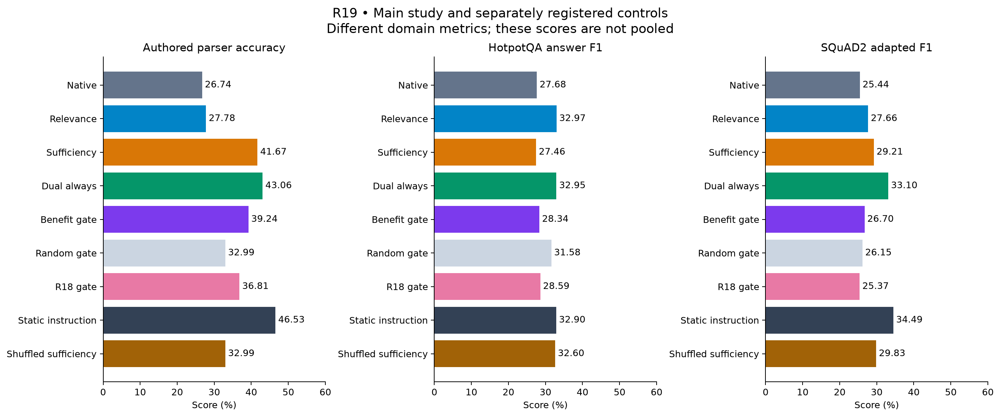
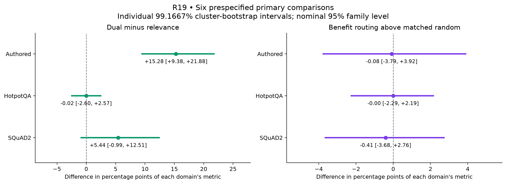
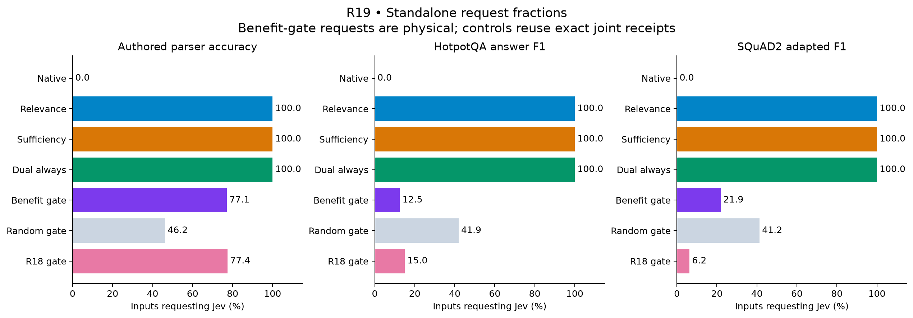
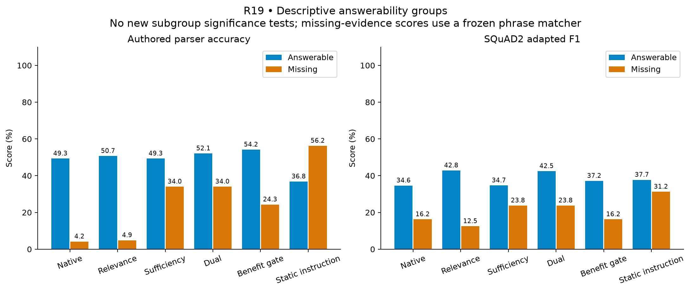

# R19: benefit prediction and evidence-sufficiency steering

**Complete: 7,312 generated outcomes, audited and publicly replayed.** The new
source/instruction policy improves the frozen scores over native Granite in all
three domains. Its strongest primary result is **+15.28 percentage points over
relevance-only on authored parser accuracy**, with a 99.1667% interval of
**[9.38, 21.88]**. These are score improvements, not established improvements of
that magnitude in semantic correctness: examples expose unrecognized valid
abstentions and F1 rewards for wording or incorrect partial overlap.

The extra controls also limit attribution. Static instruction steering without
Jev has similar or higher overall point estimates. Question-specific sufficiency
beats one shuffled assignment on authored tasks, an exploratory result. The
benefit gate saves requests but does not demonstrate better within-domain call
selection than matched random routing.

[Method and architecture](method.md) · [All tables](tables.md) ·
[Examples](examples.md) · [Validation](validation.md) · [Reproduction](reproduce.md) ·
[Prospective plan](../../research/benefit-sufficiency-plan.md).

## Scores and controls

Granite generates every final token in every row. Scores use the unchanged
R18 graders; Hotpot F1 and adapted SQuAD F1 are not general accuracy measures.
No cross-domain accuracy average is reported.

| Configuration | Authored parser accuracy % | Hotpot answer F1 % | SQuAD2 adapted F1 % | Standalone requests / 608 |
| --- | ---: | ---: | ---: | ---: |
| Native Granite | 26.74 | 27.68 | 25.44 | 0 |
| Jev relevance only | 27.78 | 32.97 | 27.66 | 608 |
| Jev sufficiency only | 41.67 | 27.46 | 29.21 | 608 |
| Jev dual guidance, always | 43.06 | 32.95 | 33.10 | 608 |
| Learned benefit gate | 39.24 | 28.34 | 26.70 | 277 |
| Random gate | 32.99 | 31.58 | 26.15 | 266 |
| Frozen R18 gate on dual treatment | 36.81 | 28.59 | 25.37 | 257 |
| Static instruction, no Jev | 46.53 | 32.90 | 34.49 | 0 |
| Shuffled sufficiency | 32.99 | 32.60 | 29.83 | 608 logical, recorded |

The test has 288 authored contexts from 144 paired worlds, 160 Hotpot questions,
and 160 SQuAD questions from 125 article clusters. Authored and SQuAD answerability
are each balanced 50/50. Under these metrics, a constant recognized abstention
scores 50% on those two balanced cohorts; all configurations remain below it.
Public datasets are held out within this project, with unknown pretraining exposure.

## Primary and exploratory comparisons

Six registered primary comparisons use 10,000 paired cluster-bootstrap resamples,
with individual 99.1667% intervals for a nominal 95% family level. This adjustment
covers R19's six comparisons, not the entire sequence of prior experiments.

| Domain | Dual minus relevance, pp [adjusted interval] | Benefit routing above matched random, pp [adjusted interval] |
| --- | --- | --- |
| Authored | +15.28 [9.38, 21.88] | −0.08 [−3.79, 3.92] |
| Hotpot | −0.02 [−2.60, 2.57] | −0.0035 [−2.29, 2.19] |
| SQuAD2 | +5.44 [−0.99, 12.51] | −0.41 [−3.68, 2.76] |

The authored sufficiency-policy contrast excludes zero; the other five primary
intervals include zero. There is no all-controls success conjunction. The positive
authored result remains a result of the frozen parser, whose semantic limitations
are consequential below.

Exploratory dual-minus-native differences, with ordinary 95% intervals, are
+16.32 pp [10.07, 22.57] authored, +5.27 pp [1.01, 9.66] Hotpot, and
+7.66 pp [2.17, 13.10] adapted SQuAD. These are secondary endpoints.

The separately registered static/shuffled contrasts also use ordinary 95% intervals:

| Domain | Dual minus static instruction, pp [95% interval] | Dual minus shuffled sufficiency, pp [95% interval] |
| --- | --- | --- |
| Authored | −3.47 [−10.42, 3.82] | +10.07 [4.51, 15.97] |
| Hotpot | +0.05 [−5.04, 4.98] | +0.35 [−2.35, 3.07] |
| SQuAD2 | −1.39 [−6.02, 3.04] | +3.27 [−1.97, 8.27] |

One fixed within-domain permutation and the dual-calibrated instruction strength
were used. No interval establishes dual superiority over the static control;
this is not an equivalence test or a search for an optimal static intervention.

## Answerability and call allocation

The intervention emphasizes the existing instruction about explaining missing
evidence. It does not force UNKNOWN or substitute any answer. Descriptive scores:

| Configuration | Authored answerable / missing % | SQuAD answerable / missing % |
| --- | ---: | ---: |
| Native | 49.31 / 4.17 | 34.63 / 16.25 |
| Relevance only | 50.69 / 4.86 | 42.82 / 12.50 |
| Dual always | 52.08 / 34.03 | 42.46 / 23.75 |
| Benefit gate | 54.17 / 24.31 | 37.16 / 16.25 |
| Static instruction | 36.81 / 56.25 | 37.73 / 31.25 |

Jev-conditioned steering retains higher answerable-case scores than static steering
on these two cohorts, while static steering has higher recognized-abstention scores.
These are descriptive groups, not new significance tests. Missing-evidence scores
measure recognition by the frozen abstention parser, not a complete semantic audit.

Calibration selected instruction strength **5**, ridge penalty **100**, and threshold
**0.08729202701946495**, using 90/200 calibration requests. Test dispatch uses
222/288 authored requests (77.08%), 20/160 Hotpot (12.50%), and 35/160 SQuAD (21.88%).
The total is **277/608**, saving **54.44% of requests** against always calling.
The 50% selection ceiling applied to calibration, not a runtime quota on unseen data.

The gate loses 3.82 / 4.61 / 6.40 score points against dual-always; each corresponding
exploratory 95% interval excludes zero. Its three primary routing intervals include
zero. The separately executed random arm uses the calibration call fraction, while
the primary random reference matches each domain's actual test call fraction.

## Reading the answers changes the interpretation

The [17 first-by-ID examples](examples.md) were selected deterministically and
inspected unblinded after both audits; they are not independent semantic regrading.
They include real repairs and harms, alongside clear metric artifacts:

- In authored case `r19/test/0003/felanodi/heavy`, guidance changes the wrong room
  blue to the reference room white. This is a concrete answer repair.
- In `r19/test/0006/mupugara/heavy`, native already says the evidence does not
  mention the room, but receives zero. Dual says it does not establish the room
  and receives one. This illustrates a wording-driven gain in the primary metric.
- In Hotpot `5a70f6425542994082a3e44c`, both outputs name the same Corvette; reducing
  the surrounding sentence raises F1 from 0.20 to 0.67.
- In SQuAD `56f97d8a9e9bad19000a09b0`, native gives the reference Sun Wu in a
  sentence for F1 0.25. Static steering answers Eastern Wu and receives 0.50.
  The shared word increases lexical score despite the wrong name.
- In missing-evidence SQuAD `5a3b04c43ff257001ab84395`, adding the word “provided”
  to an otherwise equivalent abstention changes recognition from one to zero.

The current data therefore cannot identify how much aggregate gain is better
reasoning, better abstention, brevity, or parser-compatible wording. In particular,
“missing-evidence accuracy improved by 29.86 points” would overstate what the
frozen authored parser establishes. All original scores are retained unchanged.
A blinded semantic rubric validated on natural paraphrases and wrong partial-overlap
answers is needed before further architectural gains are claimed.

## Execution, integrity and cost

The main schedule contains 6,096 outcomes and 117,442 final tokens; the corrected
supplement contains 1,216 outcomes and 22,369 final tokens. All **139,811 final
tokens** remain Granite-generated, with unchanged model weights, one retained
prefill per outcome and zero discarded pilot tokens. There are 1,824 exact
conditional-branch token identity checks. Hosted Jev returned **1,068 successful
receipts**, **2,189,099 input tokens**, and **zero provider failures**. The controls
add no paid requests; canned callbacks are not Jev calls.

The main protocol/source freeze is `73a26e0`; main execution is pinned to `8b0ab3f`.
Supplement v1 uses `47dadb7`, and corrected v2 uses `1c0bc36`. The original 53-file
main and 55-file v1 source freezes remain intact; v2 separately freezes 57 files.
The [validation record](validation.md) preserves three corrections:

1. A historical wall-clock-dependent host test was made deterministic before live
   inference, without changing production limits or scientific source.
2. Supplemental v1 stopped before generation on a tuple/list disk comparison;
   [v2](../../research/sufficiency-controls-canonicalization.md) preserves identical
   prompts, schedule, donors and settings, with the failed attempt retained.
3. The original offline audit rejected one-bit logarithm roundoff;
   [a separate portability adapter](../../research/benefit-sufficiency-audit-portability.md)
   accepts one adjacent float only for two logarithms and retains all other checks.

The raw archives preserve 28 unique verified result files, including the failed
pre-generation attempt. [Public replay](public-replay-verification.json) reproduces
all non-timestamp fields of both complete analyses with no inference or API calls.
[Adapter metadata](independent-analysis-adapter.json) records 293 normalized main
rows; [control metadata](controls-analysis-adapter.json) records 54. No raw record
or call decision changes. Mechanical reconstruction is not human scientific review.

Two sequential single-L40S episodes cost an estimated **$2.90635** for compute/disk
and **$0.09194** for Jev, totaling **$3.00**. Cumulative recorded spending is
**$30.23/$50**, before tax/separate network, not an invoice. Both instances, managed
disks, task security groups/rules and automatic IP allocations are verified deleted;
the shared network remains. See [cost](cost.json) and [cleanup verification](cleanup-verification.json).

All 451 current local tests pass; the GPU host passed its 449-test suite before
inference. Four figure layouts have been inspected. Full reproduction commands,
software versions, source hashes, raw artifacts, and [Hotpot](HotpotQA-NOTICE.md)
and [SQuAD](SQuAD-NOTICE.md) notices accompany this report.

## Contribution and next step

The working mechanism couples an internal pre-call benefit predictor with typed
relevance/sufficiency and source/instruction attention, while preserving Granite's
final-token ownership. Learned routing and attention steering have substantial
[prior art](../../research/benefit-sufficiency-related-work.md). This study establishes
score changes and important attribution/measurement limits; it does not establish
historical priority or a generally better LLM architecture.

The next useful step is to validate a blinded semantic evaluation before tuning
another controller: compare native, static instruction and Jev dual guidance on
fresh cases, with rubric tests covering equivalent abstentions, answer verbosity,
wrong partial overlap and false refusals. The current records remain unchanged.
