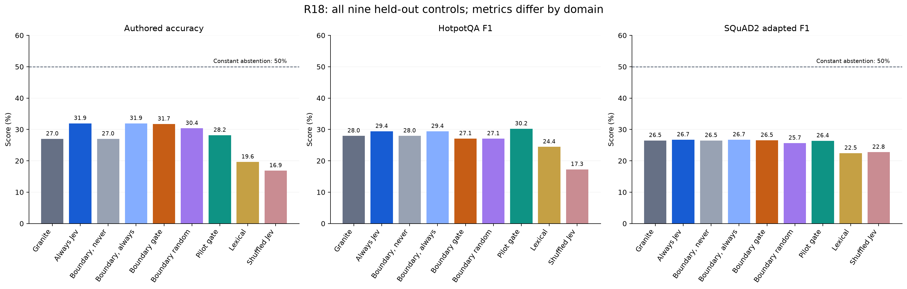
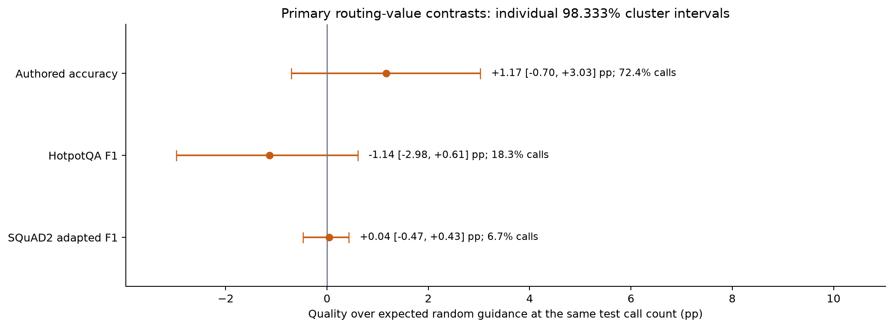
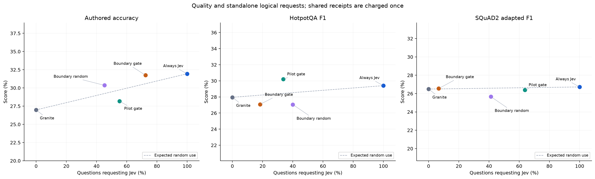
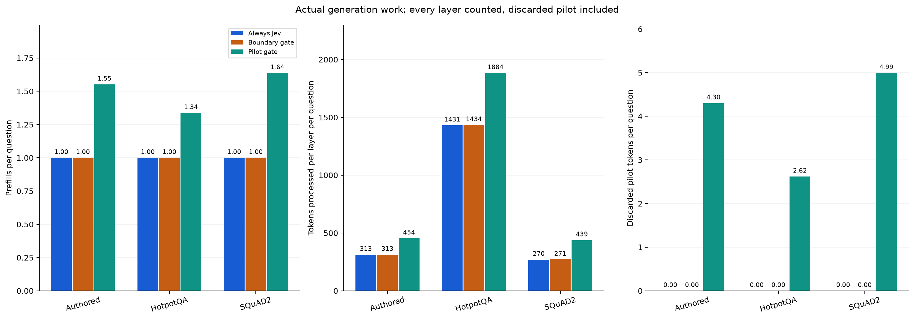
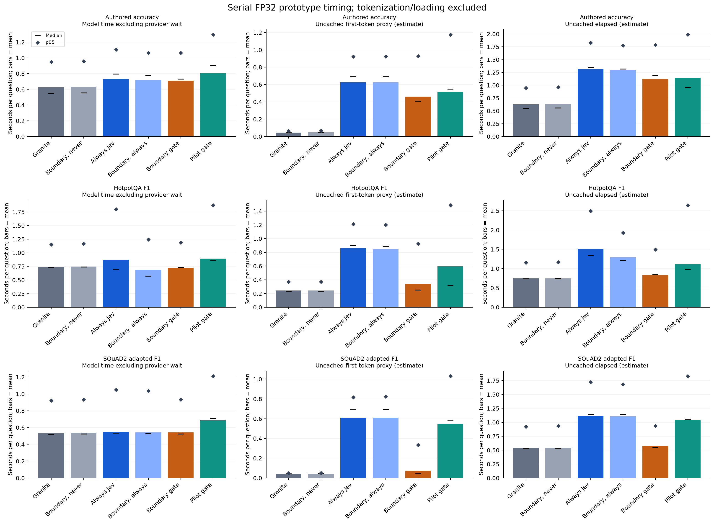
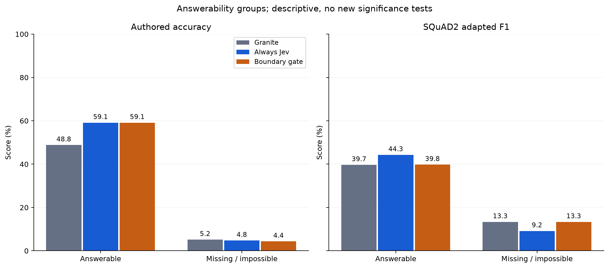
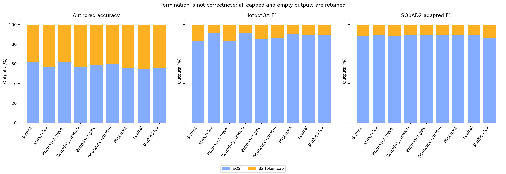

# R18: conditional Jev guidance inside one Granite prefill

**Completed, audited, and publicly reproducible.** The new internal callback works
without repeating the prompt or discarding a pilot. On fresh authored tasks,
selective Jev raises Granite accuracy from **26.98% to 31.75%**, close to
always-on Jev's **31.94%**, while saving **27.58% of requests**. External quality
is mixed, and none of the three primary routing intervals excludes zero.

The useful result is a working single-prefill mechanism and an authored
quality/request trade-off. The evidence does not establish reliable cross-domain
call selection or a generally superior LLM architecture. Granite generates every
final token, using its original weights and full vocabulary; no UNKNOWN token or
answer menu is forced.

[Architecture and method](method.md) · [Complete tables](tables.md) ·
[Prospective plan](../../research/boundary-attention-plan.md) ·
[Validation and operational corrections](validation.md) ·
[Main audit](independent-analysis.json) · [Output diagnostics](output-diagnostics.json) ·
[Examples](examples.md) · [Paper draft](../../research/paper-draft.md)

## Quality and calls

There are **984 held-out inputs**, each evaluated in nine configurations:
504 authored contexts from 252 worlds, 240 new HotpotQA questions and 240 SQuAD2
questions from 23 held-out article groups. Another 260 development inputs supply
520 selection outcomes. All **8,856 test + 520 development = 9,376 outcomes**
complete. These are paired comparisons, not 9,376 independent questions.

| Held-out domain | Native Granite | Always Jev | Selective boundary Jev | Selective calls | Requests saved versus always |
| --- | ---: | ---: | ---: | ---: | ---: |
| Authored accuracy | 26.98% | 31.94% | 31.75% | 365/504 (72.42%) | 27.58% |
| HotpotQA answer F1 | 27.96% | 29.40% | 27.08% | 44/240 (18.33%) | 81.67% |
| SQuAD2 adapted answer F1 | 26.49% | 26.72% | 26.55% | 16/240 (6.67%) | 93.33% |

Across the three domains the gate makes **425/984 requests**, saving **56.81%**
against always calling. This overall request count does not pool the different
quality metrics. The gate executes first on every test input, so all 425 selected
requests are actual physical attempts. Other arms reuse exact receipts; the whole
experiment pays for 1,244 unique development/test inputs, not each logical call.



Exploratory 95% paired cluster intervals support an authored improvement:
always-minus-native **+4.96 pp [1.59, 8.33]** and selective-minus-native
**+4.76 pp [1.79, 7.94]**. These are secondary comparisons, without correction
across all exploratory contrasts. Always-minus-native is **+1.45 pp
[−2.24, 5.11]** on Hotpot and **+0.23 pp [−2.56, 2.91]** on adapted SQuAD;
both external intervals include zero.

Selective-minus-always is **−0.20 pp [−1.98, 1.39]** authored,
**−2.32 pp [−5.62, 1.01]** Hotpot and **−0.17 pp [−2.65, 2.47]** SQuAD.
The separate exploratory 3 pp loss margin is met for authored and SQuAD, and
unresolved for Hotpot. This is a descriptive margin comparison, not equivalence
or an all-controls success requirement.

The older pilot gate scores **28.17% / 30.21% / 26.40%**, requesting Jev on
**55.16% / 33.75% / 63.75%** of the respective domains. The boundary gate is
better on authored tasks and worse on Hotpot in the corresponding exploratory
95% comparisons; neither gate dominates across tasks. All lexical, shuffled,
random and matched never/always controls remain in [the complete tables](tables.md).
Always Jev beats lexical and shuffled guidance in all three domains' exploratory
intervals. Those controls themselves often hurt native quality, limiting the
conclusions that can be drawn from outperforming them.

## Does the gate identify useful calls?

The primary measure compares the gate with **expected random guidance at its
actual test request count**, separately by domain. The separately executed random
arm uses the development request fraction, so its realized test call count differs.
It is an exploratory control, not the primary matched-count reference.

| Domain | Expected random quality at gate's call count | Gate routing value and individual 98.333% interval |
| --- | ---: | ---: |
| Authored | 30.58% | +1.17 pp [−0.70, 3.03] |
| HotpotQA | 28.22% | −1.14 pp [−2.98, 0.61] |
| SQuAD2 adapted | 26.51% | +0.04 pp [−0.47, 0.43] |

All three intervals include zero. The intervals have nominal 95% family coverage,
using 10,000 bootstrap draws with authored-world, Hotpot-question and SQuAD-article
clusters. The authored gain over native and the uncertain routing advantage are
separate findings.



Development selected `head_disagreement <= 0.05478179526607767`, with 118/260
requests (45.38%) under the 50% development ceiling. This ceiling applies across
development inputs, not separately to each test domain. Actual test usage varies
widely: authored heavy/light contexts receive calls on 88.10%/56.75% of inputs,
compared with 18.33% of Hotpot and 6.67% of SQuAD. Low disagreement is an empirical
selected feature value; it is not established as a calibrated measure of uncertainty.

The recorded decisions help locate the weakness. On authored inputs the gate
calls 44 beneficial and 20 harmful cases, while skipping 10 benefits and 9 harms.
On Hotpot it calls **6 beneficial and 14 harmful cases**, skipping **49 benefits**
and 38 harms. On SQuAD it calls 3 benefits and 2 harms, skipping 29 benefits and
21 harms. Benefit/harm here means the frozen metric difference between always
and native on that input; it is unavailable to the live gate and is not a human
grounding judgment. All ties and other gates are retained in the diagnostic tables.



## Computation and latency

The gate observes one native last-query attention row at layer 18, decides before
zero-indexed layer 19, and continues the same prefill/cache. Successful Jev source
scores activate the unchanged strength-5 treatment at eleven heads in nine layers;
skipped or failed requests preserve native computation. The [method](method.md)
contains the complete ASCII diagram, equations, query-position scope and threading
contract. Jev receives the original question and sources, while the local rule
uses Granite's native attention features.

All boundary-gate inputs use **one prefill and zero discarded pilot tokens**.
The selected older pilot gate uses 1,496 prefills over 984 test inputs and discards
3,995 generated tokens. Its per-layer processed-token count is 786,154 versus
566,896 for the boundary gate, **27.89% less**. The gates make different selections
and produce different answers, so this total combines routing and implementation
work; matched never/always controls provide the identical-output comparison.



| Domain | Native mean elapsed | Always Jev mean elapsed estimate | Boundary gate mean elapsed | Pilot gate mean elapsed estimate |
| --- | ---: | ---: | ---: | ---: |
| Authored | 0.628 s | 1.314 s | 1.123 s | 1.143 s |
| HotpotQA | 0.746 s | 1.502 s | 0.828 s | 1.112 s |
| SQuAD2 | 0.535 s | 1.119 s | 0.574 s | 1.042 s |

These are serial FP32 prototype measurements on one L40S with hosted Jev.
Tokenization/loading are excluded from per-question time and included in cloud
cost. Boundary-gate calls run before any receipt reuse; other guided arms' uncached
estimates add the saved receipt duration to cache-hit executions. Mean observation
cost for the boundary gate is **1.09 / 1.38 / 0.68 ms** by domain. The complete
tables include model time, first-token proxies, mean/median/p95, matched overhead,
actual forwards and peak allocated GPU memory.

First-token timestamps mark synchronized completion of the first retained model
forward, before argmax/statistics/text decoding. A retained pilot can compute
that token before deciding to release its buffered output. These are therefore
model timing proxies, not client delivery latency. Gate-first execution can also
introduce order/hardware-warmth effects. No colocated Jev, concurrent serving,
serving throughput or vLLM speedup was measured.



## Where the remaining damage occurs

On answerable authored cases, native/always/selective accuracy is
**48.81% / 59.13% / 59.13%**. On missing-evidence cases it is only
**5.16% / 4.76% / 4.37%**. Jev improves this cohort's answerable tasks while
leaving the principal abstention weakness unresolved.

On answerable SQuAD, native/always/selective F1 is
**39.66% / 44.28% / 39.76%**; on impossible questions it is
**13.33% / 9.17% / 13.33%**. Always guidance improves the answerable subset
and loses recognized abstentions, largely cancelling its aggregate benefit.
These are descriptive subgroups without new significance tests.



The three main configurations produce 13/12/11 recognized authored abstentions
and 16/11/16 SQuAD abstentions; none of these is bare UNKNOWN. Natural uncertainty
is possible, but uncommon. Authored unparsed outputs number 178/290/259, and
32-token caps number 190/219/210. These contract failures remain in the denominator.
The balanced authored and SQuAD cohorts each have a **50% constant-abstention
reference**, above all reported aggregate model scores. Improvements here therefore
do not establish adequate deployment quality.

SQuAD's frozen adaptation recognizes conservative whole-answer uncertainty phrases;
raw, unmodified-answer F1 is **19.83% / 22.14% / 19.88%**, versus adapted
**26.49% / 26.72% / 26.55%**. All raw EM/F1 values are also reported. This is
a project subset of the public SQuAD development set with an adapted abstention
contract, not the official hidden-test or no-answer-probability evaluation.

The first SQuAD metric-benefit example, selected by the registered ID rule,
shows why F1 must not be read as semantic accuracy: the question asks for a
function problem *other than* the traveling salesman problem. Native correctly
names integer factorization in a longer explanation (F1 **0.2727**), while guided
output repeats “the traveling salesman problem” (F1 **0.3333**, from token overlap).
This is an unblinded qualitative reading of one predetermined example, not a
regraded dataset or an estimated prevalence. The frozen scores remain unchanged.
It motivates independent semantic evaluation before broader answer-quality claims.



A paid call is not necessarily an active intervention. Of the gate's 425 calls,
**399 activate heads, 26 are successful no-ops, and 316 change the final token
path** relative to native. Four of its sixteen SQuAD requests target one-source
contexts, which are guaranteed no-ops under the unchanged uniform-score convention.
These cases motivate a future structural skip, not a retrospectively changed rule.
The [registered supplement](../../research/boundary-output-diagnostics.md) and
[first-by-ID examples](examples.md) retain positive, harmful and missed interventions.
Examples are illustrative and unblinded; no outcomes were regraded after inspection.

## Integrity, resources and limits

The frozen source is `7e570c0cf01646ddc87f38ca5a6a1f054c4bb9b3`, model revision
`6a7381ba1f54d684ff508d991aeb7dc580157103`, hosted model `jev-1.13.0`, with
FP32, greedy full-vocabulary output and a common 32-token cap. Nine real-checkpoint
admission fixtures pass **27/27** comparisons with maximum full-logit and all-layer
KV differences both **0.0**. Those admission calls use canned scores.

The live audit verifies **1,244 exact inputs, 184,889 final tokens, 188,884 model
forwards, 4,920 branch identities, 1,244 successful Jev receipts and ledger
settlements**, all 45 scientific source hashes, selection before testing and
unchanged model weights. There are **zero failed or usage-unknown provider calls**.
Public lossless archive unpacking and reanalysis reproduce every main-analysis
field except its audit timestamp. These are code-based consistency checks by the
development effort, not independent human replication or peer review.

All **15 remote result files** were byte-verified before resource deletion. The
Nebius login expired at cleanup; the existing sign-in was refreshed and deletion
completed without rerunning inference. A local metadata-export step then used the
wrong Python environment; its remaining reporting stages were resumed in the
project environment, again without inference or paid calls. Original failures are
retained privately and summarized in [validation](validation.md).

[Verified cleanup](cleanup-verification.json) covers the VM, managed disk, owned
security group/rules and automatic IP allocations; the shared network is preserved.
[Estimated incremental cost](cost.json) is **$3.77**, consisting of $3.67 cloud/disk
and $0.10 Jev, bringing the recorded series to **$27.23/$50**. The estimate includes
bootstrap, loading, admission, retrieval and the authentication delay through
verified deletion. It excludes tax/separate network charges and is not an invoice.
Rates are from [Nebius pricing](https://docs.nebius.com/compute/resources/pricing)
and [TypeSafe models](https://docs.typesafe.ai/models).

This study evaluates one checkpoint, one previously selected treatment, a finite
single-feature threshold family and short answers. The dev-selected gate's
uncertainty and generalization are incompletely characterized. Authored templates
remain related across splits; excluding earlier project questions does not exclude
pretraining exposure. Metrics can penalize valid paraphrases or reward lexical
changes. The primary plan precedes inference; descriptive diagnostics were added
during execution before held-out quality aggregates were inspected. Historical
R17 absolute scores use a different cohort and are not a matched before/after test.

The [prior-method comparison](../../research/boundary-attention-related-work.md)
positions R18 against attention monitoring and conditional assistance research.
Those methods were not implemented as live controls. The callback/feature/treatment
combination is documented, but historical novelty, an optimal layer and general
superiority remain unestablished. Concurrent serving, trained fusion and a changed
checkpoint are outside this implementation.

The next evidence-led experiments should preserve the working boundary, improve
prediction of treatment benefit on fresh external data, compare cheaper structural
features, and separately test evidence sufficiency/abstention. The one-source
no-op can motivate a prospective skip rule. These are follow-up hypotheses; the
present held-out cohort is now exposed and must not be reused for confirmation.

Seven figures are available as PNG, SVG and PDF in [figures](figures/). The
[complete tables](tables.md), raw archives and notices retain every arm and subgroup.
External text remains under its [HotpotQA](HotpotQA-NOTICE.md) and
[SQuAD](SQuAD-NOTICE.md) attribution/license notices; the package MIT license does
not relicense the data, models or provider service.

## Reproduce the recorded results

Use the research branch (`research/jev-intermediate-steps`) at the source revision
containing this report and retain the 45 scientific-file hashes in the [manifest](../../research/protocols/boundary-attention-v1/manifest.json).
The GPU study itself used clean commit `7e570c0cf01646ddc87f38ca5a6a1f054c4bb9b3`;
subsequent commits add reporting, diagnostics and guidance without changing those
frozen files. Public artifact reconstruction needs CPU dependencies and the pinned
tokenizer, but no GPU, model weights, Jev credential or new provider call.

```bash
uv sync --locked --extra dev --extra transformers
# Download tokenizer/configuration files only if absent from the local cache.
uv run --no-sync python - <<'PY'
from huggingface_hub import snapshot_download
snapshot_download(
    'ibm-granite/granite-4.0-1b',
    revision='6a7381ba1f54d684ff508d991aeb7dc580157103',
    allow_patterns=['*.json', '*.txt', '*.model'],
)
PY
# Choose unused output paths; the unpacker refuses to replace existing evidence.
uv run --no-sync python research/diagnostics/unpack_selective_artifacts.py \
  --report reports/2026-09-22-boundary-attention \
  --output results/r18-public-replay
uv run --no-sync python research/iterations/boundary_attention/analyze.py \
  --manifest research/protocols/boundary-attention-v1 \
  --results results/r18-public-replay/boundary-attention-v1 \
  --output results/r18-public-analysis.json
uv run --no-sync python research/diagnostics/boundary_outputs.py \
  --manifest research/protocols/boundary-attention-v1 \
  --results results/r18-public-replay/boundary-attention-v1 \
  --main-analysis reports/2026-09-22-boundary-attention/independent-analysis.json \
  --binding reports/2026-09-22-boundary-attention/analysis-binding.json \
  --output results/r18-output-diagnostics.json \
  --examples results/r18-examples.md
uv run --no-project --python 3.12.13 \
  --with matplotlib==3.11.2 --with numpy==2.5.3 --with pillow==12.3.0 \
  python research/diagnostics/render_boundary_attention.py
```

The generic unpacker retains its historical R17 filename; it verifies R18's public
manifest and lossless archive hashes before reconstructing a new result directory.
The figure command regenerates report figures from the audited public JSON; it
performs no inference. Audits use the recorded token statistics and actual receipt
bodies, reconstruct inputs/grades/decisions/work, and compare branch token paths;
they do not independently rerun every model logit. Numerical admission separately
checks full vocabulary logits and all-layer KV values on nine fixtures.

[Raw hashes](raw-artifact-hashes.json), [analysis binding](analysis-binding.json),
[public replay verification](public-replay-verification.json),
[analysis environment](analysis-environment.json),
[figure environment](figure-environment.json), [hardware](execution/hardware.json),
[executed shell launcher](execution/run-study.sh) and
[service limits](execution/study.service) retain the reproducibility details.
A new live replication is a separate paid study: use a new result directory and
budget, preserve errors, and expect provider/timing variation. Successful local
reconstruction is a development-team code check, not independent human replication.
