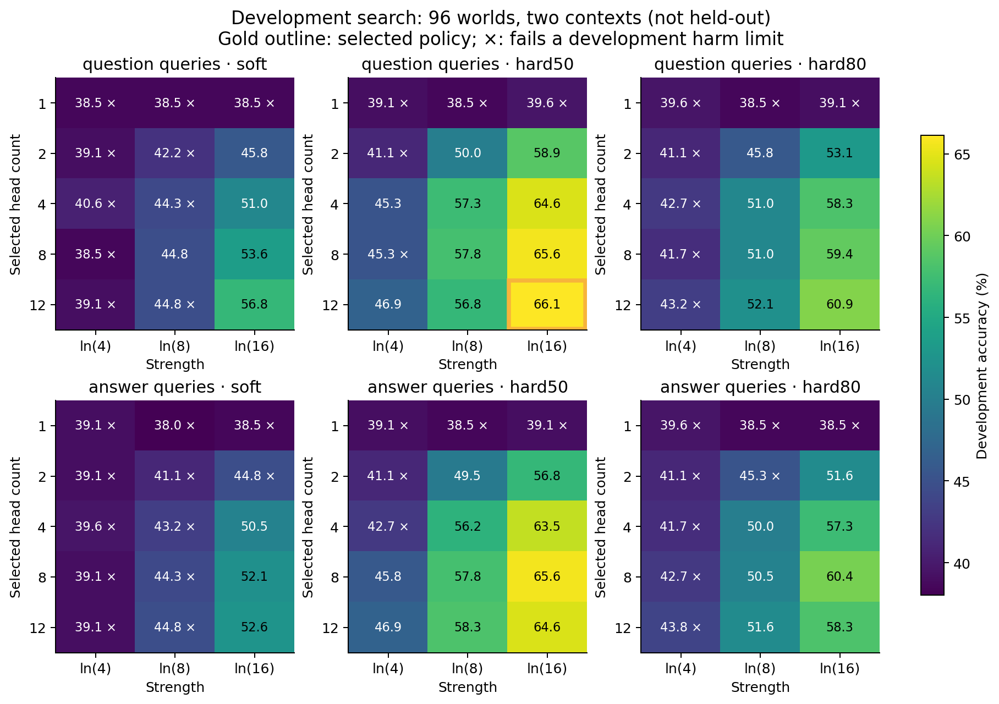
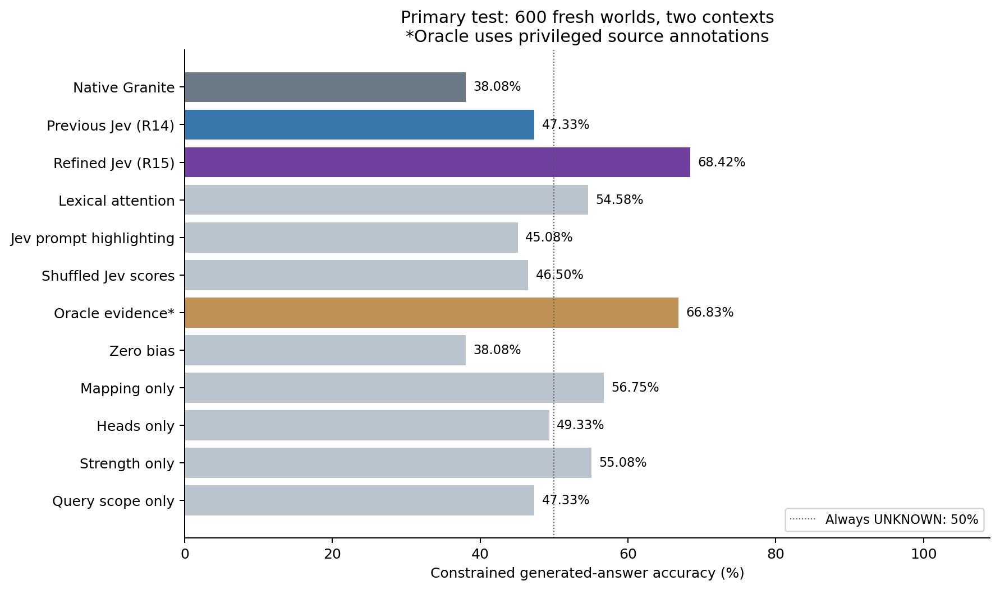
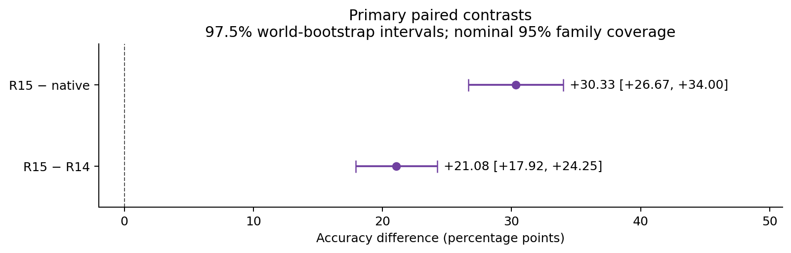
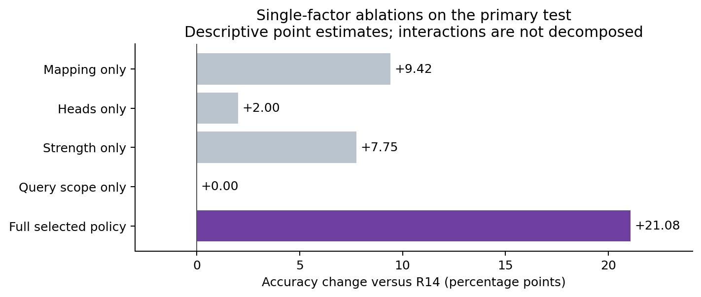
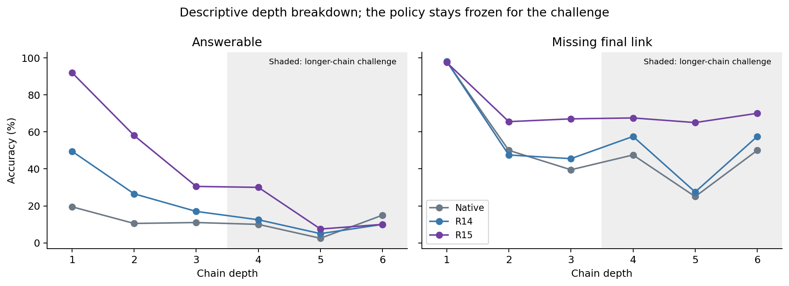

# R15: refined Jev attention in frozen Granite

Completed 2026-09-22. On **600 fresh containment worlds with two contexts**, native
Granite scored **38.08%**, the frozen previous Jev policy **47.33%**, and
the refined Jev policy **68.42%**. R15 improves by **+30.33 percentage
points versus native** and **+21.08 versus R14**. The prespecified
next-version advancement criterion is **met**; the primary intervals are below.
These are Granite-generated, constrained one-token answers on an authored task,
not unrestricted chat or a general model-improvement claim.

The complete schedule has **34,777 output records** and
**34,679 actual model forwards**. There were **2
provider failures**, retained without replay and with dependent outcomes counted
incorrect. All **1,632 scorer attempts** are accounted for. Operational amendments
were needed, including one after testing began; scientific policies/selection and
test data remained fixed. Model weights are unchanged and all task cloud resources
are deleted. New estimated cost: **$1.90**;
cumulative **$11.17 / $50**, before tax/separate network.

## Navigation

- [Original full plan](../../research/evidence-attention-v2-protocol.md),
  [frozen data/source manifest](../../research/protocols/evidence-attention-v2/manifest.json),
  [initial implementation record](pre-execution.md), [mechanism and selection](method.md).
- [Selected policy](artifacts/selected-policy.json), [original test freeze](artifacts/test-freeze.json),
  [execution metadata](artifacts/metadata.json), [completion](artifacts/completion.json).
- [Primary results](artifacts/test-summary.json), [challenge](artifacts/challenge-summary.json),
  [independent audit](independent-analysis.json), [diagnostics](diagnostics.json),
  [validation](validation.md), [cost/cleanup](cost.json), [scientific figures](figures/).
- [Complete traces](artifacts/), [all interrupted segments](interrupted/),
  [uncompressed checksums](raw-artifact-hashes.json), [artifact checksums](artifact-hashes.json).
- [Previous R14 report](../2026-09-21-evidence-attention/README.md),
  [study register](../../research/study-register.md), [paper draft](../../research/paper-draft.md).

## What changed and where Jev acts

Development selected **12 query heads across nine attention layers**, strength
**ln(16)**, a **strict relevance >0.5 threshold**, and the original scope of query
positions after the evidence block. R14 used eight heads, ln(8), and continuous
`max(0,2r-1)` weighting. The new policy changes the first three factors; query scope
stays unchanged. [Exact layer/head indices and an ASCII diagram](method.md#exact-placement)
show the placement before attention softmax/value aggregation.

One hosted Jev call judges source relevance from the question and complete evidence;
a local map becomes a bounded source-key bias in selected heads. Every fact remains
visible. Granite's output logits choose the final room or UNKNOWN from the same
seven available tokens. Jev receives no reference answer, oracle map, final-label
question, logits or hidden tensors. No network call occurs inside a layer. This is
static relevance during final-answer generation; no dynamic intermediate reasoning
refresh, training, merged checkpoint or vLLM serving extension is implemented.

## Development and fresh evaluation

The complete finite grid has 90 policies: five head counts, three strengths, three
score mappings and two query scopes. Ranking comes from exposed R14 head profiling;
new development/calibration uses fresh worlds and the deployed Jev scores. One
receipt is shared across configurations. The selected policy scores **127/192
(66.15%)** in development, versus **74/192 (38.54%)** native and **86/192 (44.79%)**
R14. One common failed guided context remains incorrect. These are optimistic
selection results. Full candidate outcomes and harm-floor decisions are public.



Primary testing uses 600 fresh worlds at depths 1/2/3; a separate challenge has
120 fresh worlds at depths 4/5/6. Every world has light and heavy distractors.
Aliases are disjoint from earlier R14 and between new worlds. Both new development
and test use the “contains” wording; R14 used a development/test wording shift.
All arms here use the same new instances, avoiding a comparison of old aggregate
scores to new ones. The reference grader independently parses visible facts and
follows directed containment links. Half require UNKNOWN, giving a **50% constant-
UNKNOWN reference**. This grammar restricts format equally but leaves the semantic
choice to Granite. Shared templates still limit generalization.

## Primary test results

| Arm | Correct / 1,200 | Accuracy | Light context | Heavy context | Failed |
| --- | ---: | ---: | ---: | ---: | ---: |
| Native Granite | 457 | 38.08% | 41.83% | 34.33% | 0 |
| Previous Jev attention (R14) | 568 | 47.33% | 50.83% | 43.83% | 1 |
| Refined Jev attention (R15) | 821 | 68.42% | 69.50% | 67.33% | 1 |
| Shuffled Jev scores | 558 | 46.50% | 53.17% | 39.83% | 1 |
| Lexical attention | 655 | 54.58% | 57.33% | 51.83% | 0 |
| Jev prompt highlighting | 541 | 45.08% | 46.17% | 44.00% | 1 |
| Oracle evidence (privileged) | 802 | 66.83% | 69.17% | 64.50% | 0 |
| Zero bias | 457 | 38.08% | 41.83% | 34.33% | 0 |
| Mapping only | 681 | 56.75% | 59.50% | 54.00% | 1 |
| Heads only | 592 | 49.33% | 51.50% | 47.17% | 1 |
| Strength only | 661 | 55.08% | 59.83% | 50.33% | 1 |
| Query scope only | 568 | 47.33% | 50.83% | 43.83% | 1 |



The unit of inference is the world, averaging its two contexts. Ten thousand paired
world-bootstrap draws provide individual 97.5% intervals for nominal 95% family
coverage across **two** primary comparisons. Advancement requires at least +2 pp
versus R14 and both interval lower bounds above zero. Other controls are secondary;
the old R14 all-controls criterion is preserved for that historical study.

| R15 minus control | Difference, pp | 97.5% interval, pp | World wins / losses / ties |
| --- | ---: | --- | --- |
| Native Granite | +30.33 | [+26.67, +34.00] | 279 / 16 / 305 |
| Previous Jev attention (R14) | +21.08 | [+17.92, +24.25] | 223 / 18 / 359 |



### Simpler controls and single-factor ablations

The following comparisons are **exploratory**, with unadjusted 95% intervals.
An interval spanning zero is inconclusive, not evidence of equality. Oracle uses
privileged source annotations and is diagnostic, not a deployable competitor or
a guaranteed upper bound. Lexical attention uses query/source overlap; prompt
highlighting uses the same Jev scores without internal attention modification.

| R15 minus control | Difference, pp | Exploratory 95% interval, pp |
| --- | ---: | --- |
| Shuffled Jev scores | +21.92 | [+18.92, +25.00] |
| Lexical attention | +13.83 | [+11.42, +16.25] |
| Jev prompt highlighting | +23.33 | [+19.83, +26.92] |
| Oracle evidence (privileged) | +1.58 | [+0.25, +2.92] |

The four one-factor arms modify one R14 setting at a time; unchanged settings stay
as explicit identity controls. In particular, scope-only equals R14 because scope
was not changed by selection. Their point estimates describe contributions but do
not identify additive effects or isolate interactions among all changes.



### Error and class breakdowns

| Arm | Answerable / 600 | Missing link / 600 |
| --- | --- | --- |
| Native Granite | 82/600 · 13.67% | 375/600 · 62.50% |
| Previous Jev attention (R14) | 186/600 · 31.00% | 382/600 · 63.67% |
| Refined Jev attention (R15) | 361/600 · 60.17% | 460/600 · 76.67% |

Against native, R15 produces **384 fixes** and
**20 regressions**; against R14, **277
fixes** and **24 regressions**. Counts include failures in
the error state. They are descriptive, not extra confirmatory hypothesis tests.
Per-depth/source-relevance diagnostics and actual token/work counts are public.

## Longer-chain challenge

The same selected policy stays frozen for all 120 longer-chain worlds. These are
**exploratory** results, with no new selection or confirmatory claim.

| Arm | Correct / 240 | Accuracy |
| --- | ---: | ---: |
| Native Granite | 60 | 25.00% |
| Previous Jev attention (R14) | 68 | 28.33% |
| Refined Jev attention (R15) | 100 | 41.67% |
| Shuffled Jev scores | 92 | 38.33% |
| Lexical attention | 81 | 33.75% |
| Jev prompt highlighting | 75 | 31.25% |
| Oracle evidence (privileged) | 121 | 50.42% |
| Zero bias | 60 | 25.00% |
| Mapping only | 87 | 36.25% |
| Heads only | 73 | 30.42% |
| Strength only | 78 | 32.50% |
| Query scope only | 68 | 28.33% |

R15 minus native is +16.67 pp with
unadjusted 95% interval [+10.42,
+22.92]; versus R14 it is
+13.33 pp [+7.92,
+19.17]. The [depth figure](figures/depth-breakdown.png)
separates answerable and missing-link cases; longer chains are still the same
synthetic relation family, not an external general reasoning benchmark.

Despite the gain over native/R14, **41.67% challenge accuracy is below the 50%
constant-UNKNOWN reference**. Answerable long-chain accuracy is only 19/120
(15.83%), versus missing-link accuracy 81/120 (67.50%). The challenge contrast
against shuffled Jev is just +3.33 pp, with unadjusted interval [−2.08,+8.75], so
Jev-specific superiority over shuffled guidance is inconclusive there. These
limits prevent a claim of broadly reliable long-chain reasoning.



## Interruptions and operational amendments

1. The original frozen `be58b72` run stopped at its 103rd development Jev request
   on an ambiguous transport timeout: 102 complete contexts, 9,294 model outputs,
   102 valid receipts. No held-out operation had started.
2. [Transport recovery](../../research/evidence-attention-v2-recovery.md), `91a637b`,
   retained the failed context for all ninety policies and charged its full unknown
   reservation. Two new successful calls preceded a write-once zero-snapshot bug.
   The interrupted segment has 9,479 records, including ninety failed outcomes.
3. [Checkpoint repair](../../research/evidence-attention-v2-checkpoint-repair.md),
   `e9f16c5`, restored individual jobs and saved snapshots atomically. It finished
   development/selection and 47 test contexts, then stopped on HTTP 503 at the 48th
   test request. That failure had no receipt and was never replayed.
4. The [service-continuation amendment](../../research/evidence-attention-v2-service-continuation.md)
   was registered **after testing began**, expanding transient admission and raising
   the ceiling to thirty incidents within the same spending/time caps. No held-out
   accuracy aggregate informed it; original selection/test-freeze bytes are retained.
   Its `d1fd5fe` prelaunch falsely rejected list/tuple equivalence before any new
   model/scorer jobs. Identical raw JSONL files prove no added operations.
5. [Serialized-freeze repair](../../research/evidence-attention-v2-freeze-repair.md),
   `46f3175`, corrected that check and completed only never-started work. Actual
   policy/source/data changes still fail the guard. No prior paid or model job was
   replayed to replace a failure or an unfavorable answer.

Original bootstrap and detached-checkout prelaunch errors are also recorded in
[validation](validation.md). They precede benchmark inference. The stopped runs
are preserved, not relabeled successes. Complete schedules do not imply every
request succeeded or that the original protocol executed unchanged.

The original twelve zero/native pairs retain exact seven-label logits/token IDs;
their full-vocabulary differences were lost in memory on interruption. Thirteen
additional zero forwards occurred across recovery segments: twelve have persisted
full-vocabulary comparisons, one lost its snapshot but retains label/token evidence.
All **1,465 saved zero/native token pairs** match. There is no fabricated
full-vocabulary evidence for the lost snapshots. Final failures comprise
**2 scorer attempts** and **98 dependent output
records**; unknown usage remains charged at its maximum.

## Runtime and cost

One Nebius L40S (48 GB), eight vCPUs, 32 GiB RAM and an 80 GiB SSD ran CUDA BF16
with Python 3.12.13, Torch 2.8.0+cu128 and Transformers 4.57.1. This is a serial
reference experiment, not a concurrent serving-throughput benchmark. No weights
were trained; all five loaded segments preserve the same complete state digest.

| Arm | Mean completed model forward, seconds | Additional mean successful Jev call, seconds |
| --- | ---: | ---: |
| Native Granite | 0.02546 | 0.00000 |
| Previous Jev attention (R14) | 0.02743 | 0.37270 |
| Refined Jev attention (R15) | 0.02785 | 0.37270 |
| Lexical attention | 0.02800 | 0.00000 |
| Jev prompt highlighting | 0.02551 | 0.37270 |

The [execution record](execution-summary.json) separates new jobs from copied
prefixes across all five loaded segments. Their elapsed times sum to **1,779.09 s
(29.65 minutes)**, including model setup; gaps for local repairs are excluded.
The cloud lifetime was **66.32 minutes**, which includes those gaps and cleanup.

Model-forward times exclude loading, scoring, reporting and cooldown. Successful
API latency is shown separately and counted once for a request needing fresh
relevance; the shared receipt is charged once across experimental arms. Failed
calls/cooldowns contribute to wall time but are not silently folded into successful
call means. Colocated Jev latency and peak-memory/production throughput are unmeasured.

There are **1,630 valid receipts**, **4,144,933
known input tokens**, and **2 maximum-charged unknown calls**.
All valid receipts identify `jev-1.13.0`. The private token was transferred to the
VM, verified privately with mode 0600 and never included in public traces.

Cloud lifetime costs an estimated $1.71999, including
setup, repair waits and deletion latency; known-receipt Jev cost is
$0.17409, plus
$0.00655 reserved for unknown calls.
The [cost record](cost.json) uses [Nebius pricing](https://docs.nebius.com/compute/resources/pricing)
and [TypeSafe input-token pricing](https://docs.typesafe.ai/models), verified on
2026-09-22 Amsterdam. This is an estimate, not an invoice.
All **69 remote result files** matched the local
backup before deletion; VM, managed disk, task security rules/group and both
allocated addresses were verified absent. Private network/account records stay
outside Git. No paid resource remains for this study.

## Integrity, reproduction and limits

The independent auditor reconstructs graph answers, exact prompt tokens/source
spans, typed Jev payloads/receipts, threshold maps, head/query/bias coordinates,
final-token ownership, all ninety development metrics and selection, failed/started
schedules, raw segment prefixes, original freeze, ledger and paired intervals.
It performs no new model or Jev inference. [Source/input hashes](independent-analysis.json)
and [artifact checksums](artifact-hashes.json) bind its result to public evidence.

The common model revision is `6a7381ba1f54d684ff508d991aeb7dc580157103`, with
1,631,750,144 parameters, zero trainable parameters, 40 attention layers, 16 query
heads and four KV heads. Complete state digest before/after every loaded segment:

```text
311c1141187580dc0905c810e9d9e78853a0bf37b865bd5a5a511f6eed72f8c9
```

Reproduction commands are in [validation](validation.md). Public JSONL files are
losslessly gzip-compressed; their uncompressed hashes are recorded separately.
All data in this R15 task are authored fixtures. The repository license does not
relicense Granite, Jev, other datasets or provider services.

This finite grid does not prove a globally optimal insertion point. Test/challenge
share authored motifs, one model/checkpoint, one hosted judge version and one
constrained grammar. The post-start admission amendment limits pristine
preregistration claims, despite fixed selection and failure-inclusive scoring.
Comparisons to earlier step/logit studies cannot isolate insertion point because
the tasks/contracts differ. The manuscript remains a draft, without human
scientific review, peer review or a published model checkpoint.
