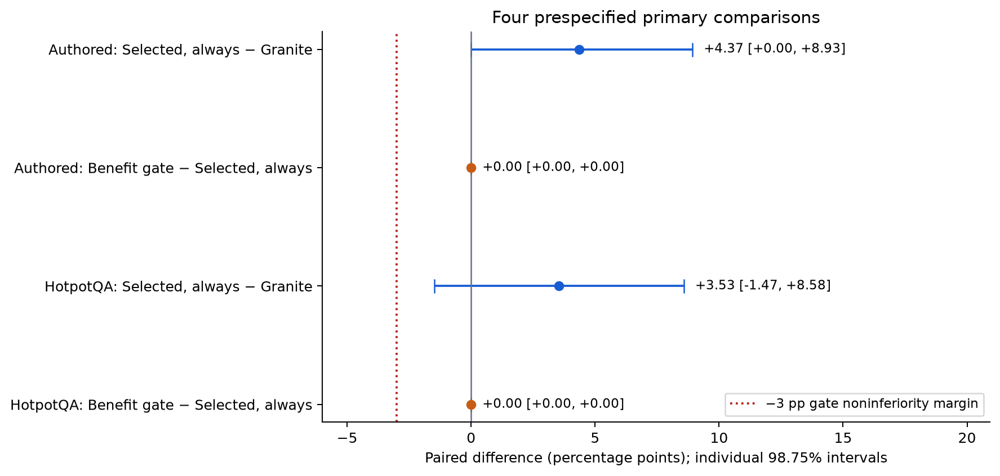
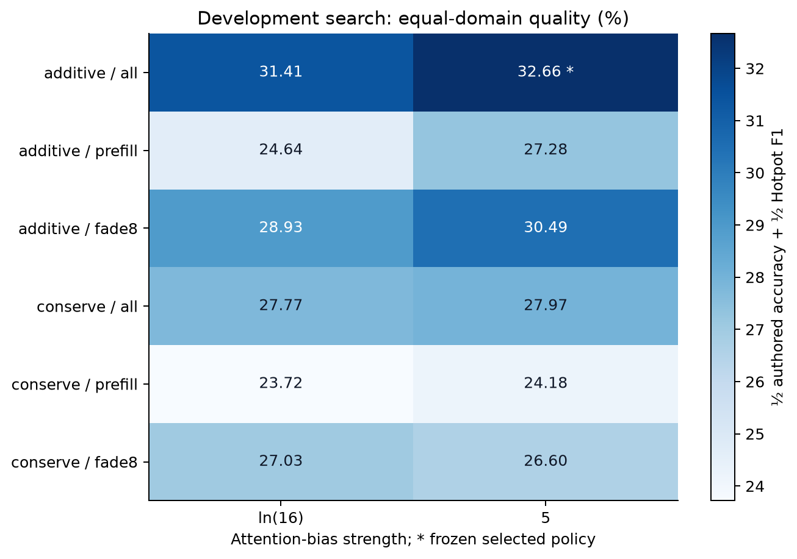
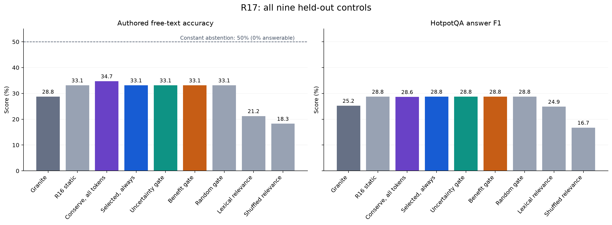
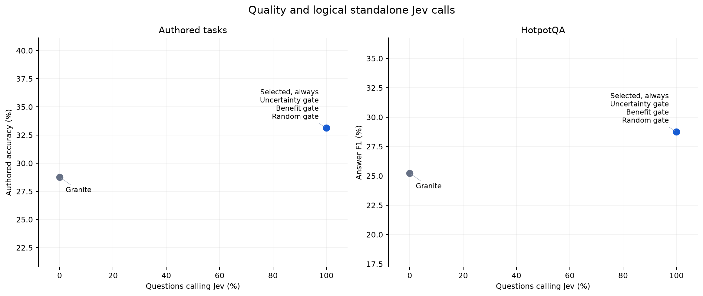
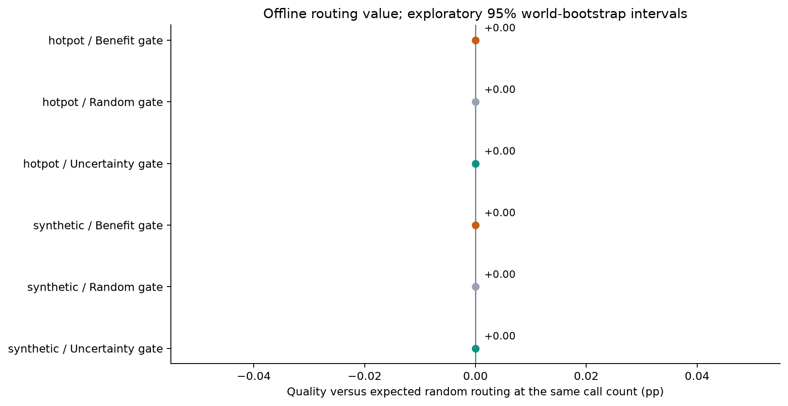
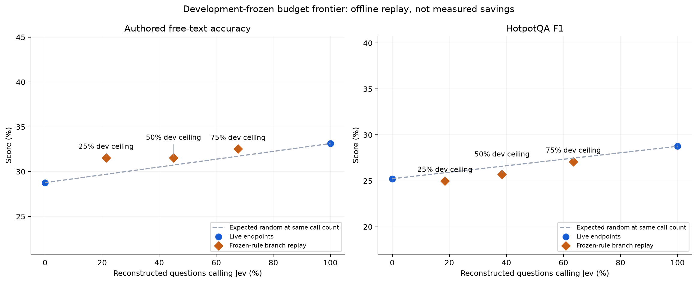

# R17: selective, phase-dependent Jev evidence attention

Completed study of frozen-weight Granite 4.0 1B and hosted Jev, with all **6,336 test outcomes** and **2,028 development outcomes** retained. All final semantic tokens are Granite-generated; no training or final-answer substitution occurred.

The study tests three separable ideas: when to request Jev, when to apply its guidance, and whether to preserve total attention on evidence. Unrestricted full-vocabulary answers use no colour menu or required UNKNOWN token. Authored accuracy and Hotpot answer F1 remain different metrics.

## Interpretation

This run finds modest positive estimates for existing Jev attention, **not a new
policy that outperforms R16**. The development winner is exactly R16's additive,
all-token, strength-5 policy. Both primary gains over native include zero at the
prespecified interval level. Mass conservation scores slightly higher on authored
test cases, but its comparison with R16 is inconclusive; selecting it now would
be test-set tuning. Prefill-only and fading variants were tested in development
and not advanced as the selected held-out policy.

**The main conditional gates saved no calls.** Their development objectives chose
always-calling behavior, and all 704 test decisions requested Jev. The resulting
zero-loss noninferiority finding is trivial: the final answers are identical to
always guidance. The benefit gate adds 5,340 discarded pilot tokens and one fresh
prefill per test input. Duplicate policies are controls, not replications.

The [offline request-budget replay](budget-frontier.md) finds a narrower opportunity:
at the 25% development ceiling, 21.43% of authored requests gives 31.55% accuracy
versus 28.77% native and 33.13% always guided. On Hotpot, 18.50% of requests gives
25.00% F1, versus 25.23% native and 28.76% always guided. These are reconstructed
branches from development-frozen rules, not a live selective deployment or measured
savings. All three budgets are reported; the authored routing signal does not
transfer reliably to external QA.

Answerable authored accuracy rises from 50.40% to 61.11%, while missing-evidence
accuracy falls from 7.14% to 5.16%. There is no required UNKNOWN token, and all
recognized abstentions are natural phrases. Every tested arm remains below the
50% constant-abstention reference overall. The model still struggles to turn
relevant evidence into a complete answer or justified uncertainty.

## Primary findings

| Domain | Comparison | Difference and 98.75% interval (pp) | Interpretation |
| --- | --- | ---: | --- |
| synthetic | Selected always − Granite | +4.37 [+0.00, +8.93] | inconclusive at stated interval level |
| synthetic | Benefit gate − Selected always | +0.00 [+0.00, +0.00] | Identical answers; all calls, no savings |
| hotpot | Selected always − Granite | +3.53 [-1.47, +8.58] | inconclusive at stated interval level |
| hotpot | Benefit gate − Selected always | +0.00 [+0.00, +0.00] | Identical answers; all calls, no savings |

Four prespecified comparisons use individual 98.75% paired world/question bootstrap intervals, nominally controlling family coverage at 95%. Each question has its own conclusion. Here noninferiority is degenerate because the gate always calls; it establishes no useful selective routing. Other comparisons below are exploratory 95% intervals.



## Selected mechanism and gate

Development selected **additive** attention with **all** timing at strength **5**, on eleven fixed heads across nine layers with relevance >0.65. Policy ID: `42e1896dba6c5ee8`.

The twelve development policies use additive or evidence-mass-conserving attention, all-token/prefill/fade-eight timing, and strength ln(16)/5. Selection weights authored accuracy and Hotpot F1 equally. The test policy and gates were frozen before the first test job. Lower intervention cost is only a tie-breaker.



| Gate | Selected rule | Development quality (%) | Development call fraction (%) |
| --- | --- | ---: | ---: |
| benefit | `{"direction": "le", "feature": "copy_fraction", "kind": "threshold", "threshold": 1.0}` | 32.66 | 100.00 |
| uncertainty | `{"kind": "always"}` | 32.66 | 100.00 |

The gate observes at most eight native pilot tokens before any Jev request. A skipped call continues the exact pilot cache and token IDs. A successful call restarts generation from the original prompt with a fresh guided cache; pilot work is counted as discarded. A failed call falls back to the native path and retains the error/charge. The benefit gate is a development-fitted threshold rule; no neural model weights are trained.

Prefill includes first-token prediction and may leave changed question representations in the cache. Fade-eight decreases strength to zero after eight generated tokens. Mass conservation preserves total evidence attention and outside-key probabilities for the same controlled query/key vectors; later representations can still change.

[Full architecture/method](method.md) · [Prospective plan](../../research/selective-attention-plan.md) · [Prior art](../../research/selective-attention-related-work.md) · [Frozen manifest](../../research/protocols/selective-attention-v1/manifest.json)

## Complete held-out quality and calls



### Authored free-text reasoning

| Arm | Cases | Accuracy (%) | Strict EM (%) | Calls (%) | Fallbacks | Mean model time (s) | Mean uncached elapsed estimate (s) |
| --- | ---: | ---: | ---: | ---: | ---: | ---: | ---: |
| Granite | 504 | 28.77 | — | 0.00 | 0 | 0.601 | 0.602 |
| R16 static | 504 | 33.13 | — | 100.00 | 0 | 0.696 | 1.343 |
| Conserve all tokens | 504 | 34.72 | — | 100.00 | 0 | 0.811 | 1.458 |
| Selected always | 504 | 33.13 | — | 100.00 | 0 | 0.696 | 1.343 |
| Uncertainty gate | 504 | 33.13 | — | 100.00 | 0 | 0.932 | 1.580 |
| Benefit gate | 504 | 33.13 | — | 100.00 | 0 | 0.934 | 1.591 |
| Random gate | 504 | 33.13 | — | 100.00 | 0 | 0.932 | 1.580 |
| Lexical relevance | 504 | 21.23 | — | 0.00 | 0 | 0.738 | 0.750 |
| Shuffled relevance | 504 | 18.25 | — | 100.00 | 0 | 0.703 | 1.351 |


Paired contrasts; primary rows use 98.75% intervals, all other rows use exploratory 95% intervals.

| Comparison | Difference and interval (pp) | Status |
| --- | ---: | --- |
| Selected always − Granite | +4.37 [+0.00, +8.93] | Primary |
| Benefit gate − Selected always | +0.00 [+0.00, +0.00] | Primary |
| Benefit gate − Granite | +4.37 [+0.99, +7.74] | Exploratory |
| Benefit gate − Random gate | +0.00 [+0.00, +0.00] | Exploratory |
| Uncertainty gate − Selected always | +0.00 [+0.00, +0.00] | Exploratory |
| Benefit gate − Uncertainty gate | +0.00 [+0.00, +0.00] | Exploratory |
| Selected always − R16 static | +0.00 [+0.00, +0.00] | Exploratory |
| Conserve all tokens − R16 static | +1.59 [-1.39, +4.56] | Exploratory |
| Selected always − Lexical relevance | +11.90 [+8.13, +15.87] | Exploratory |
| Selected always − Shuffled relevance | +14.88 [+10.52, +19.44] | Exploratory |

### HotpotQA free-text answers

| Arm | Cases | Accuracy / answer F1 (%) | Strict EM (%) | Calls (%) | Fallbacks | Mean model time (s) | Mean uncached elapsed estimate (s) |
| --- | ---: | ---: | ---: | ---: | ---: | ---: | ---: |
| Granite | 200 | 25.23 | 11.00 | 0.00 | 0 | 0.716 | 0.718 |
| R16 static | 200 | 28.76 | 14.50 | 100.00 | 0 | 0.921 | 1.651 |
| Conserve all tokens | 200 | 28.63 | 14.50 | 100.00 | 0 | 1.088 | 1.819 |
| Selected always | 200 | 28.76 | 14.50 | 100.00 | 0 | 0.920 | 1.650 |
| Uncertainty gate | 200 | 28.76 | 14.50 | 100.00 | 0 | 1.336 | 2.067 |
| Benefit gate | 200 | 28.76 | 14.50 | 100.00 | 0 | 1.338 | 2.076 |
| Random gate | 200 | 28.76 | 14.50 | 100.00 | 0 | 1.336 | 2.067 |
| Lexical relevance | 200 | 24.86 | 11.00 | 0.00 | 0 | 1.304 | 1.333 |
| Shuffled relevance | 200 | 16.73 | 7.50 | 100.00 | 0 | 0.945 | 1.675 |

Paired contrasts; primary rows use 98.75% intervals, all other rows use exploratory 95% intervals.

| Comparison | Difference and interval (pp) | Status |
| --- | ---: | --- |
| Selected always − Granite | +3.53 [-1.47, +8.58] | Primary |
| Benefit gate − Selected always | +0.00 [+0.00, +0.00] | Primary |
| Benefit gate − Granite | +3.53 [-0.38, +7.53] | Exploratory |
| Benefit gate − Random gate | +0.00 [+0.00, +0.00] | Exploratory |
| Uncertainty gate − Selected always | +0.00 [+0.00, +0.00] | Exploratory |
| Benefit gate − Uncertainty gate | +0.00 [+0.00, +0.00] | Exploratory |
| Selected always − R16 static | +0.00 [+0.00, +0.00] | Exploratory |
| Conserve all tokens − R16 static | -0.13 [-3.60, +3.32] | Exploratory |
| Selected always − Lexical relevance | +3.90 [+0.51, +7.34] | Exploratory |
| Selected always − Shuffled relevance | +12.03 [+7.62, +16.56] | Exploratory |



The benefit-gate arm runs first on every held-out input, so its actual HTTP attempts equal its logical calls. Other arms reuse byte-identical receipts. Their standalone call fractions describe how many calls the policy would request; they do not imply that the experiment paid for every logical call. Uncached elapsed estimates add the recorded call duration to cache-hit executions. These are estimates, not independent live latency replications; incident cooldowns and service variability limit comparisons.

Model time includes forward passes, attention-control and token-statistic work and discarded pilot computation. Loading, startup and admission are excluded from per-case latency but included in cloud cost. This serial FP32 Python prototype is not a vLLM or colocated throughput benchmark.

## Does the gate choose useful calls?

The live random arm uses the benefit gate’s balanced development call fraction, so actual test call counts can differ. The [prospective offline supplement](../../research/selective-routing-supplement.md) calculates expected random quality at the actual gate call count using audited native/always branch identities. It matches call counts, not input tokens or dollars, and adds no live model/API work.

| Domain | Gate | Calls (%) | Gate quality (%) | Expected random quality (%) | Routing value, 95% interval (pp) | Permutation tail p |
| --- | --- | ---: | ---: | ---: | ---: | ---: |
| hotpot | Benefit gate | 100.00 | 28.76 | 28.76 | +0.00 [+0.00, +0.00] | 1.0000 |
| hotpot | Random gate | 100.00 | 28.76 | 28.76 | +0.00 [+0.00, +0.00] | 1.0000 |
| hotpot | Uncertainty gate | 100.00 | 28.76 | 28.76 | +0.00 [+0.00, +0.00] | 1.0000 |
| synthetic | Benefit gate | 100.00 | 33.13 | 33.13 | +0.00 [+0.00, +0.00] | 1.0000 |
| synthetic | Random gate | 100.00 | 33.13 | 33.13 | +0.00 [+0.00, +0.00] | 1.0000 |
| synthetic | Uncertainty gate | 100.00 | 33.13 | 33.13 | +0.00 [+0.00, +0.00] | 1.0000 |



| Domain | Gate | Called | Skipped | Called beneficial | Called harmful | Called tied | Skipped beneficial |
| --- | --- | ---: | ---: | ---: | ---: | ---: | ---: |
| synthetic | Benefit gate | 504 | 0 | 52 | 30 | 422 | 0 |
| synthetic | Uncertainty gate | 504 | 0 | 52 | 30 | 422 | 0 |
| synthetic | Random gate | 504 | 0 | 52 | 30 | 422 | 0 |
| hotpot | Benefit gate | 200 | 0 | 51 | 36 | 113 | 0 |
| hotpot | Uncertainty gate | 200 | 0 | 51 | 36 | 113 | 0 |
| hotpot | Random gate | 200 | 0 | 51 | 36 | 113 | 0 |

These beneficial/harmful labels compare the selected guided and native outcomes on the same input. They are held-out diagnostics, not labels available to the inference-time gate.

## Output forms and subgroup limitations

| Domain | Arm | EOS | Token cap | Parsed (%) | Natural abstentions | Bare UNKNOWN | Wrong abstentions |
| --- | --- | ---: | ---: | ---: | ---: | ---: | ---: |
| hotpot | Selected always | 178 | 22 | — | — | — | — |
| hotpot | Benefit gate | 178 | 22 | — | — | — | — |
| hotpot | Lexical relevance | 173 | 27 | — | — | — | — |
| hotpot | Conserve all tokens | 173 | 27 | — | — | — | — |
| hotpot | Granite | 169 | 31 | — | — | — | — |
| hotpot | R16 static | 178 | 22 | — | — | — | — |
| hotpot | Random gate | 178 | 22 | — | — | — | — |
| hotpot | Shuffled relevance | 176 | 24 | — | — | — | — |
| hotpot | Uncertainty gate | 178 | 22 | — | — | — | — |
| synthetic | Selected always | 309 | 195 | 46.43 | 13 | 0 | 0 |
| synthetic | Benefit gate | 309 | 195 | 46.43 | 13 | 0 | 0 |
| synthetic | Lexical relevance | 291 | 213 | 36.71 | 17 | 0 | 0 |
| synthetic | Conserve all tokens | 331 | 173 | 58.53 | 16 | 0 | 0 |
| synthetic | Granite | 335 | 169 | 66.87 | 18 | 0 | 0 |
| synthetic | R16 static | 309 | 195 | 46.43 | 13 | 0 | 0 |
| synthetic | Random gate | 309 | 195 | 46.43 | 13 | 0 | 0 |
| synthetic | Shuffled relevance | 296 | 208 | 56.75 | 13 | 0 | 0 |
| synthetic | Uncertainty gate | 309 | 195 | 46.43 | 13 | 0 | 0 |

The unchanged conservative parser supplies authored accuracy; unparsed answers are retained as incorrect by that scoring contract. This does not establish that every unparsed string is semantically wrong. Hotpot EM/F1 grade the whole final answer; verbosity/formatting can change scores without changing facts.

Authored subgroups below are descriptive, without new significance tests. The cohort is half missing-evidence cases, so constant abstention scores 50% overall and 0% on answerable cases.

### missing

| Value | Cases per arm | Granite (%) | R16 (%) | Selected always (%) | Benefit gate (%) | Gate calls (%) |
| --- | ---: | ---: | ---: | ---: | ---: | ---: |
| False | 252 | 50.40 | 61.11 | 61.11 | 61.11 | 100.00 |
| True | 252 | 7.14 | 5.16 | 5.16 | 5.16 | 100.00 |

### depth

| Value | Cases per arm | Granite (%) | R16 (%) | Selected always (%) | Benefit gate (%) | Gate calls (%) |
| --- | ---: | ---: | ---: | ---: | ---: | ---: |
| 1 | 84 | 64.29 | 64.29 | 64.29 | 64.29 | 100.00 |
| 2 | 84 | 42.86 | 44.05 | 44.05 | 44.05 | 100.00 |
| 3 | 84 | 21.43 | 35.71 | 35.71 | 35.71 | 100.00 |
| 4 | 84 | 15.48 | 23.81 | 23.81 | 23.81 | 100.00 |
| 5 | 84 | 16.67 | 19.05 | 19.05 | 19.05 | 100.00 |
| 6 | 84 | 11.90 | 11.90 | 11.90 | 11.90 | 100.00 |

### family

| Value | Cases per arm | Granite (%) | R16 (%) | Selected always (%) | Benefit gate (%) | Gate calls (%) |
| --- | ---: | ---: | ---: | ---: | ---: | ---: |
| dependency | 168 | 23.81 | 29.17 | 29.17 | 29.17 | 100.00 |
| original | 168 | 33.33 | 33.33 | 33.33 | 33.33 | 100.00 |
| paraphrase | 168 | 29.17 | 36.90 | 36.90 | 36.90 | 100.00 |

### condition

| Value | Cases per arm | Granite (%) | R16 (%) | Selected always (%) | Benefit gate (%) | Gate calls (%) |
| --- | ---: | ---: | ---: | ---: | ---: | ---: |
| heavy | 252 | 25.79 | 34.13 | 34.13 | 34.13 | 100.00 |
| light | 252 | 31.75 | 32.14 | 32.14 | 32.14 | 100.00 |

[Predefined illustrative examples](examples.md) show fixes, harms and natural abstentions; the gate-skip example categories are empty because every case called Jev. They are automatic first-by-ID examples, not blinded human evaluation or evidence of a causal failure mechanism.

## Explicit request-budget exploration



The [complete supplement](budget-frontier.md) reports the 25/50/75% development
ceilings, their frozen confidence thresholds, both-domain intervals, same-count
random expectations and reconstructed work. Actual overall test call fractions
are 20.60/43.18/66.48%. At the lowest ceiling, authored routing value is +1.84 pp
[0.41,3.39] at exploratory 95%, but Hotpot routing value is −0.88 pp [−2.10,0.44].
The stronger two budgets do not establish positive routing value in either domain.
Higher native pilot confidence, rather than lower confidence, is selected by all
three rules. This is an observed development choice, not a general rule that
confident answers need intervention.

Even the lowest replay budget requires more model forwards than always guidance:
11,588 versus 10,858 authored and 3,668 versus 3,171 Hotpot, because successful
calls restart after a pilot. Lower API use alone is not computational efficiency.
The failed-request accounting amendment leaves all frozen rule choices unchanged;
R17 had no provider failures, so the repair changes no observed quality or work.

## Work, integrity and failures

The completed audit reconstructs **8,364 outcomes**, **860 exact inputs**, **169,773 final tokens**, **185,793 total model forwards**, **704 native/fallback identity pairs** and **2,112 native pilot identity pairs**. Every final token matches its recorded full-vocabulary argmax and exact decoded prefix. Recorded source and pre/post weight hashes match. These are code-based consistency audits by the development effort, not independent human replication.

There were **860 unique paid attempts**, **860 successful receipts**, **0 unknown-usage calls**, **1,944,119 known input tokens** and **1,944,119 tokens charged/reserved by the durable ledger**. No ambiguous paid attempt was silently replayed. Fallback counts include reuse of a failed receipt, so summed fallback outcomes can exceed distinct failed calls.

An initial cloud bootstrap test hit an existing 60-second CPU deadline; pinning both intra-op and inter-op threads to one produced 396 passing tests before live inference. The failed log is preserved. A private local data-check helper initially used system Python without the installed package and was rerun in the project environment before launch. These are setup failures, not hidden excluded model outcomes. [Validation record](validation.md).

| Domain | Arm | Model forwards | Final tokens | Discarded pilot tokens | Experiment physical API attempts |
| --- | --- | ---: | ---: | ---: | ---: |
| synthetic | Granite | 10,640 | 10,640 | 0 | 0 |
| synthetic | R16 static | 10,858 | 10,858 | 0 | 0 |
| synthetic | Conserve all tokens | 10,897 | 10,897 | 0 | 0 |
| synthetic | Selected always | 10,858 | 10,858 | 0 | 0 |
| synthetic | Uncertainty gate | 14,834 | 10,858 | 3,976 | 0 |
| synthetic | Benefit gate | 14,834 | 10,858 | 3,976 | 504 |
| synthetic | Random gate | 14,834 | 10,858 | 3,976 | 0 |
| synthetic | Lexical relevance | 11,721 | 11,721 | 0 | 0 |
| synthetic | Shuffled relevance | 10,989 | 10,989 | 0 | 0 |
| hotpot | Granite | 3,528 | 3,528 | 0 | 0 |
| hotpot | R16 static | 3,171 | 3,171 | 0 | 0 |
| hotpot | Conserve all tokens | 3,386 | 3,386 | 0 | 0 |
| hotpot | Selected always | 3,171 | 3,171 | 0 | 0 |
| hotpot | Uncertainty gate | 4,535 | 3,171 | 1,364 | 0 |
| hotpot | Benefit gate | 4,535 | 3,171 | 1,364 | 200 |
| hotpot | Random gate | 4,535 | 3,171 | 1,364 | 0 |
| hotpot | Lexical relevance | 3,238 | 3,238 | 0 | 0 |
| hotpot | Shuffled relevance | 3,066 | 3,066 | 0 | 0 |

## Cost and cleanup

New estimated spend is **$3.77**, cumulative **$23.46 / $50**. The single L40S VM, managed disk, study security resources and allocated addresses were deleted and verified absent at `2026-09-22T13:56:44.184865+00:00`. All 14 result files were byte-verified against local backups before deletion.

The estimate includes the whole VM lifetime, bootstrap retry, loading, admission, evaluation and retrieval; it excludes tax/separate network and is not an invoice. [Cost calculation](cost.json), [Nebius rates](https://docs.nebius.com/compute/resources/pricing), [Jev rates](https://docs.typesafe.ai/models).

## Next architectural hypothesis

The [single-prefill boundary design](../../research/selective-attention-next-design.md)
places a possible benefit decision just before zero-indexed layer 19, the earliest
currently steered layer. Layers 0–18 would run once; a call or skip would then
continue the same prefill through layers 19–39. This could remove pilot/restart
work, but cannot by itself make poor relevance guidance useful. State features,
request-local execution, numerical parity and fresh cross-domain evaluation remain
unimplemented. R17's output-confidence thresholds cannot be reused for new hidden
state features. This note is a concrete next hypothesis, not another completed
experiment or proof of novelty.

## Reproducibility and claim limits

- Checkpoint: `ibm-granite/granite-4.0-1b`, revision `6a7381ba1f54d684ff508d991aeb7dc580157103`; hosted scorer receipts pin `jev-1.13.0`.
- Frozen main source: `796873b`; Python 3.12.13, Torch 2.8.0, Transformers 4.57.1, FP32 greedy generation on one L40S, one intra-op and one inter-op CPU thread.
- [Manifest and cohort hashes](../../research/protocols/selective-attention-v1/manifest.json), [raw artifact hashes](raw-artifact-hashes.json), [main audit](independent-analysis.json), [routing analysis](routing-analysis.json), [output diagnostics](output-diagnostics.json), [public replay verification](public-replay-verification.json). JSONL files are losslessly gzip-compressed; the manifest records both raw and stored hashes.
- Hotpot data uses full ten-paragraph contexts filtered to 3,072 prompt tokens, with 48 development and 200 test questions plus six mechanics fixtures, all disjoint from R16. The cohort is not the full benchmark; pretrained exposure is unknown. [Data rights](HotpotQA-NOTICE.md).
- Guidance and gate selection reuse the same development outcomes; only held-out tests support quality claims. Primary intervals and exploratory routing controls have different inferential status. Constant/duplicate selected policies must not be counted as independent replications.
- The three gate features are limited proxies. This trial does not test arbitrary event-triggered calls later in long reasoning, latent Jev states, trained cross-model adapters, other base models, broad chat safety, or colocated/vLLM serving.
- Prior conditional retrieval and attention-steering work limits novelty claims. This study measures the tested combination; it does not establish a historically unique or generally superior LLM architecture. [Related methods](../../research/selective-attention-related-work.md).

To re-render the standalone PNG/SVG/PDF figures:

```bash
uv run --no-project --python 3.12.13 \
  --with matplotlib==3.11.2 --with numpy==2.5.3 --with pillow==12.3.0 \
  python research/diagnostics/render_selective_attention.py
```

Offline audit commands are listed in the validation record. A new live run requires the frozen source/cohorts, the pinned model locally available, a private Jev key and a new output directory. Published outcomes are never overwritten.
