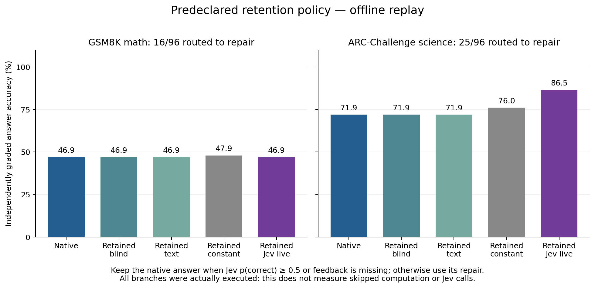

# R25: Jev-gated natural-draft repair

**Completed and audited, 2026-09-23 UTC.** The always-repair architecture regresses;
a predeclared selective-retention replay improves science answers, with no math
gain. This is a two-domain pilot, not the ten-benchmark objective or a win over
larger models. All temporary cloud resources are deleted.

## What changed in Granite

A new **262,144-parameter rank-64 branch after block 19** learns to repair natural
Granite drafts. Jev supplies one probability that the draft is correct; its error
probability scales the branch inside Granite's second generation pass. Original
Granite and Jev weights remain frozen. **Granite generates every answer token.**
See the [architecture and exact token ownership](method.md).

There are 384 training examples, 64 development examples and 192 fresh evaluation
cases: 96 GSM8K math and 96 ARC-Challenge science questions. Two training seeds
have equally trained constant-feedback controls; additional controls use blind
repair, textual feedback, and shuffled/inverted feedback on the live weights.
Checkpoint selection precedes all held-out generation.

## Results

Scores use the fixed independent answer readout, averaged across two seeds for
learned branches. Formatting failures remain incorrect; math accuracy is therefore
particularly format-sensitive. These are sampled task results, not official full
benchmark scores.

| Method | Math (96) | Science (96) | Combined (192) |
| --- | ---: | ---: | ---: |
| Original Granite | 46.88% | 71.88% | 59.38% |
| Blind repair on every case | 45.83% | 32.29% | 39.06% |
| Jev text repair on every case | 44.79% | 31.25% | 38.02% |
| Matched constant branch, every case | 44.27% | 66.15% | 55.21% |
| Internal Jev branch, every case | 46.88% | 42.71% | 44.79% |
| Selective constant branch, offline replay | 47.92% | 76.04% | 61.98% |
| **Selective internal Jev branch, offline replay** | **46.88%** | **86.46%** | **66.67%** |

Primary full repair loses **14.58 percentage points versus native** (individual
95% interval −21.61 to −7.29) and **10.42 points versus matched constant training**
(−17.19 to −3.39). It beats blind and textual repair, but those controls also
regress badly. The combined live-versus-shuffled interval includes zero.
Changing feedback does change final tokens: shuffling changes 120/192 and 117/192
outputs in the two seeds. Feedback dependence is demonstrated; broad benefit is not.

The [retention policy](../../research/gated-repair-retention-supplement.md),
registered before test inference, keeps the native answer when Jev p(correct)
is at least 0.5 or feedback is unavailable; otherwise it uses a repair. It routes
41/192 cases to repair, including 25 science questions. Retained live science
accuracy rises **14.58 points** (8.33 to 21.88) versus native, and **10.42 points**
(5.21 to 16.67) versus retained constant. Science gains appear in both seeds:
85/96 and 81/96 correct, compared with native 69/96. Math has no recovery or damage
under retained live. Combined retained live gains 7.29 points (4.17 to 10.94).

These intervals resample problems with paired seed means and task stratification;
they are conditional on the two fitted seeds and are not simultaneous intervals.
Every repair was actually generated, so the replay measures **neither skipped
execution nor fewer Jev calls**. Even retained blind/constant policies use Jev
for this routing decision. See [all arms, paired effects and actual work](tables.md).

## What output inspection adds

[Complete post-hoc inspection](output-inspection.md) preserves every native
unparseable answer and every live recovery/damage transition. It changes no grade.
All 16/12 retained science recoveries were **parseable wrong choices becoming
correct choices**, rather than merely fixing an unparseable answer. No native
correct answer becomes wrong under the retained-live policy in either seed.
Some native rationales already suggested the correct answer despite a wrong final
letter, so these gains do not uniformly establish improved underlying reasoning.

The full-repair regression has a substantial formatting component: each live seed
damages 42 originally correct science answers, including 38 becoming unparseable.
The common repair instruction mentions both math and choice formats; many science
repairs emit the math marker. Separately, **34/96 native math answers are
unparseable**, including examples with the correct number in an unsupported
position. This limits the meaning of the absolute math score. It does not justify
retrospectively changing the parser or prove that a cleaner prompt alone will fix
performance. No semantic regrading or test-driven threshold tuning was performed.

The [descriptive critic diagnostic](feedback-diagnostic.json) flags 40/78
readout-wrong native answers and 1/114 readout-correct answers. Among parseable
answers it flags 34/42 wrong answers with the same one false flag; formatting
explains part of the critic/readout disagreement. Jev is a critic in this
comparison, never an alternative answer generator.

## Decision and limits

R25's predeclared gate for spending on the [larger-model follow-up](../../research/gated-repair-larger-replication-outline.md)
is **false**: full-repair live does not beat both native and constant in both
domains. That outline remains unimplemented and unexecuted. The positive retention
result stays visible as a promising, narrower finding; it does not replace the
primary result or establish architectural novelty.

The next candidate is fresh validation of actual selective repair, with task-specific
output instructions admitted on development cases, fixed checkpoints, native and
matched no-informative-feedback controls, and separately measured execution cost.
The R25 test cohort is now exposed and cannot be reused as fresh evidence. No such
follow-up or model release is claimed here. The full ten-task scorecard still
requires evaluator admission and remains unrun.

## Completed execution and reproducibility

V4 source **640987e**, data freeze **6bade56**:
[manifest](../../research/protocols/gated-repair-retry-v4/manifest.json),
[operational amendment](../../research/gated-repair-overload-recovery.md),
[retention binding](../../research/protocols/gated-repair-retention-retry-v4.json),
[data attribution and terms](../../research/protocols/gated-repair-retry-v4/NOTICE.md).
Original [plan](../../research/gated-repair-plan.md) and [prior-art review](../../research/gated-repair-related-work.md)
remain unchanged. Original Granite is revision
`6a7381ba1f54d684ff508d991aeb7dc580157103`; Jev is pinned to `jev-1.13.0`.
All evaluated arms use float32 on one L40S with 16 vCPUs and 64 GiB RAM.

- **3,072/3,072 outputs**, 219,253 generated tokens, and 3,072 teacher-forced
  example passes (384 optimizer updates across four fits) are recorded.
- **640 physical API attempts**, 632 valid receipts and eight inherited missing
  training scores are fully accounted for. V4 adds no failed or retried request;
  every held-out case has valid feedback. Missing scores remain explicit nulls,
  with neutral effective 0.5 used in training, never labeled a Jev response.
- All **57 raw files**, including **12 adapter checkpoints**, are byte-verified
  and distributed in [hashed archives](raw-artifact-hashes.json). References stay
  out of inference prefixes and Jev inputs; original base-weight values are unchanged.
- [Primary/tokenizer audit](analysis.json), [training audit](training-audit.json),
  [retention audit](retention.json), and [work/details audit](details.json) pass.
  [Fresh public-archive replay](public-replay.json) reproduces all four JSON objects
  exactly without inference. [Feedback replay](feedback-replay.json) also matches.
- The [source-data audit](data-audit.json) checks all 640 questions/references and
  384 training targets against pinned upstream files, with zero exact normalized
  split overlap and exclusion of the 24 R23 math questions. Near-duplicates and
  pretraining contamination are not ruled out.
- **536 tests** passed on the frozen worker. Later report-only helpers bring the
  local suite to **546 passing tests**; Ruff, guidance checks and package build pass.
  See [completion notes](completion-notes.md) and [replay commands](method.md).

The [cost estimate](cost.json) is **$5.85 for all R25 attempts**, bringing cumulative
use to **$42.63 of the owner-authorized $75**, with approximately **$32.37 remaining**
before tax/separate network charges. The inherited API ledger is counted once.
These are estimates, not invoices. [Cleanup](cleanup.json) verifies deletion of
the GPU, owned disk, allocations and security rules/group at 23:05 UTC; unrelated
resources were untouched.

## Preserved attempt history

| Attempt | Frozen source / data | Outcome before continuation |
| --- | --- | --- |
| V1 BF16 | 9246708 / 4197f8e | Numerical admission fails: max cached/full discrepancy 0.25 > 0.125; no drafts, API calls or training; five files archived; resources deleted. |
| V2 FP32 | 0c015fd / 1b4dfd0 | Admission passes (max 0.0000211000); 113 training drafts and 112 receipts, then one unknown-status provider failure; no optimizer/test; 20 files archived; resources deleted. |
| V3 continuation | 10c968a / 05d130b | Reuses V2 exactly; reaches 165 drafts and 157 receipts, with six HTTP 529 responses then HTTP 503; eight total missing scores; no optimizer/test; 25 files archived; resources deleted. |
| V4 bounded overload recovery | 640987e / 6bade56 | Reuses V3 exactly; completes training, dev selection and all held-out outputs; no new provider failure; final audits and public replay pass; resources deleted. |

[Failed V1](failed-v1/README.md), [interrupted V2](interrupted-v2/README.md),
[interrupted V3](interrupted-v3/README.md), and the [precision diagnostic](precision-diagnostic/summary.json)
preserve all failed work and costs. The diagnostic finds comparable BF16 numerical
differences in native and intervened Granite with identical argmax choices; all six
FP32 comparisons pass, max 0.0000267029. It does not establish an adapter-specific
BF16 error or certify every sequence. Operational amendments preceded any held-out
quality inspection; no unfavorable answer result was removed.
