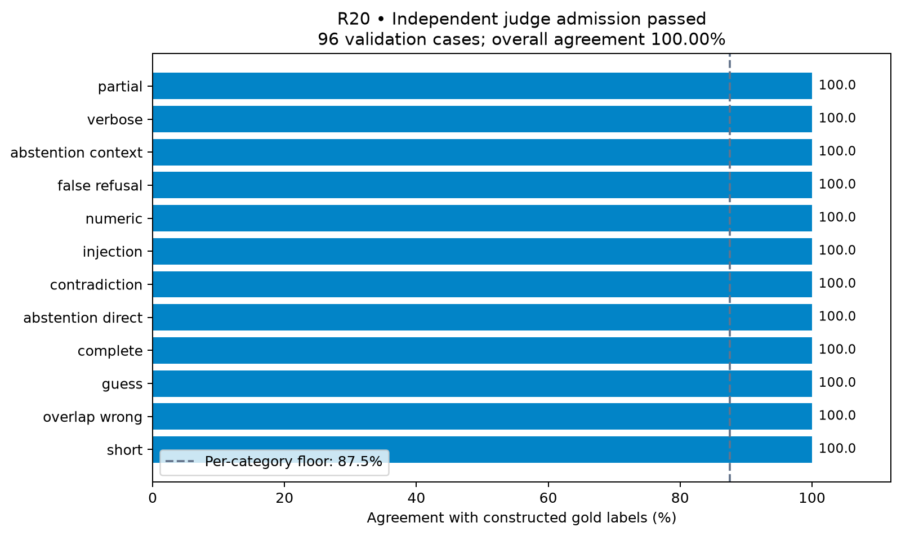
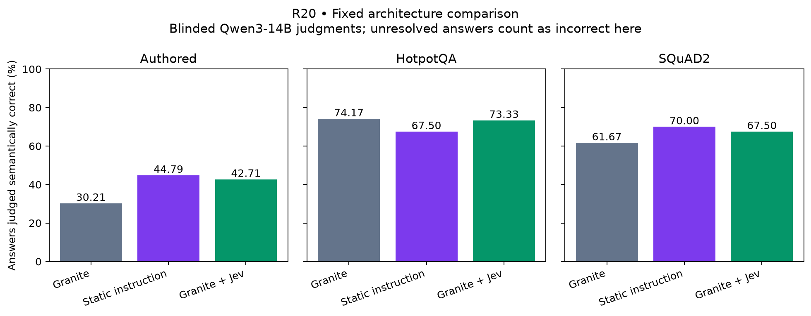
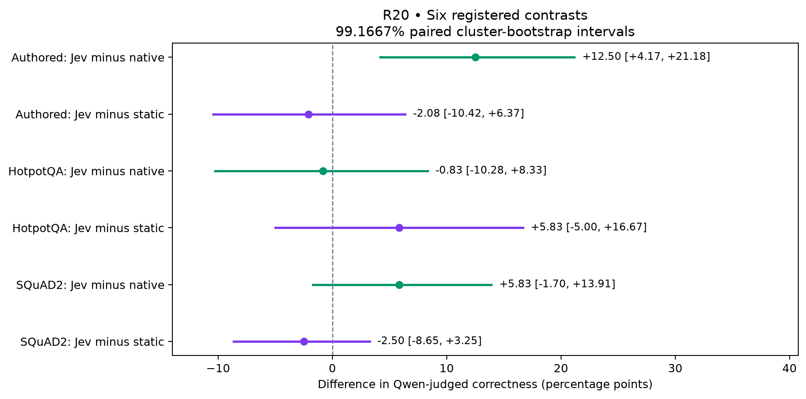

# R20: blinded semantic evaluation — completed, evaluator transfer limited

The full study completed on one Nebius L40S. Jev produces a positive **authored
judge-score effect**, but the fresh comparison does not establish superiority over
static attention steering. A registered blind inspection and deterministic examples
expose substantive mistakes in the independent evaluator, so these results do
**not establish reliable semantic improvement or a novel superior LLM architecture**.

| Domain | Native Granite | Granite + Jev | Static instruction, no Jev |
| --- | ---: | ---: | ---: |
| Authored, 288 inputs | 30.21% | 42.71% | 44.79% |
| HotpotQA, 120 inputs | 74.17% | 73.33% | 67.50% |
| SQuAD2, 120 inputs | 61.67% | 67.50% | 70.00% |

These percentages are **Qwen3-14B judgments**, not human-verified accuracy. Dual
minus native is +12.50 pp [4.17, 21.18] authored, −0.83 pp [−10.28, 8.33] Hotpot
and +5.83 pp [−1.70, 13.91] SQuAD, using the registered 99.1667% paired cluster
intervals. Only the authored interval excludes zero. All three dual-minus-static
intervals include zero. The six contrasts are separate; there is no all-controls
conjunction or pooled success score. See [all tables](tables.md).

## What the blind evaluation discovered

Qwen passed **96/96 constructed validation cases**, **24/24 diagnostic development
cases** and all **12 repeat consistency checks** before Granite test generation.
It then graded 1,070 anonymous unique answer packets with no unresolved outputs.

The implementing coding assistant independently recorded labels for the first 24
anonymous packets before seeing Qwen labels or treatment identities. Agreement
was **21/24**. Two disagreements are clear completeness failures: Qwen credited
an unfinished answer that omitted the requested network and a person's name
instead of the requested nationality. It supplied the missing answer in its own
reason. The third disagreement concerns ambiguous question/answerability labeling.
A separate population-decline reference is inconsistent with its evidence even
though both reviewers rejected the candidate answer. This is not human review.

The fixed illustrative sample also shows Qwen accepting a bare `[E02]` citation
as a room answer. A subsequent descriptive syntax count finds **8/18 Jev authored
citation-only outputs** credited, versus **1/14 native**; these are not valid
full-text answers to the requested colour/room question. No primary grade has
been changed or replaced. See [blind review](blind-review.md),
[transfer diagnostics](transfer-diagnostics.md) and [score examples](examples.md).
The audit's `quality_claims_admitted` flag checks unresolved coverage only; it is
not evidence that these substantive evaluator failures are absent.

## Meaning for Granite + Jev

The strongest descriptive movement is on missing evidence: authored native/dual
scores rise from **13.89% to 40.97%**, while answerable scores move from **46.53%
to 44.44%**. Static steering gives **58.33% missing / 31.25% answerable**. Jev
therefore changes the answer/abstention balance, with no demonstrated overall
advantage over static steering and unresolved semantic measurement error. The
corresponding SQuAD groups are in the tables. None is an additional primary test.

The internal mechanism remains the R19 intervention: one Jev relevance/sufficiency
request at the boundary before layer 19, with biases at the inherited eleven
heads and the same retained prefill/cache. Granite generates every final token,
with original weights, full vocabulary and no forced UNKNOWN spelling. Qwen is
used only afterward for evaluation. R20 does not fit a new architecture or gate.
The [method and ASCII architecture](method.md) make these boundaries explicit.

The next measurement revision needs response-completeness tests and independently
reviewed reference/answerability labels on new cases before more architectural
optimization. These results and examples remain exposed evidence, not a fresh
validation set for that revision. No further cloud run or model release is implied.

## Completion, verification and cost

- **1,584 generations**, **30,112 Granite final tokens**, **528 successful Jev
  requests**, zero provider failures and unchanged weight hashes.
- **1,202 Qwen outputs** across validation and test, with **45,159 generated judge
  tokens**; all 1,070 test judgments parse, with no silent retries or dropped rows.
- Full source/input/token/cache/attention/provider/budget/blinding audit passes.
  All **25 raw files (63,104,571 bytes)** were verified before resource deletion.
  Public archive reconstruction reproduces every analysis field except its timestamp.
- The local and GPU environments each passed **462 tests** before live inference.
  The core-only test declaration correction and all original capability/regression
  failures are retained in [validation](validation.md) and execution logs.
- Mean instrumented answer latency was **0.629 s native / 1.017 s Jev / 0.645 s
  static**; Jev wait averaged **0.370 s**. These are serial study timings with
  different answer lengths, not optimized serving or colocated Jev performance.
- The VM, managed disk, task security rules/group and automatic allocations are
  verified deleted; shared network resources are preserved. Estimated new cost
  is **$2.32**, cumulative **$32.55/$50**, before taxes/separate networking.

## Reproducible record

[Prospective plan](../../research/semantic-evaluation-plan.md) ·
[63-file source/data freeze](../../research/protocols/semantic-evaluation-v1/manifest.json) ·
[Independent analysis](independent-analysis.json) · [Artifact hashes](raw-artifact-hashes.json) ·
[Public replay](public-replay-verification.json) · [Reproduce](reproduce.md) ·
[Cost](cost.json) · [Cleanup](cleanup-verification.json) ·
[Paper draft](../../research/paper-draft.md#79-r20-blinded-semantic-evaluation-of-fixed-attention-interventions).

The [blind inspection rule](../../research/semantic-evaluation-blind-review.md) was
registered before live evaluator admission. The illustrative example rule was
fixed in commit `a56a71b` while grading was running, before treatment-score
inspection. The citation-only count is explicitly post hoc. Scientific inference
uses `e1249c8`; later test/report changes preserve all 63 scientific hashes.
[Previous R19 scores and limitations](../2026-09-22-benefit-sufficiency/README.md)
remain unchanged. This is research-branch evidence; the PR remains unmerged.

Figures are also available as standalone PDF and SVG files in `figures/`.
[Granite](https://huggingface.co/ibm-granite/granite-4.0-1b) and
[Qwen3-14B](https://huggingface.co/Qwen/Qwen3-14B) model terms, Jev service terms and
[HotpotQA](HotpotQA-NOTICE.md)/[SQuAD](SQuAD-NOTICE.md) attribution remain separate
from the repository software license. Training contamination is not ruled out by
excluding prior project cases. Human scientific review and historical novelty
validation remain outstanding.
