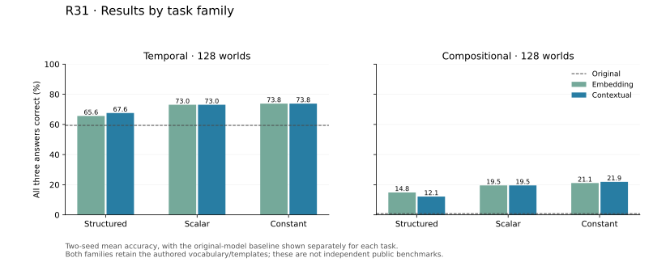

# R31 matched contextual memory

**Completed and independently reconstructed, 26 September 2026.** Original Granite
scores **30.08%** and the prospectively selected contextual-scalar condition
scores **46.29%** on 256 fresh authored worlds, averaging two fixed training
seeds. Every world requires all three answers correct. These are same-template
mechanism results, not public-benchmark or larger-model performance.

The lead condition improves over native by **+16.21 percentage points** (registered
98.75% interval **[+10.94,+21.68]**). It also exceeds its same-checkpoint donor
feedback by **+8.40 points [+3.71,+13.48]**. However, contextual and embedding
scalar repair have identical complete-world correctness on every test case;
structured contextual repair is **6.45 points worse** than scalar
(interval **[-10.55,-2.54]**). The richer memory hypothesis receives no measured
accuracy support in this cohort.

The strongest absolute score is **47.85% for the separately constant-trained
contextual adapter**, a recipe that needs no Jev in training or inference.
Live scalar minus that control is -1.56 points (secondary descriptive 95%
**[-5.08,+2.15]**), so neither its superiority nor equivalence is established.
Useful live feedback within a Jev-trained checkpoint does not establish an
advantage over this separately trained Jev-free alternative.

Preservation differs: scalar repair fixes **44/39** native failures across seeds
and damages **0/0** of the 77 native passes; constant-trained contextual repair
fixes **55/47** and damages **7/4**. This observed correction/preservation trade-off
motivates a subsequent transfer check; it is not a proven routing policy or a
newly measured deployment saving. All main arms pass the requested format on every
test case, with no length stops, so these gains are not rescued formatting counts.

The [post-hoc identity check](identity-diagnostic.json) confirms that all 832 pairs
of memory tensors differ and the selected scalar checkpoints have different
weights. Generated token sequences match in 254/256 and 251/256 cases across
memory types, while complete-world correctness matches in all cases. The zero-width
paired interval is the empirical bootstrap consequence of those zero observed
correctness differences; it does not prove identical behavior on unseen inputs.

The next bounded MuSR admission will retain both scalar memory conditions and add
the constant-trained adapters as strong controls before any fresh evaluation.
This is a result-informed follow-up, not part of R31's frozen comparisons. No
broad benchmark, larger-model or architectural-novelty claim follows from R31.


The [complete tables](TABLES.md) retain all conditions, adjusted primary intervals,
secondary controls, seed results, fixes/damage, selected epochs and readout checks.
The four registered questions are assessed individually. Failure of one comparison
does not erase a supported result on another comparison.

## Registered design and mechanism

The [prospective protocol](../../research/contextual-memory-plan-v1.md) fixes
512 training, 64 development and 256 test worlds, balanced across temporal and
compositional tracking. These are disjoint from R29/R30 and have independently
graph-replayed references; they retain the same authored vocabulary/templates.
Twelve adapters cross two memory representations, three feedback conditions and
two training seeds. Architecture, capacity, initialization, data, optimization,
token positions and checkpoint selection are matched. Each adapter's epoch is
selected on development accuracy before any test generation.

```text
Problem -> frozen Granite -> actual native draft
              |                      |
              +-- exact token IDs ---+
                            |
              +-------------+---------------------+
              |             |                     |
              v             v                     v
       frozen extraction   Jev p           common repair prompt
              |             |                     |
              v             |             frozen blocks 0..19
     three memory vectors   |                     |
              |             |                     v
              +-------------+---------> trained residual branch
                                                  |
                                         frozen blocks 20..39
                                                  |
                                         Granite vocabulary head
                                                  |
                                          generated repair tokens
```

The selected original checkpoint contains 1,631,750,144 parameters. Original
Granite and Jev weights remain frozen; only the new rank-32 branch is trained.
Three detached memory vectors pool each question and its available unique actual
draft field. Both representations use exactly the same native token positions.
The contextual extraction processes those positions in their original story and
draft context. Missing/duplicate fields use question positions only. No reference,
training target, repaired token or future token enters memory extraction or Jev.

Structured feedback uses the three actual correctness probabilities; scalar
feedback repeats their mean; constant-trained feedback is 0.5. The mean still
comes from three Jev questions and is not evidence for a cheaper one-question
verifier. Same-checkpoint constant, same-family donor and nondeployable oracle
conditions diagnose sensitivity without retraining. Oracle gates can lie outside
the training distribution and are not a guaranteed performance upper bound.
Separately trained constant
adapters answer a different training comparison. Structured versus scalar also
compares separately trained checkpoints: it changes training conditioning as well
as the inference signal, and is not an inference-only within-draft permutation
test. The matched embedding condition
differs from R29's standalone retokenized memory; do not compare absolute scores
between those studies as if memory were the only difference.

Every repair starts from a fresh cache and preserves the exact original token IDs.
The branch first acts at the final prompt position predicting the first repair
token, then at generated positions. An all-one correctness gate reproduces the
unmodified model on the repair prompt; it does not automatically retain the saved
native answer. No retention threshold, constrained grammar or forced UNKNOWN
policy is added to this experiment.



Intervals resample 256 worlds, stratified by family, using 10,000 paired bootstrap
draws. Adapter results average the two fixed seeds within each world; they are not
512 independent test cases or an ensemble. The intervals describe case sampling
conditional on these trained checkpoints, not uncertainty over arbitrary training
seeds. Four primary comparisons receive Bonferroni 98.75% intervals; 95% intervals
and other comparisons are descriptive. No new layer, learning rate or test-case
policy was selected from partial quality results.

## Integrity, work and limits

The audit verifies **11,840 outputs, 832 Jev requests, 832 memory extractions,
12,288 training-example passes and 1,536 optimizer updates**, including exact
coverage, checkpoint selection, token/tensor/feedback bindings and unchanged
original weights. Actual CUDA admission passes initial/off identity, absent
original gradients and cached/full agreement (maximum error 0.00003815, equal
argmax). All provider responses identify Jev 1.13.0.

The worker generated **143,167 tokens**, with
**711,344 Jev input tokens**. [Component accounting](WORK.md) includes
native generation, repair, bindings, extraction and provider time. These sums are
not measured interactive latency. No API-skipping policy is measured here. The
shared extraction obtains both memory types; an optimized embedding-only path was
not separately timed. Jev's model size and compute remain undisclosed, so the
combined system is not established as smaller or cheaper than another model.

The deterministic authored task, narrow room-name readout and limited training
seed count constrain generalization. [Class-balance references](supplemental.json)
are retrospective descriptive controls, not model runs. The prior-art review
already identifies verifier-guided internal steering, so this mechanism alone is
not a novelty claim. Public transfer and fair larger-model comparisons remain
separate research questions.

## Cost, cleanup and reproduction

The owned instance, disk, security group and subnet were removed after exact
immutable backup verification. The [conservative cost estimate](cost-and-cleanup.json)
is **$6.52 for this stage**, cumulative
**$129.42/$175**. It includes $3.18 operating
allowance, is not an invoice, and leaves tax/network charges unconfirmed.

- [Frozen inputs and references](artifacts/inputs.tar.gz).
- [Complete recorded run](artifacts/recorded-run.tar.gz).
- [Detached memories](artifacts/memories.tar.gz).
- [Initial and trained research adapters](artifacts/adapters.tar.gz).
- [Audited analysis](analysis.json), [hash inventory](provenance.json), and
  [independent public-archive replay](public-replay.json).

Extract inputs into a separate directory; extract recorded-run, memories and
adapters into the same run directory. Their disjoint union reconstructs every
original recorded file. Keep an immutable copy because the auditor adds analysis.
Worker source is `30bb4bc184d3ce553af9b4f59f8e0da17a6a2eaf`; frozen manifest is
`78af8126bb8f3cccaf893b26ea88ed4695bdaf85a52f6d5ce8cdbb6a7fa4fe65`.
Use the report revision and locked development/Transformers extras to run the
[documented audit correction](../../research/contextual-memory-audit-correction.md),
which canonicalizes the equivalent CUDA device label in memory only:

```bash
uv run --no-sync python research/diagnostics/audit_contextual_completion_v2.py \
  --input /path/to/inputs --output /path/to/run-copy
```

Reconstruction requires the pinned tokenizer, but no model inference or paid API
call. The extracted public evidence reproduces the complete analysis exactly.
Regenerate the figures with `uv run --no-sync --with matplotlib==3.10.7 python
reports/2026-09-26-contextual-memory/plot.py`; the pinned plotting environment is
recorded in [figure-environment.json](figure-environment.json). Both rendered PNGs
were visually inspected, and a caption overlap in the first draft was corrected.

New authored data and source use the project license; IBM's checkpoint and
external services retain their own terms. These are research artifacts, not a
generally improved Hugging Face model release or a submitted paper.
