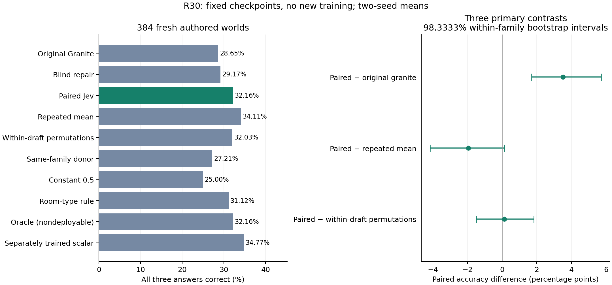

# R30 fresh feedback-pairing replication

**Completed and audited, 2026-09-26.** On 384 fresh authored tracking worlds,
original Granite scores **28.65%** and correctly
paired Jev repair scores **32.16%**, averaged over
two frozen R29 training seeds. These are mechanism results, not public-benchmark
or larger-model performance. The broad objective remains unachieved.

[Registered protocol](../../research/feedback-pairing-plan-v1.md) and
[continuation program](../../research/feedback-exploration-program.md) were frozen
before inference. This study trained no new weights and tuned no thresholds.

The native improvement replicates: **+3.52 pp**, with a family-adjusted interval
of **[+1.69, +5.73] pp**. Both seeds preserve every one of the 110 native passes
and repair 15/12 failures. The benefit is useful within this diagnostic, while
the low absolute accuracy, especially 6.51% on compositional worlds, limits its scope.

Precise field-score placement is not supported: live exceeds the average of the
two within-draft permutations by only +0.13 pp, with an adjusted interval spanning
zero. Repeated mean scores **34.11%**, versus **32.16%** live; the live-minus-mean
adjusted interval is [−4.17, +0.13] pp. Thus neither a live advantage nor the
registered ±2 pp equivalence criterion is established. The separately trained
scalar checkpoint scores **34.77%**; its comparison is secondary. Live exceeds
donor feedback descriptively, but that donor changes overall reliability as well
as localization. The room-type control is **31.12%**, with an unresolved live
advantage. These findings favor examining correction capacity and preservation,
while retaining both scalar and structured feedback in the next finite study.

Substituting perfect correctness flags into the same checkpoint scores 32.16%,
equal on average to live feedback. That motivates a memory/capacity hypothesis;
it does not establish its cause, since oracle flags also change the input distribution.



The public archives independently reconstruct the identical complete analysis.
The [SVG figure](figures/r30-feedback-pairing.svg) is available for manuscript use.

## Results

| System | All worlds (384) | Temporal (192) | Compositional (192) |
| --- | ---: | ---: | ---: |
| Original Granite | 28.65% | 55.21% | 2.08% |
| Untrained blind repair | 29.17% | 56.25% | 2.08% |
| Correctly paired Jev | 32.16% | 57.81% | 6.51% |
| Within-draft rotation left | 32.03% | 58.33% | 5.73% |
| Within-draft rotation right | 32.03% | 58.07% | 5.99% |
| Repeated mean, same checkpoint | 34.11% | 61.46% | 6.77% |
| Same-family donor feedback | 27.21% | 50.52% | 3.91% |
| 0.5, same checkpoint | 25.00% | 43.49% | 6.51% |
| Known-room answer-type rule | 31.12% | 56.25% | 5.99% |
| Correctness oracle, same checkpoint | 32.16% | 57.81% | 6.51% |
| Separately trained scalar checkpoint | 34.77% | 62.24% | 7.29% |
| Offline retention at min(p) < 0.5 | 32.16% | 57.81% | 6.51% |
| R29 frozen never-repair policy | 28.65% | 55.21% | 2.08% |

All three requested room names must be correct. Native and blind outputs are
shared; other rows average the two frozen training seeds. No grammar forces
answers. Oracle uses reference labels and is explicitly nondeployable.
The answer-type rule checks whether each actual field is a known room name,
without replaying state or knowing the correct room; its checkpoint was originally
trained with Jev, although this inference condition does not call Jev.

| Primary paired comparison | Difference (pp) | 95% interval | Family-adjusted 98.3333% interval |
| --- | ---: | --- | --- |
| Live minus native | +3.52 | [+1.95, +5.34] | [+1.69, +5.73] |
| Live minus mean | -1.95 | [-3.78, -0.26] | [-4.17, +0.13] |
| Live minus permutation_mean | +0.13 | [-1.17, +1.50] | [-1.50, +1.82] |

Intervals use 10,000 paired, within-family bootstrap draws, treating the world as
the sampling unit. The wider intervals cover the registered family of three
primary contrasts. Results are conditional on two fixed training seeds, and these
fresh worlds still use R29's vocabulary and templates.

| Secondary paired comparison | Difference (pp) | Descriptive 95% interval |
| --- | ---: | --- |
| Live minus blind | +2.99 | [+1.43, +4.82] |
| Live minus donor | +4.95 | [+2.86, +7.29] |
| Live minus constant | +7.16 | [+3.52, +11.07] |
| Live minus type_only | +1.04 | [-0.39, +2.47] |
| Live minus oracle | +0.00 | [-1.17, +1.04] |
| Live minus scalar_trained | -2.60 | [-4.30, -0.91] |

The prospective ±2 pp equivalence reference for live versus repeated mean is
**not met** by its 95% interval.
A nonsignificant difference alone does not establish equivalence. The repeated
mean still comes from three Jev questions; this does not prove that a single
Jev question would behave the same or cost less.

| Training seed | Live | Mean | Donor | Native failures repaired | Native passes damaged |
| --- | ---: | ---: | ---: | ---: | ---: |
| 2901 | 32.55% | 34.38% | 27.08% | 15 | 0 |
| 2902 | 31.77% | 33.85% | 27.34% | 12 | 0 |

Across seeds, live repairs 13.5 failed worlds and damages
0 passing worlds on average. Exact token changes for every
transformation, field accuracy, formatting, stop reasons and per-case grades are
in [analysis.json](analysis.json). Changed tokens alone do not prove useful feedback.
The half-threshold policy selects 260/384 repairs; both retention
rows are offline replay, not measured avoided API calls or GPU work.

## Mechanism and controls

The original dense Granite 4.0-1B and Jev 1.13 weights remain frozen. Each selected
R29 checkpoint adds a 262,144-parameter rank-32 residual branch after zero-indexed
block 19, using pooled input embeddings of questions and actual draft fields.
Granite generates every final token. The branch first acts at the repair boundary,
with a fresh cache for each condition and exact original draft token IDs retained.

All transformed-score conditions use the **same structured checkpoint**. The
separately trained scalar condition is labeled explicitly. Unlike R29, the constant
and oracle rows here are interventions on that structured checkpoint, not separately
trained constant/oracle adapters. Within-draft rotations preserve the score multiset
and mean; uniform vectors remain in the denominator. Same-family donor feedback
also changes overall reliability, so it alone cannot establish score localization.

## Integrity, work and limitations

All **7,680 outputs**, **384 Jev requests**, four selected checkpoint files, prompt/
draft/final token chains, intervention positions and independent graph-replayed
references pass audit. Original and adapter before/after digests match. Actual
CUDA admission passed initial/off identity, gradient ownership, and cached/full
logit agreement. No new API question design was introduced in this replication.

The run generated **93,207 tokens**. Serialized generation
summed to **4483.3 seconds**; provider usage was
**328,283 input tokens**. The deliberate 0.25-second request pause,
model loading and mechanical admission add work. These are not optimized serving
latency measurements, and Jev's undisclosed model resources count toward the system.

Authored worlds are solvable by a deterministic graph program, use a narrow
room-name readout, and do not establish broad reasoning ability or architectural
novelty. See [class-balance references](supplemental.json). R29 and R30 results
must not be pooled as if independent checkpoint selection and fresh replication
were one prespecified study. Other benchmarks and larger models remain necessary.

## Cost, cleanup and reproduction

After verified backup the owned instance, disk, security group and subnet were
removed. [Conservative cost estimate](cost-and-cleanup.json): stage
**$4.78**, cumulative
**$122.90/$175**. This
includes $3.18 operational allowance; it is not an invoice and tax/network remain
unconfirmed. Reservations are not billed amounts.

- [Frozen inputs, references and four inherited research adapters](artifacts/inputs.tar.gz).
- [Complete recorded run and provider judgments](artifacts/recorded-run.tar.gz).
- [Audited analysis](analysis.json) and [artifact hashes/inventory](provenance.json).
- [Independent auditor](../../research/iterations/feedback_pairing/audit.py).

These are research adapters requiring the separately licensed IBM checkpoint,
not a generally improved model release. New authored data/source use the project
license; external models/services retain their own terms. Frozen source:
`d2ed7b898a044d75bc672ab20aa3c2a125ac23a0`; manifest:
`793153d5b963a4265296ce6fd351dbd973763a62bd049acc636d66f59f8466f9`.

Check out the source commit, install locked development/Transformers extras,
unpack both archives into separate folders, then reconstruct without model/API
inference (the pinned tokenizer is required):

```bash
uv run --no-sync python research/iterations/feedback_pairing/audit.py \
  --input /path/to/inputs --output /path/to/recorded-run
```

Keep an immutable copy: the auditor adds `analysis.json` to the supplied run folder.
