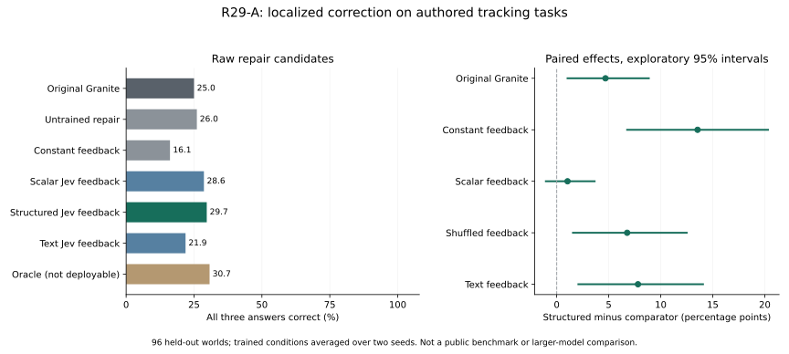

# R29-A localized correction capacity study

**Completed and audited, 2026-09-26.** On 96 held-out authored tracking worlds,
original Granite scores **25.00%** and structured Jev repair scores
**29.69%**, averaged over two training seeds. These are controlled mechanism
results, not public-benchmark or larger-model performance.

The [registered protocol](../../research/structured-correction-plan-v1.md),
[design](../../research/structured-correction-proposal.md),
[admission failures](../../research/structured-correction-admission-v1.md) and
[supplemental analysis notes](../../research/structured-correction-analysis-notes.md)
preserve the design and admission history. The frozen execution protocol and
source bindings remain unchanged. The broad north-star objective remains unachieved.

## Results

**Decision:** retain this branch as a promising mechanism candidate. The raw repair
gain over native is +4.69 percentage points (exploratory 95% interval
[+1.04, +8.85]); correctly matched feedback also beats the shuffled signal.
The scalar comparison remains unresolved: +1.04 points [−1.04, +3.65]. Thus we
have evidence that feedback alignment matters in this small cohort, but cannot
attribute the benefit specifically to three localized scores rather than overall
reliability. Across seeds, 5 and 4 of the 72 native failures are fixed, while all
24 native passing worlds are retained. These are world-level preservation counts,
not a guarantee that every individual answer field is preserved.

| System | All 96 worlds | Temporal (48) | Compositional (48) |
| --- | ---: | ---: | ---: |
| Original Granite | 25.00% | 50.00% | 0.00% |
| Untrained blind repair | 26.04% | 52.08% | 0.00% |
| Trained constant feedback | 16.15% | 27.08% | 5.21% |
| Trained scalar Jev feedback | 28.65% | 54.17% | 3.12% |
| Trained structured Jev feedback | 29.69% | 55.21% | 4.17% |
| Shuffled feedback | 22.92% | 41.67% | 4.17% |
| Trained text Jev feedback | 21.88% | 41.67% | 2.08% |
| Oracle diagnosis (not deployable) | 30.73% | 54.17% | 7.29% |
| Structured with development-selected retention | 25.00% | 50.00% | 0.00% |

Trained rows are paired seed means; native and blind generation are shared across
seeds. A world passes only when all three requested room names are correct under
the frozen readout. Formatting is separate. No grammar forces final tokens.

| Paired seed-mean comparison | Difference (pp) | Exploratory 95% interval |
| --- | ---: | --- |
| Structured minus native | +4.69 | [+1.04, +8.85] |
| Structured minus constant | +13.54 | [+6.77, +20.31] |
| Structured minus scalar | +1.04 | [-1.04, +3.65] |
| Structured minus shuffled | +6.77 | [+1.56, +12.50] |
| Structured minus text | +7.81 | [+2.08, +14.06] |

Relative to native, structured repair fixes **4.5** originally
failing worlds and damages **0** originally passing worlds on
average over the two seeds. Shuffling changes final token sequences on
**41/96** and **39/96**
cases. Changed tokens alone do not establish useful feedback.

| Training seed | Structured | Constant | Shuffled | Text |
| --- | ---: | ---: | ---: | ---: |
| 2901 | 30.21% | 16.67% | 22.92% | 21.88% |
| 2902 | 29.17% | 15.62% | 22.92% | 21.88% |



The primary experiment compares raw repair candidates. The secondary retention
thresholds are {'2901': 0, '2902': 0}, selected on development outcomes before any test
generation. Retained controls share live Jev allocation; they are not wholly
Jev-free deployment systems. Retention is offline replay, not measured skipped
API calls or GPU work. Oracle feedback deliberately uses reference correctness
flags and cannot support a deployable-performance claim.

Both selected thresholds are zero: the development policy chose **never repair**.
Its held-out result is therefore exactly native, despite the positive raw-candidate
comparison. We do not retune the threshold on the test set or describe the
selective policy as improved. Compositional accuracy remains only 4.17% for
structured repair (native 0%); this is still a weak practical solver.

## Diagnostic findings and next experiment

The [post-result readout inspection](readout-diagnostics.json) finds no formatting
failures in any held-out arm. Every non-room answer is a crate name or color:
`blue crate`, `yellow crate`, `green`, `red crate`, `green crate`, `blue`, `yellow`,
or `red`. These identify a container rather than the requested final room; they
are not equivalent expressions for a gold room name. The registered grades stay
unchanged. The failure pattern is compatible with incomplete composition through
the container-to-room relation; it does not identify a neural cause.

Individual-field accuracy is 45.49% native and 52.43% structured repair averaged
over seeds; this is a secondary measure, distinct from all-three-correct world
accuracy. All 1,344 held-out generations end at EOS, with no empty or length-stopped
output. Per-arm field accuracy, format and stopping counts are in the inspection.

At the descriptive cutoff p < 0.5, Jev flags 125/157 wrong native answer fields
and only 1/131 correct fields. All 32 missed wrong fields occur in compositional
worlds. This is verifier accuracy on the original drafts, not generated-answer
accuracy. The independently supplied oracle diagnoses reach only 30.73% final
world accuracy, so knowing which fields are wrong does not solve most cases with
this training/repair configuration. The oracle arm is not a ceiling for future
models or a measured effect of changing only Jev, since it has separately trained
weights.

The next decision is to distinguish **global reliability from slot localization**
before investing in broader benchmarks or a larger adapter. A fresh, separately
registered replication should keep these selected checkpoints fixed and compare
live scores with their within-draft permutations and their repeated mean. That
holds the score multiset or global mean fixed, whereas R29-A's donor shuffling also
changes overall reliability. Include native, blind repair and the existing
separately trained scalar control; retain every case and both seeds.

Only then compare contextual question/answer memory with the current mean input
embeddings, changing memory construction while matching capacity and training.
Representations must derive solely from the observed problem and actual draft,
never test references or future training target tokens. Broader public transfer
needs a new source-disjoint protocol, calibrated selective execution and explicit
preservation checks. These are follow-up decisions, not additional executed runs,
novelty claims or a promise that a particular insertion layer will succeed.

## Mechanism and training

The original dense Granite 4.0-1B checkpoint and Jev 1.13 stay frozen. A new
262,144-parameter rank-32 branch after zero-indexed block 19 conditions its residual
update on three question/draft representations and localized correctness scores.
Memory uses mean frozen input embeddings. Jev judges actual native drafts and
Granite generates every final token. Intervention begins at the repair boundary;
earlier cached states are not retroactively changed.

Five conditions have identical capacity, initialization, data, optimizer and two
seeds: structured, scalar, constant, text and oracle feedback. Each has two epochs.
Correct training drafts use their exact original tokens as preservation targets;
wrong drafts use independently constructed corrections. Checkpoints and retention
thresholds are chosen only on 32 development worlds and frozen before test.
The data contain 128 training and 96 test worlds, balanced across the two families.

## Integrity and limitations

All **2,144 outputs**, **256 Jev requests** and
**2,560 training steps** pass reconstruction of source/data hashes,
exact prompt/draft/final tokens, feedback treatment, receipts, checkpoint selection,
preservation targets and independent graph-replayed references. Both backbone
weight digests match. Actual MPS and CUDA mechanical admissions passed. The six
constructed API fixtures still have their disclosed 16/18 slot accuracy; no
question was retuned after that finding.

This small test uses fresh worlds sharing training templates. Its exact room-name
readout is not a general semantic grader, and a deterministic graph program solves
the task by construction. [Constant-room references](supplemental.json) disclose
class balance. Results cannot establish broad reasoning gains, novel architecture,
or superiority to larger language models. Two seeds are not a large training
replication. Intervals are exploratory and are not adjusted multi-benchmark tests.
Jev's undisclosed model resources belong to the system's total cost and size.

The best retrospective constant-room policies (always office or always hall on
all three lines) each solve 3/96 worlds, or 3.12%. Those are class-balance
references, not separately run language models.

The [training-only memory probe](training-memory-diagnostic.json) finds median
within-world slot cosine similarity 0.913105. That motivates investigating contextual
memory but does not establish the cause of any result. It did not inspect test
outputs or change the frozen run.

## Work, cost and cleanup

The recorded run generated **26,114 tokens**. Serialized generation
summed to **1216.5 seconds**; this is not optimized serving
latency or wall-clock experiment time. Provider usage is **218,877 input
tokens**. The deliberate two-second pre-request pause, training, development and
bootstrap also consume time; API receipts record request latency separately.

The GPU instance, owned disk, security group and subnet are verified deleted
following an exact-inventory/hash-verified backup. [Cost and cleanup](cost-and-cleanup.json)
estimate this stage conservatively at **$4.12**, including
$3.18 operating allowance, and the cumulative research total at
**$118.12/$125**. These are estimates,
not invoices; taxes/network remain unconfirmed.

## Reproduction and artifacts

- [Audited analysis and per-case grades](analysis.json).
- [Frozen authored cases, references and manifest](artifacts/inputs.tar.gz).
- [Recorded run, API judgments and all research adapter checkpoints](artifacts/recorded-run.tar.gz).
- [All six constructed API admission fixtures and receipts](artifacts/api-admission.tar.gz).
- [Artifact hashes and backup inventory](provenance.json).
- [Archive verification and exact independent replay](replay-verification.json).
- [Independent auditor](../../research/iterations/structured_correction/audit.py).

The recorded-run archive contains research adapters that require the separately
licensed IBM checkpoint, not a generally improved model release. Source and
new authored cases use the repository's license; external models/services retain
their own terms. The source commit is
`71bf96440cb7c3bde7a06139df5677e6fc142864` and the frozen manifest hash is
`025db0b26b7c3c6223ab4e66bd0aaf092f1b05be4286069872e87e2f97fd26cc`.

For an offline statistical/token reconstruction, check out the source commit,
install the locked development and Transformers extras, unpack the inputs and
recorded run into separate folders, and run:

```bash
uv run --no-sync python research/iterations/structured_correction/audit.py \
  --input /path/to/inputs --output /path/to/recorded-run
```

The auditor loads the pinned tokenizer but does not call Jev or run the model.
Keep an immutable copy of the downloaded run; the auditor adds `analysis.json`
to its output folder. [Figure renderer](../../research/diagnostics/render_structured_correction.py)
uses Matplotlib in an optional separate environment.
