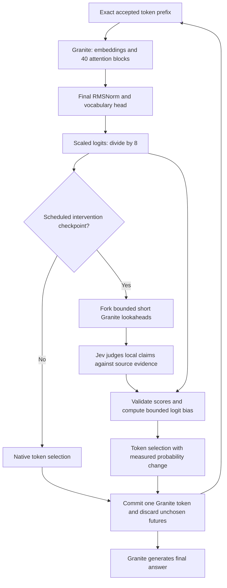

# Where Jev should influence Granite

Date: 2026-09-21. Status: **research decision and proposed design**, not an
implemented replacement decoder or a demonstrated quality improvement.

## Decision

With the interfaces we actually have, the most defensible next insertion point
is **after Granite's final normalization, vocabulary projection and logit scaling,
before selecting the next token**. Jev should supply a small, bounded preference
between short, meaningful counterfactual continuations, at selected checkpoints.
It should first prove reliable at a narrow semantic judgment, such as whether a
new claim matches its source. Do not make it the universal arithmetic/proof oracle.

This is an inference-engine intervention into Granite's token probabilities.
It is still decoding, not Jev embedded as a neural module within attention.
Moving the old controller into a method named `forward` would not change that.
If the requirement is literally to change hidden activations inside a layer,
that is a separate, data-dependent experiment described below. No evidence yet
identifies a correct layer number for it, and deeper placement does not itself
make an unreliable judgment reliable.

## Exact model, verified rather than inferred from its name

The studied checkpoint is `ibm-granite/granite-4.0-1b` revision
`6a7381ba1f54d684ff508d991aeb7dc580157103`. Its
[pinned configuration](https://huggingface.co/ibm-granite/granite-4.0-1b/blob/6a7381ba1f54d684ff508d991aeb7dc580157103/config.json)
uses `GraniteMoeHybridForCausalLM`, but all 40 configured layers are attention and
`num_local_experts = num_experts_per_tok = 0`. This is the dense attention model;
the class supports other variants. Width is 2,048, with 16 attention heads and
4 KV heads. The previous runtime counted 1,631,750,144 parameters, all frozen.

In [Transformers 4.57.1's actual implementation](https://github.com/huggingface/transformers/blob/v4.57.1/src/transformers/models/granitemoehybrid/modeling_granitemoehybrid.py),
the path is embeddings → 40 decoder blocks → final RMSNorm → `lm_head` → division
by `config.logits_scaling` (8) → returned logits. The installed source and upstream
file hashes match; the [inspection record](../reports/2026-09-21-architecture-reassessment/model-audit.json)
preserves the exact fields and hashes. A hook written for the separate
`GraniteForCausalLM` class would target the wrong implementation.

The current backend reads model-produced logits internally but exposes complete
candidate continuations to the controller. Jev does not see those logits, residual
vectors, attention heads or KV cache. The controller's choice changes which token
prefix Granite sees on the next generation call; it changes no weight or hidden
activation directly. It also repeats prefix prefill between chunks.

## What Jev can supply

The verified [API](https://docs.typesafe.ai/api.md) accepts text/structured state
and typed questions. It returns judgments such as a Noul probability or a Choice
distribution. The documented interface supplies no tensor-forward or gradient
API, model weights, or vocabulary-aligned next-token logits. This is a statement
about the public interface inspected here, not a claim that private deployment
arrangements could never exist.

Jev's [Noul](https://docs.typesafe.ai/primitives/noul.md) is the estimated probability
that a specified condition holds; it has no separate confidence field. Neither
that value nor Choice/Score confidence is automatically the probability that a
Granite continuation will eventually produce a correct answer. Distribution
concentration is distinct from empirical accuracy. [Confidence documentation](https://docs.typesafe.ai/confidence.md).

The provider explicitly documents weaknesses in exact numerical tasks, indirect
multi-hop questions and irrelevant context for [Jev 1.13](https://docs.typesafe.ai/model-jaggedness/jev-1.13.md),
last reviewed 2026-09-17. Our old support question asks Jev to validate *every*
claim in the accumulated prefix plus the candidate against all original evidence.
That grows the verification burden over time. The progress question also excludes
restatement, so an innocuous setup step can stop the entire trajectory. The
[new trace audit](../reports/2026-09-21-architecture-reassessment/README.md) establishes
gate behavior; attributing a particular wrong answer to these limitations remains
a hypothesis until an independently labeled audit or ablation tests it.

## Proposed runtime path



The runtime scheduler holds the accepted prefix and the corresponding model state.
At a scheduled checkpoint it proposes a small set of distinct next-token actions
and generates bounded continuations from each. Jev scores the resulting short
claims, not isolated token fragments. There must be a meaningful semantic branch
to compare; alternative whitespace or subword spellings are not enough.

The first prototype should use complete evidence for short source passages and
a narrow rubric: does the local assertion follow from that evidence, including
correctly reporting a missing fact? It must distinguish “supported,” “unsupported”
and “not yet an assessable assertion” in the decision policy. The last case makes
no intervention; it does not force a final answer. Long-source retrieval is an
additional component requiring its own omission tests, not an implicit capability.

Progress/novelty is recorded separately and is **not a hard eligibility gate** in
the first proposed treatment. Exact arithmetic and formal rule engines, if later
introduced, are separately named arms with the same tool access in controls;
their gains cannot be attributed to Jev. Jev continues to participate live; no
trained replacement critic is proposed for this first experiment.

### A concrete token-level contract

Let `z` be Granite's returned, already-scaled logits and let `p` be the common
baseline sampling distribution after the chosen temperature and required token
masks. The initial mechanism experiment should use `top_p = 1` to avoid an
additional moving nucleus; masks and EOS rules are identical across arms.

For each evaluated action `v`, generate the same fixed number of short lookaheads
and aggregate Jev's local judgments into a utility `u(v)` with a rule fixed on
development data. A score of an unfinished claim is missing evidence about utility,
not a false judgment. If no actionable comparison exists, set every bias to zero.
Unexamined actions also retain zero bias. One possible bounded form is:

```text
b(v) = clip(lambda * (u(v) - u(reference)), -b_max, +b_max)
q(v) = p(v) * exp(b(v)) / sum_w[p(w) * exp(b(w))]
```

The reference is a prespecified native continuation scored with the same rubric;
when it is unassessable, the initial prototype makes no intervention. Candidate
selection never masks the rest of Granite's vocabulary. Decrease the bias scale
until the exact one-step `KL(q || p)` satisfies the development-frozen bound.
Apply this as an additive bias in log-probability space, after temperature. Adding
it before Granite's division by 8 or before temperature without rescaling would
change its intended strength.

This is a bounded heuristic control law, not a derivation that Jev estimates the
true future value function. A local claim can be correct but useless, or lead to
an incorrect later answer. [Controlled Decoding](https://arxiv.org/abs/2310.17022)
learns a prefix value function; its guarantees do not transfer to an arbitrary
Noul rubric. [DeAL](https://arxiv.org/abs/2402.06147) is a particularly relevant
lookahead-guided decoding precedent. The general idea is established prior work,
so novelty must be narrower than “a second model guides generation.”

At `lambda = 0`, the sampling distribution must be exactly the native distribution.
Lookahead RNG must be separate from the committed-token RNG so a no-op treatment
reproduces the control token path. Committing only one token avoids copying a
Jev-selected whole answer, but it creates a credit-assignment limitation: the
eventual continuation may differ from the evaluated lookahead. Measure this;
do not call the short-rollout score an exact future-value estimate.

### Scheduler, cache and failure behavior

No HTTP call belongs inside each attention layer's GPU forward pass. A Python
scheduler can orchestrate branches and the hosted request, then supply a local
tensor bias to the token selector. A normal synchronous `LogitsProcessor` alone
does not supply asynchronous lookahead, branch budgets and cache ownership.
Start with an explicit Transformers generation loop; consider a vLLM scheduler
integration only after quality and cache semantics are established.

Every response is bound to a request ID, exact prefix hash, model revision,
checkpoint index and branch token IDs. A stale response cannot affect a later
prefix. Branches must have independent mutable caches, masks and positions.
Begin with re-prefill from exact tokens as the correctness reference; optimize
cache reuse later and test it against that reference. No rejected branch cache
may enter the accepted state. Log every lookahead token, padded slot, prefill,
API request, score, applied bias, KL value, committed token and stop reason.

No useful score distinction means native continuation under the declared policy.
An API error, unknown paid usage, malformed score, or cancellation is a recorded
failure and stops the guided trial; it must not silently become a successful
baseline trial. Exhausted intervention budget, decided before dispatch, means
continue under the explicitly recorded native policy within the final-generation
reserve. All comparison arms receive the same completion opportunity.

Guidance initially applies only to intermediate generation. The final-answer
phase uses the same unassisted Granite rule in all primary arms; Jev does not see
or choose final labels. No reference answer reaches either model. More permissive
final-token guidance, if investigated, is a new protocol with different attribution.

## If we require intervention inside an actual decoder layer

A valid hidden-layer experiment would alter a residual or selected attention-head
output, for example `h_l' = h_l + alpha * d_l`, where `d_l` is a validated direction
for a specific behavioral property. Jev could choose whether and how strongly to
activate a previously validated direction based on the current textual context.
This would give Jev a live role while changing a tensor within Granite.

The missing ingredient is the mapping from a Jev judgment to a useful direction
in Granite's 2,048-dimensional representation. A scalar judgment does not provide
it. Broadcasting a probability to all dimensions or attention heads is arbitrary;
interpreting it as an attention weight is unjustified. Serializing hidden vectors
as text does not create a trained shared representation.

A separate development study would collect independently labeled contrastive
examples, estimate directions or a small mapping, and use **causal interventions**
to evaluate layer/site/strength choices. A linear probe's prediction accuracy is
not evidence that moving along its direction improves generation. Test no-op,
sign-reversed, norm-matched random, fixed-direction and Jev-triggered interventions;
measure answer utility, fluency, abstention and unrelated-task degradation.
Choose the site on development data, then freeze a fresh test. A late-layer sweep
is a possible search range, not an already discovered best location.

[Inference-Time Intervention](https://arxiv.org/abs/2306.03341) demonstrates selected
head interventions using labeled examples in other models; it does not identify
Granite's effective heads. [PPLM](https://arxiv.org/abs/1912.02164) uses a differentiable
attribute model; the hosted text-only Jev call cannot provide those gradients.
We need neither Granite's original pretraining corpus nor full retraining to
collect calibration examples, but activation alignment is still additional
research and may involve fitting parameters. It is outside the implemented
frozen-weight controller and not silently substituted for live Jev.

## Alternatives and decision boundary

| Placement | What it changes | Main missing evidence | Decision now |
| --- | --- | --- | --- |
| Prompt feedback after a full answer | Next prompted attempt | Attribution versus ordinary revision | Useful control if studied; not inside-model integration |
| Old hard step filter | Accepted complete text prefix and early stopping | Reliable critic, proposals, stop-policy separation | Preserve as historical comparator; do not repeat unchanged at larger scale |
| Sparse output-logit bias | Distribution used to commit the next token | Local critic discrimination and lookahead value | First feasible mechanism hypothesis after critic gate |
| Residual/attention intervention | Hidden representation within chosen layers | Causal direction/site calibration and dynamic Jev mapping | Separate later experiment; no layer selected yet |
| Cross-attention to Jev hidden representations | Network architecture and representation exchange | Jev weights/tensor access, alignment, training and serving contract | Not supported by the verified hosted interface |
| Jev at every layer/token | Frequent intervention or network waits | Meaningful tensor semantics plus feasible cost | No technical justification from current evidence |

Colocation can reduce communication overhead if a suitable deployment becomes
available. It cannot repair a bad rubric, missing useful branches, or forced early
termination. The decision to build a serving extension should follow a measured
quality/compute benefit, not substitute for that evidence.
