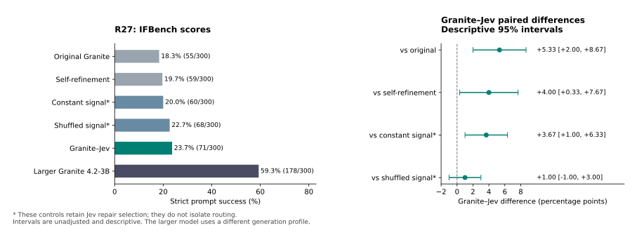
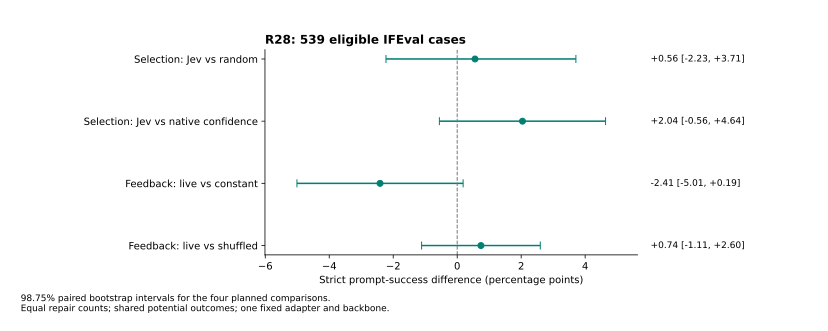

# Separating Repair Selection from Internal Feedback in a Small Language Model

Working research manuscript, updated 26 September 2026. Authors, affiliations and
contribution statements await owner/coauthor decisions. Not submitted or peer
reviewed. The earlier [chronological manuscript notebook](paper-draft.md) and
[study register](study-register.md) preserve the complete exploration, including
negative results and corrections. This manuscript narrows the research question;
it does not replace the project's broader, unachieved objective.

## Abstract

External verification can influence a language model by selecting answers for
revision or by supplying information that changes the revision itself. We study
these roles in IBM Granite 4.0-1B with TypeSafe Jev, a hosted model returning typed
judgments. Granite generates every answer token; Jev's probability scales a
262,144-parameter residual adapter after decoder block 19 during a second pass.
In a completed three-task evaluation, the guided system improves strict IFBench
success from 55/300 to 71/300 and GPQA Diamond accuracy from 37/198 to 54/198,
while all tested 1B variants solve zero of 30 AIME problems. Shuffled feedback
recovers most of both gains. Those controls retain Jev's repair selection, so
they do not isolate the value of routing. GPQA improvements also coincide with
fewer unreadable final answers, and a retrospective constant-label reference
outperforms the guided score. We therefore registered a separate, fresh policy
comparison on 539 eligible IFEval cases, holding repair counts fixed across Jev,
model-confidence and random selectors and comparing live, constant and shuffled
internal feedback. Original Granite scores 408/539 (75.70%), while Jev-selected
live repair scores 379/539 (70.32%). The repair fixes 11 native failures but damages
40 native passes. Neither selection nor internal feedback meets its registered
two-control criterion. These evaluations distinguish observed instruction
compliance from verifier attribution and reveal failed transfer of this repair
configuration; they do not establish a broadly superior language-model architecture.

## 1. Research question

A verifier can recognize an error without enabling a generator to correct it.
Conversely, a trained second pass may improve an answer even if the external
judgment contributes little useful information. These possibilities require
separate comparisons: improvement over the original generator establishes a
system-level difference; improvement over equally equipped controls is needed
to attribute that difference to a particular verifier input.

Our question is whether Jev contributes useful inference-time information to a
small generator through (a) selecting which answers receive repair or (b)
modulating the repair computation. We study one fixed checkpoint and insertion
point. The contribution sought is a controlled empirical account of these roles,
not the invention of verification, refinement, low-rank intervention or routing.
The ambitious goal of outperforming named larger models across a broad benchmark
suite motivates the project but is not supported by the present evidence.

## 2. Relation to previous work

Zhang et al.'s [SCORE](https://arxiv.org/abs/2404.17140) already separates verification
from refinement and evaluates external and intrinsic verifiers for smaller language
models. We extend the experimental question to a scalar signal entering a fixed
internal adapter. The conceptual separation itself is not new.
[Self-Refine](https://arxiv.org/abs/2303.17651) studies iterative textual feedback;
our second-pass control does not reproduce its full procedure.
[ReFT](https://arxiv.org/abs/2404.03592) establishes learned representation
interventions with frozen backbones. [SCoRe](https://arxiv.org/abs/2409.12917)
studies correction training with reinforcement learning; our small supervised
adapter does not test that approach.

[RouteLLM](https://arxiv.org/abs/2406.18665) addresses model routing under quality
and cost trade-offs. Our allocation is between retaining an answer and running
a second pass through the same generator. [IFEval](https://arxiv.org/abs/2311.07911)
and [IFBench](https://arxiv.org/abs/2507.02833) provide independently verifiable
instruction constraints, which measure compliance rather than comprehensive
semantic quality. The [prior-art comparison](routing-feedback-related-work.md)
records the review depth and relevant differences. No direct empirical comparison
with these published methods has been performed.

## 3. Method

### 3.1 Generator, verifier and token ownership

The generator is dense, all-attention IBM Granite 4.0-1B, pinned to revision
`6a7381ba1f54d684ff508d991aeb7dc580157103`. Its model family implementation has
hybrid support, but the selected checkpoint is not a mixed attention/Mamba model.
The checkpoint contains 1,631,750,144 original parameters; the product name is
not an exact parameter count. Those original weights remain frozen.

Granite first produces an ordinary full-vocabulary response. Jev 1.13.0 receives
only the user problem and this response and returns the probability that the
response satisfies the requested judgment. For instruction tasks the question
asks whether all content and explicit formatting requirements are fulfilled.
The benchmark checker, constraint metadata and reference answers are absent
from that request. A probability is a fallible judgment, not a correctness label.

If repair is selected, the next input preserves the exact original prompt and
generated token IDs and appends a request to check and correct the answer. Every
repair uses a new cache. There is no forced UNKNOWN option, restricted answer
vocabulary, or Jev-generated final label in the scored system.

```text
User prompt --> Frozen Granite --> Original generated answer
                                      |             |
                                      |             +--> Native log-probability
                                      v                  or random control
                                Jev judgment p                |
                                      |                       |
                             Select answers to repair <-------+
                                      |
             +------------------------+------------------------+
             | retain                                          | repair
             v                                                 v
     Exact original answer                   Prompt + exact original answer
                                              + common repair instruction
                                                           |
                                               Frozen blocks 0 through 19
                                                           |
                                            h' = h + g * trained residual(h)
                                                           |
                                              Frozen blocks 20 through 39
                                                           |
                                              Granite vocabulary head
                                                           |
                                              Generated repair answer
```

The experiment varies selection and the scalar g. Jev is called after the native
answer, not once per layer or token. Its scalar is held fixed while the repair is
generated; it does not provide hidden states, gradients, a textual correction or
missing factual knowledge.

### 3.2 Internal intervention and earlier training

For hidden vector h, define s as its root-mean-square magnitude with a small
positive floor. The intervention is:

    residual(h) = 0.5 s tanh(U tanh(D(h / s)))
    h' = h + g residual(h)

D and U are rank-64, bias-free matrices with 262,144 total parameters. Live
feedback uses g = 1 - p. A zero gate is exactly the identity. The branch acts
after zero-indexed block 19 at the last prompt position predicting the first
repair token and subsequent generated positions. Earlier draft positions are
not retroactively modified.

The [completed R25 study](../reports/2026-09-23-gated-repair/README.md) trained
live- and constant-gated adapters using 384 examples from GSM8K and ARC-Challenge,
64 development examples and two training seeds. Only the new matrices were
trained; source solutions supplied training targets. Final completed training
and evaluation used FP32 after a preserved BF16 admission failure. R27 and R28
reuse the live seed-2501 epoch-2 checkpoint selected on that development set.
They do not train on IFBench or IFEval.

Controls using that checkpoint with fixed feedback are **Jev-free at inference**
when their selector also avoids Jev. They are not Jev-free training controls,
because the shared adapter was originally trained with Jev judgments. The older,
separately trained constant adapter answers a different training comparison.

## 4. Completed benchmark evidence: R27

The following are complete denominators under the registered OVRLab generation
profiles, not claims to reproduce every official leaderboard recipe. Original,
guided and all listed 1B controls are complete. The larger Granite profile also
finished every scheduled case, although many responses reached its token limit
without finishing the thinking segment.

| System | GPQA Diamond /198 | IFBench strict /300 | AIME 2026 /30 |
| --- | ---: | ---: | ---: |
| Original Granite 4.0-1B | 37 (18.69%) | 55 (18.33%) | 0 |
| Granite–Jev | 54 (27.27%) | 71 (23.67%) | 0 |
| Jev-free self-refinement of every case | 33 (16.67%) | 59 (19.67%) | 0 |
| Jev-routed blind repair | 36 (18.18%) | 59 (19.67%) | 0 |
| Jev-routed constant-trained adapter | 53 (26.77%) | 59 (19.67%) | 0 |
| Jev-routed live adapter, constant signal | 52 (26.26%) | 60 (20.00%) | 0 |
| Jev-routed inverted signal | 36 (18.18%) | 57 (19.00%) | 0 |
| Jev-routed shuffled signal | 51 (25.76%) | 68 (22.67%) | 0 |
| Granite 4.2-3B, thinking profile | 42 (21.21%) | 178 (59.33%) | 8 (26.67%) |



Figure 1. Completed R27 instruction-following evidence. Constant and shuffled
signal controls keep Jev routing; the intervals are descriptive.

The guided-minus-original IFBench difference is +5.33 percentage points, with
22 wins, six losses and a descriptive paired 95% interval [2.00, 8.67]. All wins
start from nonempty native answers. Guided-minus-shuffled is only +1.00 point,
with six wins, three losses and interval [-1.00, 3.00]. These unadjusted intervals
are descriptive; they are not a confirmatory multi-benchmark superiority test.

On GPQA the guided gain is +8.59 points, with 32 wins and 15 losses. Unparseable
finals fall from 67 to 16. A post-hoc partition finds 16 wins originating from
unparseable native answers and 16 from parseable wrong answers; all 15 losses end
in parseable wrong answers. Thus the net gain partitions into +16 and +1. This
describes transitions between readout categories, not the correctness of hidden
reasoning. The reference labels are imbalanced: a retrospective always-B output
would score 70/198, above guided 54/198. It was not a preregistered policy or a
separate model run and does not alter the saved grades.

The larger Granite is substantially stronger on IFBench and AIME. Its 140/198
unfinished GPQA thinking responses make the lower GPQA score unsuitable as
evidence of a smaller-model capability victory. Qwen output coverage is incomplete
and prompt-length ordered, so no representative Qwen accuracy is reported.
Seven other planned full benchmark tasks remain incomplete.

The six routed 1B arms all use the same Jev repair decision. Their signal controls
therefore do not establish whether Jev contributes through selection. The
Jev-free self-refinement control repairs every case and has a different repair
budget. This is the attribution gap motivating R28.

Full evidence, token/receipt audits, frozen readouts and uncertainty are in the
[R27 report](../reports/2026-09-25-completed-granite/README.md). The post-hoc
completed-Granite analysis was specified before fresh scoring, after generation
closed with the larger cross-family comparison incomplete; it is not an external
preregistration or completion of the originally planned full suite.

## 5. Prospective attribution study: R28

### 5.1 Cohort and independent scoring

IFEval is pinned to Google Research commit
`e6890f85757dd84e27ca6df2dd30651dafad28e0`. Before generation, its 541 input
prompts were screened against 2,040 unique earlier project prompts: no normalized
exact or five-word-shingle near overlap at Jaccard 0.65 was found. This limited
check does not establish absence of semantic overlap or pretraining exposure.

Metadata admission found that upstream keys 1122 and 1129 use punctuation in the
letter-frequency checker, which substitutes a random alphabetic character.
These two cases are excluded prospectively without changing the upstream grader,
leaving 539 eligible cases. We report the eligible cohort, not an official full
541-case score. All other admitted constraint parameters are fully specified.
The original grader passes 48 upstream tests and 12 constructed strict
pass/fail/empty checks. Language detection is seeded for repeatability.

The primary outcome is original strict prompt-level compliance. Loose prompt-level
and instruction-level compliance are secondary. These checks do not determine
whether an otherwise compliant answer is factually correct or useful.

### 5.2 Equal-count allocation and feedback controls

The fixed checkpoint, prompt contract and 2,048-token ceiling are shared across
conditions. Two deterministic disjoint blocks contain 270 and 269 cases. Each
selector repairs floor(n/2) per block, totaling 269 repairs. Jev chooses the lowest
probabilities of compliance; native confidence chooses the lowest mean log
probability of generated non-EOS tokens; random selection uses a fixed hash seed.
Empty native answers have lowest confidence. Stable hash ordering breaks ties.

A constant-strength repair is collected for every case. Jev-selected cases also
receive live and shuffled-signal repairs. Shuffling is a deterministic cyclic
derangement within each block's selected cases, preserving exactly their signal
distribution and avoiding self-donors. This permits seven policy comparisons:
native, always-constant repair, Jev/constant, confidence/constant, random/constant,
Jev/live and Jev/shuffled. A 100-seed random allocation sensitivity is secondary.

These are policies evaluated from freshly collected deterministic potential
outcomes. Shared responses do not inflate the number of evaluated problems.
The study queries Jev on every native answer and generates counterfactual repairs;
it is not a measurement of skipped API requests or separately deployed latency.
Equal repair counts and ceilings do not imply equal realized token counts or FLOPs.

### 5.3 Analysis and decision criteria

Four primary paired comparisons test Jev/constant versus random/constant and
confidence/constant, then Jev/live versus Jev/constant and Jev/shuffled. We use
20,000 paired bootstrap draws stratified by block, with 98.75% intervals to
account for this family of four. A component meets the registered practical
criterion only if both relevant lower bounds exceed zero, each point estimate
is at least two percentage points, and both blocks agree in direction. The
blocks are consistency checks, not independent trained-model replications. The
bootstrap conditions on the frozen selection and donor assignment; it does not
measure uncertainty from refitting or re-ranking a policy in another cohort.

Unadjusted 95% intervals for native comparisons remain descriptive. Failure to
meet the criterion is not proof of equivalence; this sample may miss small
benefits. We do not tune thresholds or stop early based on correctness scores.
Generation, source, checkpoint, prefix, hook, donor, selection, workload and API
receipt admission precede grading. Missing planned outcomes leave the study
incomplete instead of silently reducing its denominator.

### 5.4 Results

| Policy | Strict prompt success | Loose prompt success | Repairs |
| --- | ---: | ---: | ---: |
| Original Granite | 408/539 (75.70%) | 417/539 (77.37%) | 0 |
| Always repair, constant signal | 360/539 (66.79%) | 369/539 (68.46%) | 539 |
| Jev selection, constant signal | 392/539 (72.73%) | 402/539 (74.58%) | 269 |
| Native confidence, constant signal | 381/539 (70.69%) | 391/539 (72.54%) | 269 |
| Random selection, constant signal | 389/539 (72.17%) | 396/539 (73.47%) | 269 |
| Jev selection, live signal | 379/539 (70.32%) | 387/539 (71.80%) | 269 |
| Jev selection, shuffled signal | 375/539 (69.57%) | 383/539 (71.06%) | 269 |

| Primary contrast | Difference (pp) | 98.75% interval | Wins / losses | Blocks (pp) |
| --- | ---: | ---: | ---: | ---: |
| Selection: Jev − random | +0.56 | [-2.23, +3.71] | 22 / 19 | +0.00, +1.12 |
| Selection: Jev − native confidence | +2.04 | [-0.56, +4.64] | 21 / 10 | +1.85, +2.23 |
| Feedback: live − constant | -2.41 | [-5.01, +0.19] | 10 / 23 | -2.22, -2.60 |
| Feedback: live − shuffled | +0.74 | [-1.11, +2.60] | 10 / 6 | +1.48, +0.00 |

Selection criterion: **not met**. Internal-feedback criterion: **not met**.
Each component requires both relevant adjusted lower bounds above zero, both
point estimates at least +2 pp, and a positive difference in each block.
Failure to meet that criterion does not establish equivalence or rule out
smaller benefits. All planned comparisons are retained.



Figure 2. Registered primary comparisons on the 539 eligible cases. All 1,616
generated answers and 539 Jev receipts passed independent integrity admission
before scoring. The [complete R28 report](../reports/2026-09-25-routing-feedback/README.md)
contains token/work accounting, secondary readouts, numerical replay and costs.

## 6. Interpretation and limitations

The fresh IFEval cohort reverses the earlier IFBench direction: all tested repair
policies score below original Granite. Live repair loses 5.38 percentage points
relative to native, with 11 wins, 40 losses and a descriptive 95% interval
[-7.98, -2.78]. None of the four primary attribution intervals excludes zero at
the registered 98.75% level. A positive point estimate for selection versus native
confidence therefore does not establish an effective repair system.

Post-result selection inspection finds 116 of the 131 native failures among Jev's
269 selected cases, compared with 53 for native confidence and 67 for fixed random
selection. Jev identifies many problematic drafts, but live repair fixes only 11
of those 116 and damages 40 of 153 selected native passes. The fixed quota would
require at least 138 native passes even under perfect error ranking. Correction
ability and preservation are therefore central limitations under this allocation;
we have not tested a policy that can choose very few repairs. These descriptive
counts are not a newly substituted primary outcome or a validated threshold.

The original checker also emitted one handled language-detection exception during
a loose-check candidate evaluation. The pinned upstream fallback accepts that
language constraint. Post-result rechecking reproduces all original booleans and
finds no such exception during strict evaluation. This limits the secondary loose
metric without changing the primary scores; details and hashes are in the
[R28 diagnostic record](../reports/2026-09-25-routing-feedback/review-diagnostics.json).

The earlier IFBench result supports improved constraint compliance in that tested
system. It does not establish that correct scalar pairing is essential, nor that
the generator has acquired broad reasoning ability. A scalar assessment also
specifies neither which requirement failed nor how to repair it. Whether richer
structured feedback would help is a separate hypothesis requiring another study.

The evidence concerns one backbone, one adapter selected from a small supervised
training study, one fixed layer and specific generation profiles. Greedy decoding
and pinned software improve traceability but do not guarantee identical behavior
on other hardware. Hosted Jev's internal compute and parameters are unknown;
reporting only Granite's size would understate the whole system. Colocation,
production serving and end-to-end latency are not measured.

R27's repeated exploration, descriptive analyses, readout artifacts and incomplete
larger-model comparison limit generalization. R28 avoids tuning on its answers
but uses a long-public benchmark, and its rule-based grader does not provide
comprehensive semantic evaluation. Numerous earlier attempts are retained rather
than selectively presenting the most favorable stage. Their lexical, classifier,
judge-based and independently checked scores are not interchangeable metrics.

## 7. Reproducibility and publication status

The repository preserves source revisions, protocols, manifests, original and
adapter weight hashes, exact generated IDs, stopping decisions, API receipts,
negative attempts and resource accounting. Original model parameters are compared
before and after inference. Dataset-specific licenses remain separate from the
code license. Gated GPQA material and private operational credentials are not
redistributed as public raw artifacts. Public aggregate scores alone cannot
reproduce every historical token audit.

The [reproduction guide](routing-feedback-reproduction.md) documents the R28
acquisition, inference, integrity and grading paths and separates offline replay
from a new paid run. Hosted API availability and version retention remain external
dependencies. A broader replication on another backbone and appropriately
validated larger-model generation profiles would be needed for broader claims.

Implementation, orchestration, analysis and drafting received AI assistance.
Human authors must verify the evidence, review the text and take responsibility
for the final submission; authorship has not been assigned to an AI system.

This is a working manuscript for author review, not a published paper or released
model. Final authorship, affiliations, venue formatting and publication approval
remain editorial decisions. Nothing here asserts completion of the ten-benchmark
or larger-model objective.
